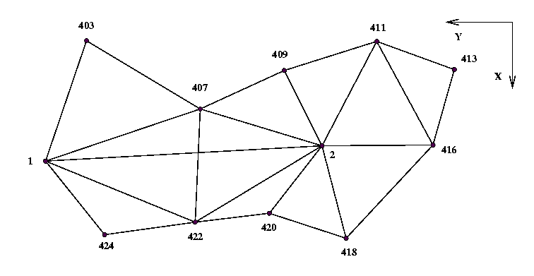
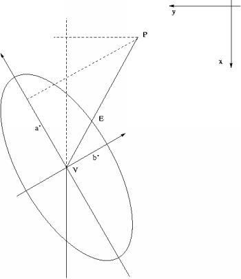
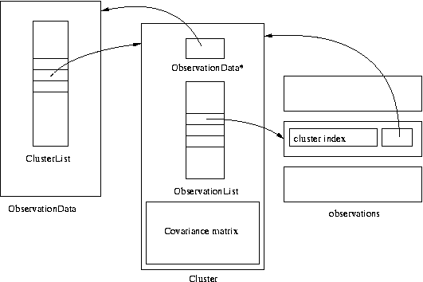
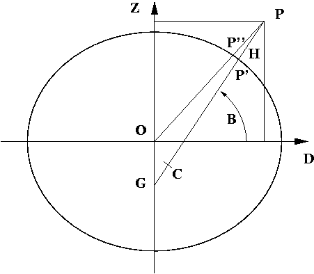

<!DOCTYPE html PUBLIC "-//W3C//DTD HTML 4.01 Transitional//EN" "http://www.w3.org/TR/html401/loose.dtd">
<html><!-- Created on February 17, 2024 by texi2html 1.82
texi2html was written by: 
            Lionel Cons <Lionel.Cons@cern.ch> (original author)
            Karl Berry  <karl@freefriends.org>
            Olaf Bachmann <obachman@mathematik.uni-kl.de>
            and many others.
Maintained by: Many creative people.
Send bugs and suggestions to <texi2html-bug@nongnu.org>
--><head>
<title>GNU Gama 2.29</title>

<meta name="description" content="GNU Gama 2.29">
<meta name="keywords" content="GNU Gama 2.29">
<meta name="resource-type" content="document">
<meta name="distribution" content="global">
<meta name="Generator" content="texi2html 1.82">
<meta http-equiv="Content-Type" content="text/html; charset=UTF-8">

</head>

<body lang="en" bgcolor="#FFFFFF" text="#000000" link="#0000FF" vlink="#800080" alink="#FF0000">

<table cellpadding="1" cellspacing="1" border="0">
<tbody><tr><td valign="middle" align="left">[<a href="#Top" title="Cover (top) of document">Top</a>]</td>
<td valign="middle" align="left">[<a href="#SEC_Contents" title="Table of contents">Contents</a>]</td>
<td valign="middle" align="left">[<a href="#Concept-Index" title="Index">Index</a>]</td>
<td valign="middle" align="left">[<a href="#SEC_About" title="About (help)"> ? </a>]</td>
</tr></tbody></table>

<h1 class="settitle">GNU Gama 2.29</h1>

<table class="menu" border="0" cellspacing="0">
<tbody><tr><td align="left" valign="top"><a href="#Introduction">1. Introduction</a></td><td>&nbsp;&nbsp;</td><td align="left" valign="top">
</td></tr>
<tr><td align="left" valign="top"><a href="#XML-input-data-format-for-gama_002dlocal">2. XML input data format for <code>gama-local</code></a></td><td>&nbsp;&nbsp;</td><td align="left" valign="top">
</td></tr>
<tr><td align="left" valign="top"><a href="#YAML-input-data-format-for-gama_002dlocal">3. YAML input data format for <code>gama-local</code></a></td><td>&nbsp;&nbsp;</td><td align="left" valign="top">
</td></tr>
<tr><td align="left" valign="top"><a href="#SQL-schema-SQLite-and-gama_002dlocal">4. SQL schema, SQLite and <code>gama-local</code></a></td><td>&nbsp;&nbsp;</td><td align="left" valign="top">
</td></tr>
<tr><td align="left" valign="top"><a href="#Network-adjustment-with-gama_002dlocal">5. Network adjustment with <code>gama-local</code></a></td><td>&nbsp;&nbsp;</td><td align="left" valign="top">
</td></tr>
<tr><td align="left" valign="top"><a href="#Data-structures-and-algorithms">6. Data structures and algorithms</a></td><td>&nbsp;&nbsp;</td><td align="left" valign="top">
</td></tr>
<tr><td align="left" valign="top"><a href="#Gama_002dlocal-companion-tools">7. Gama-local companion tools</a></td><td>&nbsp;&nbsp;</td><td align="left" valign="top">
</td></tr>
<tr><td align="left" valign="top"><a href="#Gama_002dlocal-test-suite">8. Gama-local test suite</a></td><td>&nbsp;&nbsp;</td><td align="left" valign="top">
</td></tr>
<tr><td align="left" valign="top"><a href="#Copying-This-Manual">A. Copying This Manual</a></td><td>&nbsp;&nbsp;</td><td align="left" valign="top">
</td></tr>
<tr><td align="left" valign="top"><a href="#Concept-Index">Concept Index</a></td><td>&nbsp;&nbsp;</td><td align="left" valign="top">
</td></tr>
</tbody></table>

<table cellpadding="1" cellspacing="1" border="0">
<tbody><tr><td valign="middle" align="left">[<a href="#Top" title="Previous section in reading order"> &lt; </a>]</td>
<td valign="middle" align="left">[<a href="#Download" title="Next section in reading order"> &gt; </a>]</td>
<td valign="middle" align="left"> &nbsp; </td>
<td valign="middle" align="left">[<a href="#Top" title="Beginning of this chapter or previous chapter"> &lt;&lt; </a>]</td>
<td valign="middle" align="left">[<a href="#Top" title="Up section"> Up </a>]</td>
<td valign="middle" align="left">[<a href="#XML-input-data-format-for-gama_002dlocal" title="Next chapter"> &gt;&gt; </a>]</td>
<td valign="middle" align="left"> &nbsp; </td>
<td valign="middle" align="left"> &nbsp; </td>
<td valign="middle" align="left"> &nbsp; </td>
<td valign="middle" align="left"> &nbsp; </td>
<td valign="middle" align="left">[<a href="#Top" title="Cover (top) of document">Top</a>]</td>
<td valign="middle" align="left">[<a href="#SEC_Contents" title="Table of contents">Contents</a>]</td>
<td valign="middle" align="left">[<a href="#Concept-Index" title="Index">Index</a>]</td>
<td valign="middle" align="left">[<a href="#SEC_About" title="About (help)"> ? </a>]</td>
</tr></tbody></table>

<h1 class="chapter">1. Introduction</h1>

GNU Gama package is dedicated to adjustment of geodetic networks.
It is intended for use with traditional geodetic surveyings which are
still used and needed in special measurements (e.g., underground or
high precision engineering measurements) where the Global Positioning
System (GPS) cannot be used.

In general, surveying is the technique and science of accurately
determining the terrestrial or three-dimensional spatial position of
points and the distances and angles between them.<a name="DOCF1" href="#FOOT1">(1)</a>

Adjustment is a technical term traditionally used by geodesists and
surveyors which simply means “application of the least squares method to
process the over-determined system of measurements” (statistical
methods other than least squares are used sometimes but are not common). In
other words, we have more observations than needed and we are trying to
get the best estimate for adjusted observations and/or coordinates.

<em>Adjustment of geodetic networks</em> means that we have a set of fixed
points with given coordinates, a set of points with unknown coordinates
(possibly with approximate values available) and a set of
observations among them. What is typical of adjustment of special
geodetic measurements is that the resulting linearized system might be
singular (we can have a network with no fixed points) and we are not
only interested in the values of ‘adjusted parameters and
observations’ but also in the estimates of their covariances. This is
what Gama does.

Gama was originally inspired by Fortran system Geodet/PC (1990)
designed by Frantisek Charamza. The GNU Gama project started
at the department of mapping and cartography, faculty of Civil
Engineering, Czech Technical University in Prague (CTU) about 1998 and
its name is an acronym for <em>geodesy and mapping</em>.  It was
presented to a wider public for the first time at FIG Working Week 2000
in Prague and then at FIG Workshop and Seminar at HUT Helsinki in
2001.

The GNU Gama home page is

            
   <a href="http://www.gnu.org/software/gama/">http://www.gnu.org/software/gama/</a>

and the project is hosted on

            
   <a href="http://savannah.gnu.org/git/?group=gama">http://savannah.gnu.org/git/?group=gama</a>

GNU Gama is released under the GNU General Public License and is based
on a C++ library of geodetic classes and functions and a small C++
template matrix library <code>matvec</code>. For parsing XML documents GNU
Gama calls the <code>expat</code> parser version 1.1, written by James
Clark. The <code>expat</code> parser is not part of the GNU Gama project,
but it is used by the project.

Adjustment in local Cartesian coordinate systems is fully supported
by a command-line program <code>gama-local</code> that adjusts geodetic
(free) networks of observed distances, directions, angles, height
differences, 3D vectors and observed coordinates (coordinates with
given variance-covariance matrix).  Adjustment in global coordinate
systems is supported only partly as a <code>gama-g3</code> program.

<table class="menu" border="0" cellspacing="0">
<tbody><tr><td align="left" valign="top"><a href="#Download">1.1 Download</a></td><td>&nbsp;&nbsp;</td><td align="left" valign="top">
</td></tr>
<tr><td align="left" valign="top"><a href="#Install">1.2 Install</a></td><td>&nbsp;&nbsp;</td><td align="left" valign="top">
</td></tr>
<tr><td align="left" valign="top"><a href="#Program-gama_002dlocal">1.3 Program <code>gama-local</code></a></td><td>&nbsp;&nbsp;</td><td align="left" valign="top">
</td></tr>
<tr><td align="left" valign="top"><a href="#Reporting-bugs">1.4 Reporting bugs</a></td><td>&nbsp;&nbsp;</td><td align="left" valign="top">
</td></tr>
<tr><td align="left" valign="top"><a href="#Contributors">1.5 Contributors</a></td><td>&nbsp;&nbsp;</td><td align="left" valign="top">
</td></tr>
</tbody></table>

<table cellpadding="1" cellspacing="1" border="0">
<tbody><tr><td valign="middle" align="left">[<a href="#Introduction" title="Previous section in reading order"> &lt; </a>]</td>
<td valign="middle" align="left">[<a href="#Install" title="Next section in reading order"> &gt; </a>]</td>
<td valign="middle" align="left"> &nbsp; </td>
<td valign="middle" align="left">[<a href="#Introduction" title="Beginning of this chapter or previous chapter"> &lt;&lt; </a>]</td>
<td valign="middle" align="left">[<a href="#Introduction" title="Up section"> Up </a>]</td>
<td valign="middle" align="left">[<a href="#XML-input-data-format-for-gama_002dlocal" title="Next chapter"> &gt;&gt; </a>]</td>
<td valign="middle" align="left"> &nbsp; </td>
<td valign="middle" align="left"> &nbsp; </td>
<td valign="middle" align="left"> &nbsp; </td>
<td valign="middle" align="left"> &nbsp; </td>
<td valign="middle" align="left">[<a href="#Top" title="Cover (top) of document">Top</a>]</td>
<td valign="middle" align="left">[<a href="#SEC_Contents" title="Table of contents">Contents</a>]</td>
<td valign="middle" align="left">[<a href="#Concept-Index" title="Index">Index</a>]</td>
<td valign="middle" align="left">[<a href="#SEC_About" title="About (help)"> ? </a>]</td>
</tr></tbody></table>

<h2 class="section">1.1 Download</h2>

GNU Gama  can be found in the subdirectory <code>/gnu/gama/</code> on
your favourite FTP <a href="http://www.gnu.org/prep/ftp.html">GNU mirror</a> or
cloned from the GIT. See our project page at
<a href="https://savannah.gnu.org/projects/gama/">savannah</a> for more
information.

To get anonymous read-only access to the GIT repository for the
latest GNU Gama source, issue the following command

<table><tbody><tr><td>&nbsp;</td><td><pre class="example">git clone git://git.sv.gnu.org/gama.git
</pre></td></tr></tbody></table>

<table cellpadding="1" cellspacing="1" border="0">
<tbody><tr><td valign="middle" align="left">[<a href="#Download" title="Previous section in reading order"> &lt; </a>]</td>
<td valign="middle" align="left">[<a href="#CMake" title="Next section in reading order"> &gt; </a>]</td>
<td valign="middle" align="left"> &nbsp; </td>
<td valign="middle" align="left">[<a href="#Introduction" title="Beginning of this chapter or previous chapter"> &lt;&lt; </a>]</td>
<td valign="middle" align="left">[<a href="#Introduction" title="Up section"> Up </a>]</td>
<td valign="middle" align="left">[<a href="#XML-input-data-format-for-gama_002dlocal" title="Next chapter"> &gt;&gt; </a>]</td>
<td valign="middle" align="left"> &nbsp; </td>
<td valign="middle" align="left"> &nbsp; </td>
<td valign="middle" align="left"> &nbsp; </td>
<td valign="middle" align="left"> &nbsp; </td>
<td valign="middle" align="left">[<a href="#Top" title="Cover (top) of document">Top</a>]</td>
<td valign="middle" align="left">[<a href="#SEC_Contents" title="Table of contents">Contents</a>]</td>
<td valign="middle" align="left">[<a href="#Concept-Index" title="Index">Index</a>]</td>
<td valign="middle" align="left">[<a href="#SEC_About" title="About (help)"> ? </a>]</td>
</tr></tbody></table>

<h2 class="section">1.2 Install</h2>

GNU Gama is developed and tested under GNU/Linux.  A static library
<code>libgama.lib</code> and executables are build in folders <code>lib</code> and
<code>src</code>.  You can compile Gama easily yourself if you download the
sources from a FTP server.  The preferred way is to have <code>expat</code>
XML parser installed on your system, if not, GNU Gama will be build
with internally stored <code>expat</code> older source codes version 1.1.

Change to the directory of Gama project and issue the
following commands at the shell prompt (with some optional parameters)

<table><tbody><tr><td>&nbsp;</td><td><pre class="example">$ ./configure [--enable-extra-tests --bindir=DIR --infodir=DIR]
$ make
</pre></td></tr></tbody></table>

For GNU Gama test suite run

<table><tbody><tr><td>&nbsp;</td><td><pre class="example">$ make check
</pre></td></tr></tbody></table>

If the script <code>configure</code> is not available (which is the
case when you download source codes from the
<a href="https://git.savannah.gnu.org/cgit/gama.git">git server</a>), you have to
generate it using auxiliary script <code>autogen.sh</code>.  To compile and
build all binaries. Run

<table><tbody><tr><td>&nbsp;</td><td><pre class="example">$ ./autogen.sh
$ ./configure
</pre></td></tr></tbody></table>

and

<table><tbody><tr><td>&nbsp;</td><td><pre class="example">$ make install [--prefix=/your/prefered/install/directory]
</pre></td></tr></tbody></table>

if you also want to install executables
and info documentation.

Typically, if you want to download (see section <a href="#Download">Download</a>) and compile sources,
you will run following commands:

<table><tbody><tr><td>&nbsp;</td><td><pre class="example">$ git clone git://git.sv.gnu.org/gama.git gama
$ cd gama
$ ./autogen.sh
$ ./configure
$ make
</pre></td></tr></tbody></table>

You should have <code>expat</code> XML parser and SQLite library already installed
on your system.
For example to be able to compile Gama on Ubuntu 10.04 you have to install
following packages:

<table><tbody><tr><td>&nbsp;</td><td><pre class="example">make doxygen git automake autoconf libexpat1-dev libsqlite3-dev
</pre></td></tr></tbody></table>

To compile user documentation in various formats (PDF, HTML, …) run
the following commands

<table><tbody><tr><td>&nbsp;</td><td><pre class="example">$ cd doc/
$ make download-gendocs.sh
$ make run-gendocs.sh
</pre></td></tr></tbody></table>

The documentation should be in <code>doc/manual</code> directory.
To compile API documentation run

<table><tbody><tr><td>&nbsp;</td><td><pre class="example">$ doxygen
</pre></td></tr></tbody></table>

in your <code>gama</code> directory.
Doxygen output will be in the <code>doxygen</code> directory.

<table class="menu" border="0" cellspacing="0">
<tbody><tr><td align="left" valign="top"><a href="#CMake">1.2.1 CMake</a></td><td>&nbsp;&nbsp;</td><td align="left" valign="top">
</td></tr>
<tr><td align="left" valign="top"><a href="#pkgsrc">1.2.2 pkgsrc</a></td><td>&nbsp;&nbsp;</td><td align="left" valign="top">
</td></tr>
<tr><td align="left" valign="top"><a href="#Precompiled-executables-for-Windows">1.2.3 Precompiled executables for Windows</a></td><td>&nbsp;&nbsp;</td><td align="left" valign="top">
</td></tr>
</tbody></table>

<table cellpadding="1" cellspacing="1" border="0">
<tbody><tr><td valign="middle" align="left">[<a href="#Install" title="Previous section in reading order"> &lt; </a>]</td>
<td valign="middle" align="left">[<a href="#pkgsrc" title="Next section in reading order"> &gt; </a>]</td>
<td valign="middle" align="left"> &nbsp; </td>
<td valign="middle" align="left">[<a href="#Introduction" title="Beginning of this chapter or previous chapter"> &lt;&lt; </a>]</td>
<td valign="middle" align="left">[<a href="#Install" title="Up section"> Up </a>]</td>
<td valign="middle" align="left">[<a href="#XML-input-data-format-for-gama_002dlocal" title="Next chapter"> &gt;&gt; </a>]</td>
<td valign="middle" align="left"> &nbsp; </td>
<td valign="middle" align="left"> &nbsp; </td>
<td valign="middle" align="left"> &nbsp; </td>
<td valign="middle" align="left"> &nbsp; </td>
<td valign="middle" align="left">[<a href="#Top" title="Cover (top) of document">Top</a>]</td>
<td valign="middle" align="left">[<a href="#SEC_Contents" title="Table of contents">Contents</a>]</td>
<td valign="middle" align="left">[<a href="#Concept-Index" title="Index">Index</a>]</td>
<td valign="middle" align="left">[<a href="#SEC_About" title="About (help)"> ? </a>]</td>
</tr></tbody></table>

<h3 class="subsection">1.2.1 CMake</h3>

Alternatively you can use CMake to generate makefiles for Unix,
Windows, Mac OS X, OS/2, MSVC, Cygwin, MinGW or Xcode. Configuration
file <code>CMakeLists.txt</code> is available from the root distribution
directory. For example to build <code>gama-local</code> binary for Linux run

<table><tbody><tr><td>&nbsp;</td><td><pre class="example">$ mkdir build_dir
$ cd build_dir
$ cmake .. [ -G generator-name ]
$ make --build .
</pre></td></tr></tbody></table>

where <code>build_dir</code> is an arbitrary directory name for
<em>out-of-place build</em> and optional <em>generator-name</em> specifies
a build system generator, for example <code>Ninja</code>.

<table cellpadding="1" cellspacing="1" border="0">
<tbody><tr><td valign="middle" align="left">[<a href="#CMake" title="Previous section in reading order"> &lt; </a>]</td>
<td valign="middle" align="left">[<a href="#Precompiled-executables-for-Windows" title="Next section in reading order"> &gt; </a>]</td>
<td valign="middle" align="left"> &nbsp; </td>
<td valign="middle" align="left">[<a href="#Introduction" title="Beginning of this chapter or previous chapter"> &lt;&lt; </a>]</td>
<td valign="middle" align="left">[<a href="#Install" title="Up section"> Up </a>]</td>
<td valign="middle" align="left">[<a href="#XML-input-data-format-for-gama_002dlocal" title="Next chapter"> &gt;&gt; </a>]</td>
<td valign="middle" align="left"> &nbsp; </td>
<td valign="middle" align="left"> &nbsp; </td>
<td valign="middle" align="left"> &nbsp; </td>
<td valign="middle" align="left"> &nbsp; </td>
<td valign="middle" align="left">[<a href="#Top" title="Cover (top) of document">Top</a>]</td>
<td valign="middle" align="left">[<a href="#SEC_Contents" title="Table of contents">Contents</a>]</td>
<td valign="middle" align="left">[<a href="#Concept-Index" title="Index">Index</a>]</td>
<td valign="middle" align="left">[<a href="#SEC_About" title="About (help)"> ? </a>]</td>
</tr></tbody></table>

<h3 class="subsection">1.2.2 pkgsrc</h3>

<code>pkgsrc</code> is a framework for managing third-party software on
UNIX-like systems, currently containing over 26,000 packages. It is
the default package manager of NetBSD and SmartOS, and can be used to
enable freely available software to be built easily on a large number
of other UNIX-like platforms. The binary packages that are produced by
pkgsrc can be used without having to compile anything from source. It
can be easily used to complement the software on an existing system.

Gama is available via pkgsrc as geography/gama, see
<a href="https://www.pkgsrc.org/">https://www.pkgsrc.org/</a> for more information.

<table cellpadding="1" cellspacing="1" border="0">
<tbody><tr><td valign="middle" align="left">[<a href="#pkgsrc" title="Previous section in reading order"> &lt; </a>]</td>
<td valign="middle" align="left">[<a href="#Program-gama_002dlocal" title="Next section in reading order"> &gt; </a>]</td>
<td valign="middle" align="left"> &nbsp; </td>
<td valign="middle" align="left">[<a href="#Introduction" title="Beginning of this chapter or previous chapter"> &lt;&lt; </a>]</td>
<td valign="middle" align="left">[<a href="#Install" title="Up section"> Up </a>]</td>
<td valign="middle" align="left">[<a href="#XML-input-data-format-for-gama_002dlocal" title="Next chapter"> &gt;&gt; </a>]</td>
<td valign="middle" align="left"> &nbsp; </td>
<td valign="middle" align="left"> &nbsp; </td>
<td valign="middle" align="left"> &nbsp; </td>
<td valign="middle" align="left"> &nbsp; </td>
<td valign="middle" align="left">[<a href="#Top" title="Cover (top) of document">Top</a>]</td>
<td valign="middle" align="left">[<a href="#SEC_Contents" title="Table of contents">Contents</a>]</td>
<td valign="middle" align="left">[<a href="#Concept-Index" title="Index">Index</a>]</td>
<td valign="middle" align="left">[<a href="#SEC_About" title="About (help)"> ? </a>]</td>
</tr></tbody></table>

<h3 class="subsection">1.2.3 Precompiled executables for Windows</h3>

<code>qgama</code> is a Qt application for adjustment of geodetic networks
with database support, where the database can be a simple SQLite3 flat
file, used for storing geodetic network data, or any full-featured
relational DBMS with Qt driver available like PostgreSQL or MySQL. It
is build on the GNU gama adjustment library.

Windows executable <code>qgama.exe</code> with all DLL libraries is
available from the GNU FTP server

 <a href="https://ftp.gnu.org/gnu/gama/windows/">https://ftp.gnu.org/gnu/gama/windows/</a>

together with command-line interface executables <code>gama-local.exe</code>
and <code>gama-g3</code> in the subdirectory <code>bin</code>.

<table cellpadding="1" cellspacing="1" border="0">
<tbody><tr><td valign="middle" align="left">[<a href="#Precompiled-executables-for-Windows" title="Previous section in reading order"> &lt; </a>]</td>
<td valign="middle" align="left">[<a href="#Reductions-of-horizontal-and-zenith-angles" title="Next section in reading order"> &gt; </a>]</td>
<td valign="middle" align="left"> &nbsp; </td>
<td valign="middle" align="left">[<a href="#Introduction" title="Beginning of this chapter or previous chapter"> &lt;&lt; </a>]</td>
<td valign="middle" align="left">[<a href="#Introduction" title="Up section"> Up </a>]</td>
<td valign="middle" align="left">[<a href="#XML-input-data-format-for-gama_002dlocal" title="Next chapter"> &gt;&gt; </a>]</td>
<td valign="middle" align="left"> &nbsp; </td>
<td valign="middle" align="left"> &nbsp; </td>
<td valign="middle" align="left"> &nbsp; </td>
<td valign="middle" align="left"> &nbsp; </td>
<td valign="middle" align="left">[<a href="#Top" title="Cover (top) of document">Top</a>]</td>
<td valign="middle" align="left">[<a href="#SEC_Contents" title="Table of contents">Contents</a>]</td>
<td valign="middle" align="left">[<a href="#Concept-Index" title="Index">Index</a>]</td>
<td valign="middle" align="left">[<a href="#SEC_About" title="About (help)"> ? </a>]</td>
</tr></tbody></table>

<h2 class="section">1.3 Program <code>gama-local</code></h2>

Program <code>gama-local</code> is a simple command line tool for adjustment
of geodetic <em>free networks.</em> It is available for GNU Linux (the
main platform on which project GNU Gama is being developed), BSD or
Windows.

Program <code>gama-local</code> reads input data in XML format (<a href="#XML-input-data-format-for-gama_002dlocal">XML input data format for <code>gama-local</code></a>) and prints adjustment results into
ASCII text file. If output file name is not given, adjustment results
in XML format are sent to the standard output device.
If development files for <code>Sqlite3</code> (package <code>libsqlite3-dev</code>) are
installed, <code>gama-local</code> also supports reading
adjustment input data from <code>sqlite3</code> database.
When run without arguments <code>gama-local [--help]</code>
prints a review of runtime options

<table><tbody><tr><td>&nbsp;</td><td><pre class="example">Adjustment of local geodetic network        version: 2.29
************************************
https://www.gnu.org/software/gama/

Usage: gama-local  [--input-xml] input.xml  [options]
       gama-local  [--input-xml] input.xml  --sqlitedb sqlite.db  --configuration name  [options]
       gama-local  --sqlitedb sqlite.db  --configuration name  [options]
       gama-local  --sqlitedb sqlite.db  --readonly-configuration name  [options]

Options:

--algorithm  gso | svd | cholesky | envelope
--language   en | ca | cz | du | es | fi | fr | hu | ru | ua | zh
--encoding   utf-8 | iso-8859-2 | iso-8859-2-flat | cp-1250 | cp-1251
--angular    400 | 360
--latitude   &lt;latitude&gt;
--ellipsoid  &lt;ellipsoid name&gt;
--text       adjustment_results.txt
--html       adjustment_results.html
--xml        adjustment_results.xml
--octave     adjustment_results.m
--svg        network_configuration.svg
--cov-band   covariance matrix of adjusted parameters in XML output
             n  = -1  for full covariance matrix (implicit value)
             n &gt;=  0  covariances are computed only for bandwidth n
--iterations maximum number of iterations allowed in the linearized
             least squares algorithm (implicit value is 5)
--export     updated input data based on adjustment results
--verbose    [yes | no]
--version
--help

Report bugs to: &lt;bug-gama@gnu.org&gt;
GNU gama home page: &lt;https://www.gnu.org/software/gama/&gt;
General help using GNU software: &lt;https://www.gnu.org/gethelp/&gt;
</pre></td></tr></tbody></table>

Program version is followed by information on
compiler used to build the program (apart from GNU <code>g++</code>
compiler other possibilities are Clang, Intel C++ compiler and
Visual C++, when build under Microsoft Windows).

Program <code>gama-local</code> can read XML input from the standard input
if you put "-" (hyphen) after the option <code>--input-xml</code>. This
option is special because it is optional (you can specify XML input
file name or "-" without it). Elective <code>--input-xml</code> enables
backward compatibility with the usage of older versions.

Adjustment results (<code>--text</code>, <code>--xml</code>) and others can be
similarly redirected to standard output if instead of a file name is
used "-" string. If no output is given, XML adjustment format is
implicitly send to standard output.

Option <code>--algorithm</code> enables to select numerical method for
solution of the adjustment.
Implicit algorithm is sparse matrix <code>envelope</code>.
Another possibilities are
Cholesky decomposition of semidefinite matrix of normal
equations (<code>cholesky</code>),
block matrix algorithm GSO by Frantisek Charamza based on
Gram-Schmidt orthogonalization (<code>gso</code>) and
Singular Value Decomposition (<code>svd</code>).
In the last two cases (<code>gso</code> and <code>svd</code>) project equations
are solved directly without forming <em>normal equations</em>.

Option <code>--language</code> selects language used in output protocol. For
example, if run with option <code>--language cz</code>, <code>gama-local</code>
prints output results in Czech languague using UTF-8
encoding. Implicit value is <code>en</code> for output in English.

Option <code>--encoding</code> enables to change inplicit UTF-8 output
encoding to iso-8859-2 (latin-2), iso-8859-2-flat (latin-2 without
diacritics), cp-1250 (MS-EE encoding) cp-12251 (Russian encoding).

Option <code>--angular</code> selects angular units to be used in output.

Options <code>--latitude</code> and/or <code>--ellipsoid</code> are used when
observed vertical and/or zenith angles need to be transformed into the
projection plane. If none of these two options is explicitly used, no
corrections are added to horizontal and/or zenith angles. If only one
of these options is used, then implicit value for <code>--latitude</code> is
45 degrees (50 gons) and implicit ellipsoid is WGS84.
Mathematical formulas for the corrections is given in the following
section.

Option <code>--octave</code> is used to output simplified adjustment results
for <a href="https://www.gnu.org/software/octave/">GNU Octave</a>, i.e. in
an .m file. The following information is give in the output
file

<ul>
<li>
general adjustment paramameters (number of unknowns, observetions etc.)

</li><li>
list of fixed points’ ids (may be empty)

</li><li>
adjustment points; ids

</li><li>
adjustment indexes of unknouwns

</li><li>
indexes of constrained coordinates (subset of adjustment indexes)

</li><li>
approximate and adjusted coordinates (zero if not available)

</li><li>
full covariance matrix of adjusted coordinates

</li><li>
sparse design matrix, rhs and weights (Ax = b, P = inv(C_ll))

</li><li>
and adjustment results in matrix format

</li></ul>

In the case of free networks system of normal equations is augmented
with matrix of constrains. Adjustmment can be then computed
independetly in Octave and compared with results from Gama for unknown
coordinates. We suggest that for comaprision of Gama and Octave
results number of itereations is set to zero (<code>--iterations 0</code>).

This Octave output is currently available only for algorithm
<em>envelope</em> (Gama version 2.10), also adjustment in Octave is not
supported for the special case of <em>one fixed point and one
constrained</em> (where normal equation cannot be directly augmented with
constraints because of different number of unknowns).

Option <code>--cov-band</code> is used to reduce the number of computed
covariances (cofactors) in XML adjustment output. Implicitly full
matrix is written to XML output, which could degrade time efficiency
for the <code>envelope</code> algorithm for sparse matrix solution. Explicit
option for full covariance matrix is <code>--cov-band -1</code>, option
<code>--cov-band 0</code> means that only a diagonal of covariance matrix is
written to XML output, <code>--cov-band 1</code> results in computing the
main diagonal and first codiagonal etc. If higher rank is specified then
available, it is reduced do maximum possible value <code>dim-1</code>.

Option <code>--iterations</code> enables to set maximum number of
iterations allowed in the linearized least squares algorithm. After
the adjustment <code>gama-local</code> computes differences between adjusted
observations computed from residuals and from adjusted coordinates. If
the positional difference is higher than 0.5mm, approximate
coordinates of adjusted points are updated and the whole adjustment is
repeated in a new iteration. Implicit number of iterations is 5.

<table class="menu" border="0" cellspacing="0">
<tbody><tr><td align="left" valign="top"><a href="#Reductions-of-horizontal-and-zenith-angles">1.3.1 Reductions of horizontal and zenith angles</a></td><td>&nbsp;&nbsp;</td><td align="left" valign="top">
</td></tr>
</tbody></table>

<table cellpadding="1" cellspacing="1" border="0">
<tbody><tr><td valign="middle" align="left">[<a href="#Program-gama_002dlocal" title="Previous section in reading order"> &lt; </a>]</td>
<td valign="middle" align="left">[<a href="#Reporting-bugs" title="Next section in reading order"> &gt; </a>]</td>
<td valign="middle" align="left"> &nbsp; </td>
<td valign="middle" align="left">[<a href="#Introduction" title="Beginning of this chapter or previous chapter"> &lt;&lt; </a>]</td>
<td valign="middle" align="left">[<a href="#Program-gama_002dlocal" title="Up section"> Up </a>]</td>
<td valign="middle" align="left">[<a href="#XML-input-data-format-for-gama_002dlocal" title="Next chapter"> &gt;&gt; </a>]</td>
<td valign="middle" align="left"> &nbsp; </td>
<td valign="middle" align="left"> &nbsp; </td>
<td valign="middle" align="left"> &nbsp; </td>
<td valign="middle" align="left"> &nbsp; </td>
<td valign="middle" align="left">[<a href="#Top" title="Cover (top) of document">Top</a>]</td>
<td valign="middle" align="left">[<a href="#SEC_Contents" title="Table of contents">Contents</a>]</td>
<td valign="middle" align="left">[<a href="#Concept-Index" title="Index">Index</a>]</td>
<td valign="middle" align="left">[<a href="#SEC_About" title="About (help)"> ? </a>]</td>
</tr></tbody></table>

<h3 class="subsection">1.3.1 Reductions of horizontal and zenith angles</h3>

For evaluating of reductions of horizontal and zenith angles,
<code>gama-local</code> computes a helper point <em>P_1</em> in the center of
the network. Horizontal and zenith angles observed at point <em>P_2</em>
are transformed to the projection plane perpendicular to the normal
<em>z_1</em> of the helper point <em>P_1</em>. Coordinates <em>(x_2,
y_2)</em> of point <em>P_2</em> are conserved, but its normal <em>z_2</em> is
rotated by the central angle <em>2\gamma_12</em> to be parallel with
<em>z_1</em>.

Formulas for reductions of horizontal and zenith angles are given only
in the printed version.

<table cellpadding="1" cellspacing="1" border="0">
<tbody><tr><td valign="middle" align="left">[<a href="#Reductions-of-horizontal-and-zenith-angles" title="Previous section in reading order"> &lt; </a>]</td>
<td valign="middle" align="left">[<a href="#Contributors" title="Next section in reading order"> &gt; </a>]</td>
<td valign="middle" align="left"> &nbsp; </td>
<td valign="middle" align="left">[<a href="#Introduction" title="Beginning of this chapter or previous chapter"> &lt;&lt; </a>]</td>
<td valign="middle" align="left">[<a href="#Introduction" title="Up section"> Up </a>]</td>
<td valign="middle" align="left">[<a href="#XML-input-data-format-for-gama_002dlocal" title="Next chapter"> &gt;&gt; </a>]</td>
<td valign="middle" align="left"> &nbsp; </td>
<td valign="middle" align="left"> &nbsp; </td>
<td valign="middle" align="left"> &nbsp; </td>
<td valign="middle" align="left"> &nbsp; </td>
<td valign="middle" align="left">[<a href="#Top" title="Cover (top) of document">Top</a>]</td>
<td valign="middle" align="left">[<a href="#SEC_Contents" title="Table of contents">Contents</a>]</td>
<td valign="middle" align="left">[<a href="#Concept-Index" title="Index">Index</a>]</td>
<td valign="middle" align="left">[<a href="#SEC_About" title="About (help)"> ? </a>]</td>
</tr></tbody></table>

<h2 class="section">1.4 Reporting bugs</h2>

Undoubtedly there are numerous bugs remaining, both in the C++
source code and in the documentation.  If you find a bug in either,
please send a bug report to

 <a href="mailto:bug-gama@gnu.org">bug-gama@gnu.org</a>

We will try to be as quick as possible in fixing the bugs and
redistributing the fixes. If you prefere, you can always write
directly to <a href="mailto:cepek@gnu.org">Aleš Čepek</a>.

<table cellpadding="1" cellspacing="1" border="0">
<tbody><tr><td valign="middle" align="left">[<a href="#Reporting-bugs" title="Previous section in reading order"> &lt; </a>]</td>
<td valign="middle" align="left">[<a href="#XML-input-data-format-for-gama_002dlocal" title="Next section in reading order"> &gt; </a>]</td>
<td valign="middle" align="left"> &nbsp; </td>
<td valign="middle" align="left">[<a href="#Introduction" title="Beginning of this chapter or previous chapter"> &lt;&lt; </a>]</td>
<td valign="middle" align="left">[<a href="#Introduction" title="Up section"> Up </a>]</td>
<td valign="middle" align="left">[<a href="#XML-input-data-format-for-gama_002dlocal" title="Next chapter"> &gt;&gt; </a>]</td>
<td valign="middle" align="left"> &nbsp; </td>
<td valign="middle" align="left"> &nbsp; </td>
<td valign="middle" align="left"> &nbsp; </td>
<td valign="middle" align="left"> &nbsp; </td>
<td valign="middle" align="left">[<a href="#Top" title="Cover (top) of document">Top</a>]</td>
<td valign="middle" align="left">[<a href="#SEC_Contents" title="Table of contents">Contents</a>]</td>
<td valign="middle" align="left">[<a href="#Concept-Index" title="Index">Index</a>]</td>
<td valign="middle" align="left">[<a href="#SEC_About" title="About (help)"> ? </a>]</td>
</tr></tbody></table>

<h2 class="section">1.5 Contributors</h2>

The following persons (in chronological order) have made contributions
to GNU Gama project:
Aleš Čepek, Jiří Veselý, Petr Doubrava, Jan Pytel, Chuck Ghilani, Dan
Haggman, Mauri Väisänen, John Dedrum, Jim Sutherland, Zoltan Faludi,
Diego Berge, Boris Pihtin, Stéphane Kaloustian, Siki Zoltan, Anton
Horpynich, Claudio Fontana, Bronislav Koska, Martin Beckett, Jiří
Novák, Václav Petráš, Jokin Zurutuza, 项维 (Vim Xiang), Tomáš Kubín,
Greg Troxel, Kristian Evers, Oleg Goussev, Petra Millarová, Jan
Holešovský and Friedhelm Krumm.

Jiří Veselý is the author of calculation of approximate coordinates by
intersections and transformations (class Acord).
Václav Petráš is the author of <a href="#SQL-schema-SQLite-and-gama_002dlocal">SQL schema, SQLite and <code>gama-local</code></a>.
Petra Millarová is the main author of class Acord2 and other helper
classes for combinatorial solution of medians of approximate
coordinates.

Friedhelm Krumm, Geodätisches Institut Universität Stuttgart,
contributed numerical examples for the adjustment of geodetic networks
(1D, 2D and 3D) published in his Geodetic Network Adjustment Examples,
Rev. 3.5, January 20, 2020.  https://www.gis.uni-stuttgart.de/
In version 2.18 the format of input data used in his <em>Examples</em>
was implemented in GNU Gama and is used in command line conversion
program <code>gama-local-krumm2xml</code> and also directly in <code>qgama</code>
GUI.

<table cellpadding="1" cellspacing="1" border="0">
<tbody><tr><td valign="middle" align="left">[<a href="#Contributors" title="Previous section in reading order"> &lt; </a>]</td>
<td valign="middle" align="left">[<a href="#Angular-units" title="Next section in reading order"> &gt; </a>]</td>
<td valign="middle" align="left"> &nbsp; </td>
<td valign="middle" align="left">[<a href="#Introduction" title="Beginning of this chapter or previous chapter"> &lt;&lt; </a>]</td>
<td valign="middle" align="left">[<a href="#Top" title="Up section"> Up </a>]</td>
<td valign="middle" align="left">[<a href="#YAML-input-data-format-for-gama_002dlocal" title="Next chapter"> &gt;&gt; </a>]</td>
<td valign="middle" align="left"> &nbsp; </td>
<td valign="middle" align="left"> &nbsp; </td>
<td valign="middle" align="left"> &nbsp; </td>
<td valign="middle" align="left"> &nbsp; </td>
<td valign="middle" align="left">[<a href="#Top" title="Cover (top) of document">Top</a>]</td>
<td valign="middle" align="left">[<a href="#SEC_Contents" title="Table of contents">Contents</a>]</td>
<td valign="middle" align="left">[<a href="#Concept-Index" title="Index">Index</a>]</td>
<td valign="middle" align="left">[<a href="#SEC_About" title="About (help)"> ? </a>]</td>
</tr></tbody></table>

<h1 class="chapter">2. XML input data format for <code>gama-local</code></h1>

The input data format for a local geodetic network adjustment (program
<code>gama-local</code>) is defined in accordance with the definition of Extended
Markup Language (XML) for description of structured data.
The XML definition can be found at

     <a href="http://www.w3.org/TR/REC-xml">http://www.w3.org/TR/REC-xml</a>

Input data (points, observations and other related information) are
described using XML start-end pair tags <code>&lt;xxx&gt;</code> and <code>&lt;/xxx&gt;</code>
and empty-element tags <code>&lt;xxx/&gt;</code>.

The syntax of XML <code>gama-local</code> input format is described in XML
schema (XSD), the file <code>gama-local.xsd</code> is a part of the
<code>GNU gama</code> distribution and can formally be validated
independently on the program <code>gama-local</code>, namely in unit testing
we use <code>xmllint</code> validating parser, if it is installed.

For parsing the XML input data, <code>gama-local</code> uses the XML parser
<code>Expat</code> copyrighted by James Clark which is described at

     <a href="http://www.jclark.com/xml/expat.html">http://www.jclark.com/xml/expat.html</a>

<code>Expat</code> is subject to the Mozilla Public License (MPL), or may
alternatively be used under the GNU General Public License (GPL)
instead.

In the <code>gama-local</code> XML input, distances are given in meters,
angular values in centigrades and their standard deviations (rms
errors) in millimeters or centigrade seconds, respectively.
Alternatively angular values in <code>gama-local</code> XML input can be
given in degrees and seconds (see section <a href="#Angular-units">Angular units</a>).  At the end of
this chapter an example of the <code>gama-local</code> XML input data
object is given.

<table class="menu" border="0" cellspacing="0">
<tbody><tr><td align="left" valign="top"><a href="#Angular-units">2.1 Angular units</a></td><td>&nbsp;&nbsp;</td><td align="left" valign="top"></td></tr>
<tr><td align="left" valign="top"><a href="#Prologue">2.2 Prologue</a></td><td>&nbsp;&nbsp;</td><td align="left" valign="top">                  XML declaration
</td></tr>
<tr><td align="left" valign="top"><a href="#Network-definition">2.3 Tags <code>&lt;gama-local&gt;</code> and <code>&lt;network&gt;</code></a></td><td>&nbsp;&nbsp;</td><td align="left" valign="top"></td></tr>
<tr><td align="left" valign="top"><a href="#Network-description">2.4 Network description</a></td><td>&nbsp;&nbsp;</td><td align="left" valign="top">       Tag  <code>&lt;description&gt;</code>
</td></tr>
<tr><td align="left" valign="top"><a href="#Network-parameters">2.5 Network parameters</a></td><td>&nbsp;&nbsp;</td><td align="left" valign="top">        Tag  <code>&lt;parameters /&gt;</code>
</td></tr>
<tr><td align="left" valign="top"><a href="#Points-and-observations">2.6 Points and observations</a></td><td>&nbsp;&nbsp;</td><td align="left" valign="top">   Tag  <code>&lt;points-observations&gt;</code>
</td></tr>
<tr><td align="left" valign="top"><a href="#Points">2.7 Points</a></td><td>&nbsp;&nbsp;</td><td align="left" valign="top">                    Tag  <code>&lt;point /&gt;</code>
</td></tr>
<tr><td align="left" valign="top"><a href="#Set-of-observations">2.8 Set of observations</a></td><td>&nbsp;&nbsp;</td><td align="left" valign="top">       Tag  <code>&lt;obs&gt;</code>
</td></tr>
<tr><td align="left" valign="top"><a href="#Directions">2.9 Directions</a></td><td>&nbsp;&nbsp;</td><td align="left" valign="top">                Tag  <code>&lt;direction /&gt;</code>
</td></tr>
<tr><td align="left" valign="top"><a href="#Horizontal-distances">2.10 Horizontal distances</a></td><td>&nbsp;&nbsp;</td><td align="left" valign="top">      Tag  <code>&lt;distance /&gt;</code>
</td></tr>
<tr><td align="left" valign="top"><a href="#Angles">2.11 Angles</a></td><td>&nbsp;&nbsp;</td><td align="left" valign="top">                    Tag  <code>&lt;angle /&gt;</code>
</td></tr>
<tr><td align="left" valign="top"><a href="#Slope-distances">2.12 Slope distances</a></td><td>&nbsp;&nbsp;</td><td align="left" valign="top">           Tag  <code>&lt;s-distance /&gt;</code>
</td></tr>
<tr><td align="left" valign="top"><a href="#Zenith-angles">2.13 Zenith angles</a></td><td>&nbsp;&nbsp;</td><td align="left" valign="top">             Tag  <code>&lt;z-angle /&gt;</code>
</td></tr>
<tr><td align="left" valign="top"><a href="#Azimuths">2.14 Azimuths</a></td><td>&nbsp;&nbsp;</td><td align="left" valign="top">                  Tag  <code>&lt;azimuth /&gt;</code>
</td></tr>
<tr><td align="left" valign="top"><a href="#Height-differences">2.15 Height differences</a></td><td>&nbsp;&nbsp;</td><td align="left" valign="top">        Tag  <code>&lt;height-differences&gt;</code>
</td></tr>
<tr><td align="left" valign="top"><a href="#Control-coordinates">2.16 Control coordinates</a></td><td>&nbsp;&nbsp;</td><td align="left" valign="top">       Tag  <code>&lt;coordinates&gt;</code>
</td></tr>
<tr><td align="left" valign="top"><a href="#Coordinate-differences">2.17 Coordinate differences (vectors)</a></td><td>&nbsp;&nbsp;</td><td align="left" valign="top">    Tag  <code>&lt;vectors&gt;</code>
</td></tr>
<tr><td align="left" valign="top"><a href="#Attribute-extern">2.18 Attribute <code>extern</code></a></td><td>&nbsp;&nbsp;</td><td align="left" valign="top"></td></tr>
<tr><td align="left" valign="top"><a href="#Example">2.19 Example of local geodetic network</a></td><td>&nbsp;&nbsp;</td><td align="left" valign="top">                   A complete example of a network
</td></tr>
</tbody></table>

<table cellpadding="1" cellspacing="1" border="0">
<tbody><tr><td valign="middle" align="left">[<a href="#XML-input-data-format-for-gama_002dlocal" title="Previous section in reading order"> &lt; </a>]</td>
<td valign="middle" align="left">[<a href="#Prologue" title="Next section in reading order"> &gt; </a>]</td>
<td valign="middle" align="left"> &nbsp; </td>
<td valign="middle" align="left">[<a href="#XML-input-data-format-for-gama_002dlocal" title="Beginning of this chapter or previous chapter"> &lt;&lt; </a>]</td>
<td valign="middle" align="left">[<a href="#XML-input-data-format-for-gama_002dlocal" title="Up section"> Up </a>]</td>
<td valign="middle" align="left">[<a href="#YAML-input-data-format-for-gama_002dlocal" title="Next chapter"> &gt;&gt; </a>]</td>
<td valign="middle" align="left"> &nbsp; </td>
<td valign="middle" align="left"> &nbsp; </td>
<td valign="middle" align="left"> &nbsp; </td>
<td valign="middle" align="left"> &nbsp; </td>
<td valign="middle" align="left">[<a href="#Top" title="Cover (top) of document">Top</a>]</td>
<td valign="middle" align="left">[<a href="#SEC_Contents" title="Table of contents">Contents</a>]</td>
<td valign="middle" align="left">[<a href="#Concept-Index" title="Index">Index</a>]</td>
<td valign="middle" align="left">[<a href="#SEC_About" title="About (help)"> ? </a>]</td>
</tr></tbody></table>

<h2 class="section">2.1 Angular units</h2>

Horizontal angles, directions and zenith angles in <code>gama-local</code>
XML adjustment input are implicitly given in gons and their standard
deviations and/or variances in centicentigons.  Gon, also called
centesimal grade and Neugrad (German for new grad), is 1/400-th of the
circumference. For example

<table><tbody><tr><td>&nbsp;</td><td><pre class="example"> &lt;direction  from="202" to="416" val="63.9347"  stdev="10.0" /&gt;
</pre></td></tr></tbody></table>

The same angular value (direction) can be expressed in degrees
(sexagesimal graduation) as

<table><tbody><tr><td>&nbsp;</td><td><pre class="example"> &lt;direction  from="202" to="416" val="57-32-28.428"  stdev="3.24" /&gt;
</pre></td></tr></tbody></table>

In XML adjustment input degrees are coded as a single string, where
degrees (57), minutes (32) and seconds (28.428) are separated by
dashes (-) with optional leading sign. Spaces are not allowed inside
the string. Gons and degrees may be mixed in a single XML document but
one should be careful to supply the information on standard deviations
and/or covariances in the proper corresponding units.

Sexagesimal seconds (ss) are commonly called arcseconds, they are
related to the metric system centicentigons (cc) as

<em>ss = cc/400/100/100 * 360*60*60 = cc*0.324.</em>

Internally <code>gama-local</code> works with gons but output can be
transformed to degrees using the option <code>--angular 360</code>.

Another angular unit commonly used in surveying is the milligon
(mgon), 1 mgon = 1 gon/1000 (similarly as 1 mm = 1 m/1000) and 10 cc =
1 mgon.

<table cellpadding="1" cellspacing="1" border="0">
<tbody><tr><td valign="middle" align="left">[<a href="#Angular-units" title="Previous section in reading order"> &lt; </a>]</td>
<td valign="middle" align="left">[<a href="#Network-definition" title="Next section in reading order"> &gt; </a>]</td>
<td valign="middle" align="left"> &nbsp; </td>
<td valign="middle" align="left">[<a href="#XML-input-data-format-for-gama_002dlocal" title="Beginning of this chapter or previous chapter"> &lt;&lt; </a>]</td>
<td valign="middle" align="left">[<a href="#XML-input-data-format-for-gama_002dlocal" title="Up section"> Up </a>]</td>
<td valign="middle" align="left">[<a href="#YAML-input-data-format-for-gama_002dlocal" title="Next chapter"> &gt;&gt; </a>]</td>
<td valign="middle" align="left"> &nbsp; </td>
<td valign="middle" align="left"> &nbsp; </td>
<td valign="middle" align="left"> &nbsp; </td>
<td valign="middle" align="left"> &nbsp; </td>
<td valign="middle" align="left">[<a href="#Top" title="Cover (top) of document">Top</a>]</td>
<td valign="middle" align="left">[<a href="#SEC_Contents" title="Table of contents">Contents</a>]</td>
<td valign="middle" align="left">[<a href="#Concept-Index" title="Index">Index</a>]</td>
<td valign="middle" align="left">[<a href="#SEC_About" title="About (help)"> ? </a>]</td>
</tr></tbody></table>

<h2 class="section">2.2 Prologue</h2>

XML documents begin with an XML declaration that specifies the version
of XML being used (<em>prolog</em>).  In the case of <code>gama-local</code>
follows the root tag <code>&lt;gama-local&gt;</code> with XML Schema namespace
defined in attribute <code>xmlns</code>:

<table><tbody><tr><td>&nbsp;</td><td><pre class="example">&lt;?xml version="1.0" ?&gt;
&lt;gama-local xmlns="http://www.gnu.org/software/gama/gama-local"&gt;
</pre></td></tr></tbody></table>

GNU Gama uses non-validating parser and the XML Schema Definition
namespace is not used in <code>gama-local</code> but it is essential for
usage in third party software that might need XML validation.

<table cellpadding="1" cellspacing="1" border="0">
<tbody><tr><td valign="middle" align="left">[<a href="#Prologue" title="Previous section in reading order"> &lt; </a>]</td>
<td valign="middle" align="left">[<a href="#Network-description" title="Next section in reading order"> &gt; </a>]</td>
<td valign="middle" align="left"> &nbsp; </td>
<td valign="middle" align="left">[<a href="#XML-input-data-format-for-gama_002dlocal" title="Beginning of this chapter or previous chapter"> &lt;&lt; </a>]</td>
<td valign="middle" align="left">[<a href="#XML-input-data-format-for-gama_002dlocal" title="Up section"> Up </a>]</td>
<td valign="middle" align="left">[<a href="#YAML-input-data-format-for-gama_002dlocal" title="Next chapter"> &gt;&gt; </a>]</td>
<td valign="middle" align="left"> &nbsp; </td>
<td valign="middle" align="left"> &nbsp; </td>
<td valign="middle" align="left"> &nbsp; </td>
<td valign="middle" align="left"> &nbsp; </td>
<td valign="middle" align="left">[<a href="#Top" title="Cover (top) of document">Top</a>]</td>
<td valign="middle" align="left">[<a href="#SEC_Contents" title="Table of contents">Contents</a>]</td>
<td valign="middle" align="left">[<a href="#Concept-Index" title="Index">Index</a>]</td>
<td valign="middle" align="left">[<a href="#SEC_About" title="About (help)"> ? </a>]</td>
</tr></tbody></table>

<h2 class="section">2.3 Tags <code>&lt;gama-local&gt;</code> and <code>&lt;network&gt;</code></h2>

A pair tag <code>&lt;gama-local&gt;</code> contains a single pair tag <code>&lt;network&gt;</code>
that contains the network definition.  The definition of the network is
composed of three sections:

<ul>
<li>
<code>&lt;description&gt;</code> of the network (annotation or comments),

</li><li>
network <code>&lt;parameters /&gt;</code> and

</li><li>
<code>&lt;points-observations&gt;</code> section.
</li></ul>

The sections <code>&lt;description&gt;</code> and <code>&lt;parameters /&gt;</code> are
optional, the section <code>&lt;points-observations&gt;</code> is mandatory.  These
three sections may be presented in any order and may be repeated several
times (in such a case, the corresponding sections are linked
together by the software).

The pair tag <code>&lt;network&gt;</code> has two optional attributes <code>axes-xy</code>
and <code>angles</code>. These attributes are used to describe orientation of
the <code>xy</code> orthogonal coordinate system axes and the orientation of the
observed angles and/or directions.

<ul>
<li>
<code>axes-xy="ne"</code> orientation of axes <code>x</code> and <code>y</code>; value
<code>ne</code> implies that axis <code>x</code> is oriented north and axis <code>y</code>
is oriented east. Acceptable values are <code>ne</code>, <code>sw</code>,
<code>es</code>, <code>wn</code> for left-handed coordinate systems and <code>en</code>,
<code>nw</code>, <code>se</code>, <code>ws</code> for right-handed coordinate systems
(default value is <code>ne</code>).

</li><li>
<code>angles="right-handed"</code> defines counterclockwise observed angles
and/or directions, value <code>left-handed</code> defines clockwise observed
angles and/or directions (default value is <code>left-handed</code>).

</li></ul>

Many geodetic systems are right handed with <code>x</code> axis oriented
east, <code>y</code> axis oriented north and counterclockwise angular
observations. Example of left-handed orthogonal system with different
axes orientation is coordinate system <em>Krovak</em> used in the Czech
Republic where the axes <code>x</code> and <code>y</code> are oriented south and
west respectively.

GNU Gama can adjust any combination of coordinate and angular
systems.

<h2 class="heading">Example</h2>

<table><tbody><tr><td>&nbsp;</td><td><pre class="example">&lt;gama-local&gt;
&lt;network&gt;
   &lt;description&gt; ... &lt;/description&gt;
   &lt;parameters ... /&gt;
   &lt;points-observations&gt; ... &lt;/points-observations&gt;
&lt;/network&gt;
&lt;/gama-local&gt;
</pre></td></tr></tbody></table>

It is planned in future versions of the program to allow more
<code>&lt;network&gt;</code> tags (analysis of deformations etc.) and definitions of
new tags.

<table cellpadding="1" cellspacing="1" border="0">
<tbody><tr><td valign="middle" align="left">[<a href="#Network-definition" title="Previous section in reading order"> &lt; </a>]</td>
<td valign="middle" align="left">[<a href="#Network-parameters" title="Next section in reading order"> &gt; </a>]</td>
<td valign="middle" align="left"> &nbsp; </td>
<td valign="middle" align="left">[<a href="#XML-input-data-format-for-gama_002dlocal" title="Beginning of this chapter or previous chapter"> &lt;&lt; </a>]</td>
<td valign="middle" align="left">[<a href="#XML-input-data-format-for-gama_002dlocal" title="Up section"> Up </a>]</td>
<td valign="middle" align="left">[<a href="#YAML-input-data-format-for-gama_002dlocal" title="Next chapter"> &gt;&gt; </a>]</td>
<td valign="middle" align="left"> &nbsp; </td>
<td valign="middle" align="left"> &nbsp; </td>
<td valign="middle" align="left"> &nbsp; </td>
<td valign="middle" align="left"> &nbsp; </td>
<td valign="middle" align="left">[<a href="#Top" title="Cover (top) of document">Top</a>]</td>
<td valign="middle" align="left">[<a href="#SEC_Contents" title="Table of contents">Contents</a>]</td>
<td valign="middle" align="left">[<a href="#Concept-Index" title="Index">Index</a>]</td>
<td valign="middle" align="left">[<a href="#SEC_About" title="About (help)"> ? </a>]</td>
</tr></tbody></table>

<h2 class="section">2.4 Network description</h2>

The description of a geodetic network is enclosed in the start-end pair
tags <code>&lt;description&gt;</code>.  Text of the description is copied into the
adjustment output and serves for easier identification of results.  The
text is not interpreted by the program, but it may be helpful for users.

<h2 class="heading">Example</h2>

<table><tbody><tr><td>&nbsp;</td><td><pre class="example">&lt;description&gt;
A short description of a geodetic network ...
&lt;/description&gt;
</pre></td></tr></tbody></table>

<table cellpadding="1" cellspacing="1" border="0">
<tbody><tr><td valign="middle" align="left">[<a href="#Network-description" title="Previous section in reading order"> &lt; </a>]</td>
<td valign="middle" align="left">[<a href="#Points-and-observations" title="Next section in reading order"> &gt; </a>]</td>
<td valign="middle" align="left"> &nbsp; </td>
<td valign="middle" align="left">[<a href="#XML-input-data-format-for-gama_002dlocal" title="Beginning of this chapter or previous chapter"> &lt;&lt; </a>]</td>
<td valign="middle" align="left">[<a href="#XML-input-data-format-for-gama_002dlocal" title="Up section"> Up </a>]</td>
<td valign="middle" align="left">[<a href="#YAML-input-data-format-for-gama_002dlocal" title="Next chapter"> &gt;&gt; </a>]</td>
<td valign="middle" align="left"> &nbsp; </td>
<td valign="middle" align="left"> &nbsp; </td>
<td valign="middle" align="left"> &nbsp; </td>
<td valign="middle" align="left"> &nbsp; </td>
<td valign="middle" align="left">[<a href="#Top" title="Cover (top) of document">Top</a>]</td>
<td valign="middle" align="left">[<a href="#SEC_Contents" title="Table of contents">Contents</a>]</td>
<td valign="middle" align="left">[<a href="#Concept-Index" title="Index">Index</a>]</td>
<td valign="middle" align="left">[<a href="#SEC_About" title="About (help)"> ? </a>]</td>
</tr></tbody></table>

<h2 class="section">2.5 Network parameters</h2>

The network parameters may be listed with the following optional
attributes of an empty-element tag <code>&lt;parameters /&gt;</code>

<ul>
<li>
<code>sigma-apr = "10"</code>       value of a priori reference standard
deviation—square root of reference variance (default value 10)

</li><li>
<code>conf-pr = "0.95"</code>       confidence probability used in statistical
tests (dafault value 0.95)

</li><li>
<code>tol-abs = "1000"</code>       tolerance for identification of gross
absolute terms in project equations (default value 1000 mm)

</li><li>
<code>sigma-act = "aposteriori"</code>  actual type of reference standard deviation
use in statistical tests (<code>aposteriori | apriori</code>); default value
is <code>aposteriori</code>

</li><li>
<code>algorithm = "gso"</code> numerical algortihm used in the adjistment
(gso, svd, cholesky, envelope).

</li><li>
<code>languade = "en"</code> the language to be used in adjustment output.

</li><li>
<code>encoding = "utf-8"</code> adjustment output encoding.

</li><li>
<code>angular = "400"</code> output results angular units (400/360).

</li><li>
<code>latitude = "50"</code>

</li><li>
<code>ellipsoid</code>

</li><li>
<code>cov-band = "-1"</code> the bandwith of covariance matrix of the
adjusted parameters in the output XML file (-1 means all covariances).

</li></ul>

Values of the attributes must be given either in the double-quotes
(<code>"…"</code>) or in the single quotes (<code>'…'</code>).  There
can be <em>white spaces</em> (spaces, tabs and new-line characters)
between attribute names, values, and the <em>equal</em> sign.

<h2 class="heading">Example</h2>

<table><tbody><tr><td>&nbsp;</td><td><pre class="example">&lt;parameters sigma-apr = "15"
            conf-pr   = '0.90'
            sigma-act = "apriori" /&gt;
</pre></td></tr></tbody></table>

<table cellpadding="1" cellspacing="1" border="0">
<tbody><tr><td valign="middle" align="left">[<a href="#Network-parameters" title="Previous section in reading order"> &lt; </a>]</td>
<td valign="middle" align="left">[<a href="#Points" title="Next section in reading order"> &gt; </a>]</td>
<td valign="middle" align="left"> &nbsp; </td>
<td valign="middle" align="left">[<a href="#XML-input-data-format-for-gama_002dlocal" title="Beginning of this chapter or previous chapter"> &lt;&lt; </a>]</td>
<td valign="middle" align="left">[<a href="#XML-input-data-format-for-gama_002dlocal" title="Up section"> Up </a>]</td>
<td valign="middle" align="left">[<a href="#YAML-input-data-format-for-gama_002dlocal" title="Next chapter"> &gt;&gt; </a>]</td>
<td valign="middle" align="left"> &nbsp; </td>
<td valign="middle" align="left"> &nbsp; </td>
<td valign="middle" align="left"> &nbsp; </td>
<td valign="middle" align="left"> &nbsp; </td>
<td valign="middle" align="left">[<a href="#Top" title="Cover (top) of document">Top</a>]</td>
<td valign="middle" align="left">[<a href="#SEC_Contents" title="Table of contents">Contents</a>]</td>
<td valign="middle" align="left">[<a href="#Concept-Index" title="Index">Index</a>]</td>
<td valign="middle" align="left">[<a href="#SEC_About" title="About (help)"> ? </a>]</td>
</tr></tbody></table>

<h2 class="section">2.6 Points and observations</h2>

The points and observations section is bounded by the pair tag
<code>&lt;points-observations&gt;</code> and contains information about points,
observed horizontal directions, angles, and horizontal distances, height
differences, slope distances, zenith angles, observed vectors and
control coordinates.

Optional attributes of the start tag <code>&lt;points-observations&gt;</code> allow
for the definition of default values of standard deviations
corresponding to observed directions, angles, and distances.

<ul>
<li>
<code>direction-stdev = "…"</code> defines the implicit value of
standard deviation of observed directions (default value is not
defined)

</li><li>
<code>angle-stdev = "…"</code> defines the implicit value of standard
deviation of observed angles (default value is not defined)

</li><li>
<code>zenith-angle-stdev = "…"</code> defines the implicit value of
standard deviation of observed zenith angles (default value is not
defined)

</li><li>
<code>azimuth-stdev = "…"</code> defines the implicit value of
standard deviation of observed azimuth angles (default value is not
defined)

</li><li>
<code>distance-stdev = "…"</code> defines the implicit value of
standard deviation of observed distances, horizontal or slope (default
value is not defined)
</li></ul>

Implicit values of standard deviations for the observed distances are
calculated from the model with three constants <em>a</em>, <em>b</em>, and
<em>c</em> according to the formula

 a + bD^c,

where <em>a</em> is a constant part of the model and <em>D</em> is the
observed distance in kilometres. If the constants <em>b</em> and/or
<em>c</em> are not given, default values <em>b=0</em> and <em>c=1</em> will be
used.

<h2 class="heading">Example</h2>

<table><tbody><tr><td>&nbsp;</td><td><pre class="example">&lt;points-observations direction-stdev = "10"
                     distance-stdev  = "5 3 1" &gt;
   &lt;!-- ... points and observation data ... --&gt;
&lt;/points-observations&gt;
</pre></td></tr></tbody></table>

<table cellpadding="1" cellspacing="1" border="0">
<tbody><tr><td valign="middle" align="left">[<a href="#Points-and-observations" title="Previous section in reading order"> &lt; </a>]</td>
<td valign="middle" align="left">[<a href="#Set-of-observations" title="Next section in reading order"> &gt; </a>]</td>
<td valign="middle" align="left"> &nbsp; </td>
<td valign="middle" align="left">[<a href="#XML-input-data-format-for-gama_002dlocal" title="Beginning of this chapter or previous chapter"> &lt;&lt; </a>]</td>
<td valign="middle" align="left">[<a href="#XML-input-data-format-for-gama_002dlocal" title="Up section"> Up </a>]</td>
<td valign="middle" align="left">[<a href="#YAML-input-data-format-for-gama_002dlocal" title="Next chapter"> &gt;&gt; </a>]</td>
<td valign="middle" align="left"> &nbsp; </td>
<td valign="middle" align="left"> &nbsp; </td>
<td valign="middle" align="left"> &nbsp; </td>
<td valign="middle" align="left"> &nbsp; </td>
<td valign="middle" align="left">[<a href="#Top" title="Cover (top) of document">Top</a>]</td>
<td valign="middle" align="left">[<a href="#SEC_Contents" title="Table of contents">Contents</a>]</td>
<td valign="middle" align="left">[<a href="#Concept-Index" title="Index">Index</a>]</td>
<td valign="middle" align="left">[<a href="#SEC_About" title="About (help)"> ? </a>]</td>
</tr></tbody></table>

<h2 class="section">2.7 Points</h2>

Points are described by the empty-element tags <code>&lt;point/&gt;</code> with the
following attributes:

<ul>
<li>
<code>id = "…"</code> is the  point identification attribute (mandatory);
point identification is not limited to <em>numbers</em>; all printable
characters can be used in identification.

</li><li>
<code>x = "…"</code>    specifies coordinate <code>x</code>

</li><li>
<code>y = "…"</code>    specifies coordinate <code>y</code>

</li><li>
<code>z = "…"</code>    specifies coordinate <code>z</code>, point height

</li><li>
<code>fix = "…"</code>  specifies coordinates that are fixed in
adjustment; acceptable values are <code>xy</code>, <code>XY</code>, <code>z</code>,
<code>Z</code>, <code>xyz</code>, <code>XYZ</code>, <code>xyZ</code> and <code>XYz</code>.

</li><li>
<code>adj = "…"</code>  specifies coordinates to be adjusted (unknown
parameters in adjustment); acceptable values are <code>xy</code>, <code>XY</code>,
<code>z</code>, <code>Z</code>, <code>xyz</code>, <code>XYZ</code>, <code>xyZ</code> and <code>XYz</code>.
</li></ul>

With exception of the first attribute (point id), all other
attributes are optional.  Decimal numbers can be used as needed.

Control coordinates marked using the <code>fix</code> parameter are not
changed in the adjustment. Uppercase and lowercase notation of
coordinates with the <code>fix</code> parameter are interpreted the same.
Corrections are applied to the unknown parameters identified by
coordinates written in lowercase characters given in the <code>adj</code>
parameter. When the coordinates are written using uppercase, they are
interpreted as <em>constrained coordinates.</em> If coordinates are marked
with both the <code>fix</code> and <code>adj</code>, the <code>fix</code> parameter will
take precedence.

<em>Constrained coordinates</em> are used for the regularization of free
networks. If the network is not free (fixed network), the
<em>constrained</em> coordinates are interpreted as other unknown
parameters.  In classical free networks, the <em>constrained</em> points
define the regularization constraint

  \sum dx^2_i+dy^2_i = \min.

where <em>dx</em> and <em>dy</em> are adjusted coordinate corrections and
the summation index <em>i</em> goes over all <em>constrained</em> points.
In other words, the set of the <em>constrained</em> points defines the
adjustment of the free network (its shape and size) with a
simultaneous transformation to the approximate coordinates of selected
points.  Program <code>gama-local</code> allows the definition of
constrained coordinates with 1D leveling networks, 2D and 3D local
networks.

<h2 class="heading">Example</h2>

<table><tbody><tr><td>&nbsp;</td><td><pre class="example">&lt;point id="1" y="644498.590" x="1054980.484" fix="xy"  /&gt;
&lt;point id="2" y="643654.101" x="1054933.801" adj="XY" /&gt;
&lt;point id="403" adj="xy" /&gt;
</pre></td></tr></tbody></table>

<table cellpadding="1" cellspacing="1" border="0">
<tbody><tr><td valign="middle" align="left">[<a href="#Points" title="Previous section in reading order"> &lt; </a>]</td>
<td valign="middle" align="left">[<a href="#Directions" title="Next section in reading order"> &gt; </a>]</td>
<td valign="middle" align="left"> &nbsp; </td>
<td valign="middle" align="left">[<a href="#XML-input-data-format-for-gama_002dlocal" title="Beginning of this chapter or previous chapter"> &lt;&lt; </a>]</td>
<td valign="middle" align="left">[<a href="#XML-input-data-format-for-gama_002dlocal" title="Up section"> Up </a>]</td>
<td valign="middle" align="left">[<a href="#YAML-input-data-format-for-gama_002dlocal" title="Next chapter"> &gt;&gt; </a>]</td>
<td valign="middle" align="left"> &nbsp; </td>
<td valign="middle" align="left"> &nbsp; </td>
<td valign="middle" align="left"> &nbsp; </td>
<td valign="middle" align="left"> &nbsp; </td>
<td valign="middle" align="left">[<a href="#Top" title="Cover (top) of document">Top</a>]</td>
<td valign="middle" align="left">[<a href="#SEC_Contents" title="Table of contents">Contents</a>]</td>
<td valign="middle" align="left">[<a href="#Concept-Index" title="Index">Index</a>]</td>
<td valign="middle" align="left">[<a href="#SEC_About" title="About (help)"> ? </a>]</td>
</tr></tbody></table>

<h2 class="section">2.8 Set of observations</h2>

The pair tag <code>&lt;obs&gt;</code> groups together a set of observations which
are somehow related. A typical example is a set of directions and
distances observed from one stand-point. An observation section
contains a set of

<ul>
<li>
horizontal directions  <code>&lt;direction … /&gt;</code>

</li><li>
horizontal distances   <code>&lt;distance … /&gt;</code>

</li><li>
horizontal angles      <code>&lt;angle … /&gt;</code>

</li><li>
slope distances        <code>&lt;s-distance …  /&gt;</code>

</li><li>
zenith angles          <code>&lt;z-angle … /&gt;</code>

</li><li>
azimuths               <code>&lt;azimuth … /&gt;</code>

</li></ul>

The band variance-covariance matrix of directions, distances, angles
or other observations
listed in one <code>&lt;obs&gt;</code> section may be supplied using a
<code>&lt;cov-mat&gt;</code> pair tag with attributes <code>dim</code> (dimension) and
<code>band</code> (bandwidth). The band-width of the diagonal matrix is equal
to 0 and a fully-populated variance-covariance matrix has a bandwidth of
<code>dim-1</code>.

Observation variances and covariances (i.e. an upper-symmetric part of
the band-matrix) are written row by row between <code>&lt;cov-mat&gt;</code> and
<code>&lt;/cov-mat&gt;</code> tags. If present, the dimension of the
variance-covariance matrix must agree with the number of observations.

The following example of variance-covariance matrix with dimension 6 and
bandwidth 2 (two nonzero codiagonals and three zero codiagonals)

<table><tbody><tr><td>&nbsp;</td><td><pre class="example">[ 1.1  0.1  0.2   0    0    0
  0.1  1.2  0.3  0.4   0    0
  0.2  0.3  1.3  0.5  0.6   0
   0   0.4  0.5  1.4  0.7  0.8
   0    0   0.6  0.7  1.5  0.9
   0    0    0   0.8  0.9  1.6 ]
</pre></td></tr></tbody></table>

is coded in XML as

<table><tbody><tr><td>&nbsp;</td><td><pre class="example">&lt;cov-mat dim="6" band="2"&gt;
   1.1  0.1  0.2
        1.2  0.3  0.4
             1.3  0.5  0.6
                  1.4  0.7  0.8
                       1.5  0.9
                            1.6
&lt;/cov-mat&gt;
</pre></td></tr></tbody></table>

If two or more sets of directions with different orientations are
observed from a stand-point, they must be placed in different <code>&lt;obs&gt;</code>
sections. The value of an orientation angle can be explicitly stated
with an attribute <code>orientation="…"</code>.  Normally, it is more
convenient to let the program calculate approximate values of
orientations needed for the adjustment. If directions are present, then
the attribute <code>station</code> must be defined.

Optional attribute <code>from_dh="…"</code> enables to enter implicit
height of instrument for all observations within the <code>&lt;obs&gt;</code> pair
tag.

Observed distances are expressed in meters, their standard deviations in
millimeters. Observed directions and angles are expressed in centigrades
(400) and their standard deviations in centigrade seconds.

<h2 class="heading">Example</h2>

<table><tbody><tr><td>&nbsp;</td><td><pre class="example">&lt;obs from="418"&gt;
   &lt;direction  to=  "2" val="0.0000"   stdev="10.0" /&gt;
   &lt;direction  to="416" val="63.9347"  stdev="10.0" /&gt;
   &lt;direction  to="420" val="336.3190" stdev="10.0" /&gt;
   &lt;distance   to="420" val="246.594"  stdev="5.0"  /&gt;
&lt;/obs&gt;

&lt;obs from="418"&gt;
   &lt;direction  to=  "2" val="0.0000"   /&gt;
   &lt;direction  to="416" val="63.9347"  /&gt;
   &lt;direction  to="420" val="336.3190" /&gt;
   &lt;distance   to="420" val="246.594"  /&gt;

   &lt;cov-mat dim="4" band="0"&gt;
      100.00 100.00 100.00 25.00
   &lt;/cov-mat&gt;
&lt;/obs&gt;
</pre></td></tr></tbody></table>

<table cellpadding="1" cellspacing="1" border="0">
<tbody><tr><td valign="middle" align="left">[<a href="#Set-of-observations" title="Previous section in reading order"> &lt; </a>]</td>
<td valign="middle" align="left">[<a href="#Horizontal-distances" title="Next section in reading order"> &gt; </a>]</td>
<td valign="middle" align="left"> &nbsp; </td>
<td valign="middle" align="left">[<a href="#XML-input-data-format-for-gama_002dlocal" title="Beginning of this chapter or previous chapter"> &lt;&lt; </a>]</td>
<td valign="middle" align="left">[<a href="#XML-input-data-format-for-gama_002dlocal" title="Up section"> Up </a>]</td>
<td valign="middle" align="left">[<a href="#YAML-input-data-format-for-gama_002dlocal" title="Next chapter"> &gt;&gt; </a>]</td>
<td valign="middle" align="left"> &nbsp; </td>
<td valign="middle" align="left"> &nbsp; </td>
<td valign="middle" align="left"> &nbsp; </td>
<td valign="middle" align="left"> &nbsp; </td>
<td valign="middle" align="left">[<a href="#Top" title="Cover (top) of document">Top</a>]</td>
<td valign="middle" align="left">[<a href="#SEC_Contents" title="Table of contents">Contents</a>]</td>
<td valign="middle" align="left">[<a href="#Concept-Index" title="Index">Index</a>]</td>
<td valign="middle" align="left">[<a href="#SEC_About" title="About (help)"> ? </a>]</td>
</tr></tbody></table>

<h2 class="section">2.9 Directions</h2>

Directions are expressed with the following attributes in an
empty-element tag <code>&lt;direction /&gt;</code>

<ul>
<li>
<code>to = "…"</code>      target point identification

</li><li>
<code>val = "…"</code>     observed direction;  see section <a href="#Angular-units">Angular units</a>

</li><li>
<code>stdev = "…"</code>   standard deviation (optional)

</li><li>
<code>from_dh = "…"</code> instrument height (optional)

</li><li>
<code>to_dh = "…"</code>   reflector/target height (optional)

</li></ul>

The standard deviation is an optional attribute. However since all
observations in the adjustment must have their weights defined, the
standard deviation must be given either explicitly with the attribute
<code>stdev="…"</code> or implicitly with <code>&lt;points-observation
direction-stdev="…" &gt;</code> or with a variance-covariance matrix for
the given observation set.  A similar approach applies to all the
observations (distances, angles, etc.)

All directions in the given <code>&lt;obs&gt;</code> tag (see section <a href="#Set-of-observations">Set of observations</a>) share a common <em>orientation shift</em>, which is an
implicit adjustment unknown parameter defining relation between the
stand point directions and bearings

 <em>direction_AB + orientation shift_A = bearing_AB.</em>

Because one <code>&lt;obs&gt;</code> tag defines one orientation shift for all its
directions, stand point <em>id</em> must be given in the <code>&lt;obs
from="id"&gt;</code> tag, using attribute <em>from</em>, which in turn must not be
used in <code>&lt;direction /&gt;</code> tags, to avoid unintentional discrepancies.

<h2 class="heading">Example</h2>

<table><tbody><tr><td>&nbsp;</td><td><pre class="example">&lt;direction  to=  "2" val="0.0000"  stdev="10.0" /&gt;
&lt;direction  to="416" val="63.9347" /&gt;
</pre></td></tr></tbody></table>

<table cellpadding="1" cellspacing="1" border="0">
<tbody><tr><td valign="middle" align="left">[<a href="#Directions" title="Previous section in reading order"> &lt; </a>]</td>
<td valign="middle" align="left">[<a href="#Angles" title="Next section in reading order"> &gt; </a>]</td>
<td valign="middle" align="left"> &nbsp; </td>
<td valign="middle" align="left">[<a href="#XML-input-data-format-for-gama_002dlocal" title="Beginning of this chapter or previous chapter"> &lt;&lt; </a>]</td>
<td valign="middle" align="left">[<a href="#XML-input-data-format-for-gama_002dlocal" title="Up section"> Up </a>]</td>
<td valign="middle" align="left">[<a href="#YAML-input-data-format-for-gama_002dlocal" title="Next chapter"> &gt;&gt; </a>]</td>
<td valign="middle" align="left"> &nbsp; </td>
<td valign="middle" align="left"> &nbsp; </td>
<td valign="middle" align="left"> &nbsp; </td>
<td valign="middle" align="left"> &nbsp; </td>
<td valign="middle" align="left">[<a href="#Top" title="Cover (top) of document">Top</a>]</td>
<td valign="middle" align="left">[<a href="#SEC_Contents" title="Table of contents">Contents</a>]</td>
<td valign="middle" align="left">[<a href="#Concept-Index" title="Index">Index</a>]</td>
<td valign="middle" align="left">[<a href="#SEC_About" title="About (help)"> ? </a>]</td>
</tr></tbody></table>

<h2 class="section">2.10 Horizontal distances</h2>

Distances are written using an empty-element tag <code>&lt;distance /&gt;</code>
with attributes

<ul>
<li>
<code>from = "…"</code>    standpoint identification

</li><li>
<code>to = "…"</code>      target identification

</li><li>
<code>val = "…"</code>     observed horizontal distance

</li><li>
<code>stdev = "…"</code>   standard deviation of observed horizontal
distance (optional)

</li><li>
<code>from_dh = "…"</code> instrument height (optional)

</li><li>
<code>to_dh = "…"</code>   reflector/target height (optional)

</li></ul>

Contrary to directions,  distances in an observation set
(<code>&lt;obs&gt;</code>) do not need to share a common stand-point. An example is
set of distances observed from several stand-points with
a common variance-covariance matrix.

<h2 class="heading">Example</h2>

<table><tbody><tr><td>&nbsp;</td><td><pre class="example">&lt;distance from = "2"  to = "1" val = "659.184" /&gt;
&lt;distance to ="422" val="228.207"  stdev="5.0"  /&gt;
&lt;distance to ="408" val="568.341" /&gt;
</pre></td></tr></tbody></table>

<table cellpadding="1" cellspacing="1" border="0">
<tbody><tr><td valign="middle" align="left">[<a href="#Horizontal-distances" title="Previous section in reading order"> &lt; </a>]</td>
<td valign="middle" align="left">[<a href="#Slope-distances" title="Next section in reading order"> &gt; </a>]</td>
<td valign="middle" align="left"> &nbsp; </td>
<td valign="middle" align="left">[<a href="#XML-input-data-format-for-gama_002dlocal" title="Beginning of this chapter or previous chapter"> &lt;&lt; </a>]</td>
<td valign="middle" align="left">[<a href="#XML-input-data-format-for-gama_002dlocal" title="Up section"> Up </a>]</td>
<td valign="middle" align="left">[<a href="#YAML-input-data-format-for-gama_002dlocal" title="Next chapter"> &gt;&gt; </a>]</td>
<td valign="middle" align="left"> &nbsp; </td>
<td valign="middle" align="left"> &nbsp; </td>
<td valign="middle" align="left"> &nbsp; </td>
<td valign="middle" align="left"> &nbsp; </td>
<td valign="middle" align="left">[<a href="#Top" title="Cover (top) of document">Top</a>]</td>
<td valign="middle" align="left">[<a href="#SEC_Contents" title="Table of contents">Contents</a>]</td>
<td valign="middle" align="left">[<a href="#Concept-Index" title="Index">Index</a>]</td>
<td valign="middle" align="left">[<a href="#SEC_About" title="About (help)"> ? </a>]</td>
</tr></tbody></table>

<h2 class="section">2.11 Angles</h2>

Observed angles are expressed with the following attributes of an
empty-element tag <code>&lt;angle /&gt;</code>

<ul>
<li>
<code>from = "…"</code>    standpoint identification (optional)

</li><li>
<code>bs = "…"</code>      backsight target identification

</li><li>
<code>fs = "…"</code>      foresight target identification

</li><li>
<code>val = "…"</code>     observed angle;  see section <a href="#Angular-units">Angular units</a>

</li><li>
<code>stdev = "…" </code>  standard deviation (optional)
</li><li>
<code>from_dh = "…"</code> instrument height (optional)

</li><li>
<code>bs_dh = "…"</code>   backsight reflector/target height (optional)

</li><li>
<code>fs_dh = "…"</code>   foresight reflector/target height (optional)

</li></ul>

Similar to distance observations, one observation set may group angles
observed from several standpoints.

<h2 class="heading">Example</h2>

<table><tbody><tr><td>&nbsp;</td><td><pre class="example">&lt;angle from="433" bs="422" fs="402" val="128.6548" stdev="14.1"/&gt;
&lt;angle from="433" bs="422" fs="402" val="128.6548" /&gt;
&lt;angle bs="422" fs="402" val="128.6548" stdev="14.1"/&gt;
&lt;angle bs="422" fs="402" val="128.6548"/&gt;
</pre></td></tr></tbody></table>

<table cellpadding="1" cellspacing="1" border="0">
<tbody><tr><td valign="middle" align="left">[<a href="#Angles" title="Previous section in reading order"> &lt; </a>]</td>
<td valign="middle" align="left">[<a href="#Zenith-angles" title="Next section in reading order"> &gt; </a>]</td>
<td valign="middle" align="left"> &nbsp; </td>
<td valign="middle" align="left">[<a href="#XML-input-data-format-for-gama_002dlocal" title="Beginning of this chapter or previous chapter"> &lt;&lt; </a>]</td>
<td valign="middle" align="left">[<a href="#XML-input-data-format-for-gama_002dlocal" title="Up section"> Up </a>]</td>
<td valign="middle" align="left">[<a href="#YAML-input-data-format-for-gama_002dlocal" title="Next chapter"> &gt;&gt; </a>]</td>
<td valign="middle" align="left"> &nbsp; </td>
<td valign="middle" align="left"> &nbsp; </td>
<td valign="middle" align="left"> &nbsp; </td>
<td valign="middle" align="left"> &nbsp; </td>
<td valign="middle" align="left">[<a href="#Top" title="Cover (top) of document">Top</a>]</td>
<td valign="middle" align="left">[<a href="#SEC_Contents" title="Table of contents">Contents</a>]</td>
<td valign="middle" align="left">[<a href="#Concept-Index" title="Index">Index</a>]</td>
<td valign="middle" align="left">[<a href="#SEC_About" title="About (help)"> ? </a>]</td>
</tr></tbody></table>

<h2 class="section">2.12 Slope distances</h2>

Slope distances (space distances) are written using an empty-element tag
<code>&lt;s-distance /&gt;</code> with attributes

<ul>
<li>
<code>from = "…"</code>   standpoint identification (optional)

</li><li>
<code>to = "…"</code>     target identification

</li><li>
<code>val = "…"</code>    observed slope distance

</li><li>
<code>stdev = "…"</code>  standard deviation of observed slope distance
(optional)

</li><li>
<code>from_dh = "…"</code> instrument height (optional)

</li><li>
<code>to_dh = "…"</code>   reflector/target height (optional)

</li></ul>

Similar to horizontal distances, one observation set may group slope
distances observed from several standpoints.

<h2 class="heading">Example</h2>

<table><tbody><tr><td>&nbsp;</td><td><pre class="example">&lt;s-distance from = "2"  to = "1" val = "658.824" /&gt;
&lt;s-distance to ="422" val="648.618"  stdev="5.0"  /&gt;
&lt;s-distance to ="408" val="482.578" /&gt;
</pre></td></tr></tbody></table>

<table cellpadding="1" cellspacing="1" border="0">
<tbody><tr><td valign="middle" align="left">[<a href="#Slope-distances" title="Previous section in reading order"> &lt; </a>]</td>
<td valign="middle" align="left">[<a href="#Azimuths" title="Next section in reading order"> &gt; </a>]</td>
<td valign="middle" align="left"> &nbsp; </td>
<td valign="middle" align="left">[<a href="#XML-input-data-format-for-gama_002dlocal" title="Beginning of this chapter or previous chapter"> &lt;&lt; </a>]</td>
<td valign="middle" align="left">[<a href="#XML-input-data-format-for-gama_002dlocal" title="Up section"> Up </a>]</td>
<td valign="middle" align="left">[<a href="#YAML-input-data-format-for-gama_002dlocal" title="Next chapter"> &gt;&gt; </a>]</td>
<td valign="middle" align="left"> &nbsp; </td>
<td valign="middle" align="left"> &nbsp; </td>
<td valign="middle" align="left"> &nbsp; </td>
<td valign="middle" align="left"> &nbsp; </td>
<td valign="middle" align="left">[<a href="#Top" title="Cover (top) of document">Top</a>]</td>
<td valign="middle" align="left">[<a href="#SEC_Contents" title="Table of contents">Contents</a>]</td>
<td valign="middle" align="left">[<a href="#Concept-Index" title="Index">Index</a>]</td>
<td valign="middle" align="left">[<a href="#SEC_About" title="About (help)"> ? </a>]</td>
</tr></tbody></table>

<h2 class="section">2.13 Zenith angles</h2>

Zenith angles are written using an empty-element tag <code>&lt;z-angle /&gt;</code>
with the following attributes

<ul>
<li>
<code>from = "…"</code>   standpoint identification (optional)

</li><li>
<code>to = "…"</code>     target identification

</li><li>
<code>val = "…"</code>    observed zenith angle; see section <a href="#Angular-units">Angular units</a>

</li><li>
<code>stdev = "…"</code>  standard deviation of observed zenith angle
(optional)

</li><li>
<code>from_dh = "…"</code> instrument height (optional)

</li><li>
<code>to_dh = "…"</code>   reflector/target height (optional)

</li></ul>

Similar to horizontal distances, one observation set may group zenith
angles observed from several standpoints.

<h2 class="heading">Example</h2>

<table><tbody><tr><td>&nbsp;</td><td><pre class="example">&lt;z-angle from = "2"  to = "1" val = "79.6548" /&gt;
&lt;z-angle to ="422" val="85.4890"  stdev="5.0"  /&gt;
&lt;z-angle to ="408" val="95.7319" /&gt;
</pre></td></tr></tbody></table>

<table cellpadding="1" cellspacing="1" border="0">
<tbody><tr><td valign="middle" align="left">[<a href="#Zenith-angles" title="Previous section in reading order"> &lt; </a>]</td>
<td valign="middle" align="left">[<a href="#Height-differences" title="Next section in reading order"> &gt; </a>]</td>
<td valign="middle" align="left"> &nbsp; </td>
<td valign="middle" align="left">[<a href="#XML-input-data-format-for-gama_002dlocal" title="Beginning of this chapter or previous chapter"> &lt;&lt; </a>]</td>
<td valign="middle" align="left">[<a href="#XML-input-data-format-for-gama_002dlocal" title="Up section"> Up </a>]</td>
<td valign="middle" align="left">[<a href="#YAML-input-data-format-for-gama_002dlocal" title="Next chapter"> &gt;&gt; </a>]</td>
<td valign="middle" align="left"> &nbsp; </td>
<td valign="middle" align="left"> &nbsp; </td>
<td valign="middle" align="left"> &nbsp; </td>
<td valign="middle" align="left"> &nbsp; </td>
<td valign="middle" align="left">[<a href="#Top" title="Cover (top) of document">Top</a>]</td>
<td valign="middle" align="left">[<a href="#SEC_Contents" title="Table of contents">Contents</a>]</td>
<td valign="middle" align="left">[<a href="#Concept-Index" title="Index">Index</a>]</td>
<td valign="middle" align="left">[<a href="#SEC_About" title="About (help)"> ? </a>]</td>
</tr></tbody></table>

<h2 class="section">2.14 Azimuths</h2>

The azimuth is defined in GNU Gama as an observed horizontal angle
measured from the North to the given target. The true north
orientation is measured by gyrotheodolites, mainly in mine
surveying. In Gama azimuths’ angle can be measured clockwise or
counterclocwise according to the angle orientation defined in
<code>&lt;parameters /&gt;</code> tag.

Azimuths are expressed with the following attributes in an
empty-element tag <code>&lt;azimuth /&gt;</code>

<ul>
<li>
<code>from = "…"</code>    standpoint identification

</li><li>
<code>to = "…"</code>      target point identification

</li><li>
<code>val = "…"</code>     observed azimuth;  see section <a href="#Angular-units">Angular units</a>

</li><li>
<code>stdev = "…"</code>   standard deviation (optional)

</li><li>
<code>from_dh = "…"</code> instrument height (optional)

</li><li>
<code>to_dh = "…"</code>   reflector/target height (optional)

</li></ul>

The standard deviation is an optional attribute. However since all
observations in the adjustment must have their weights defined, the
standard deviation must be given either explicitly with the attribute
<code>stdev="…"</code> or implicitly with <code>&lt;points-observation
azimuth-stdev="…" &gt;</code> or with a variance-covariance matrix for
the given observation set.

<h2 class="heading">Example</h2>

<table><tbody><tr><td>&nbsp;</td><td><pre class="example">&lt;points-observations azimuth-stdev="15.0"&gt;

&lt;azimuth from="1"  to=  "2" val= "96.484371" /&gt;
</pre></td></tr></tbody></table>

<table cellpadding="1" cellspacing="1" border="0">
<tbody><tr><td valign="middle" align="left">[<a href="#Azimuths" title="Previous section in reading order"> &lt; </a>]</td>
<td valign="middle" align="left">[<a href="#Control-coordinates" title="Next section in reading order"> &gt; </a>]</td>
<td valign="middle" align="left"> &nbsp; </td>
<td valign="middle" align="left">[<a href="#XML-input-data-format-for-gama_002dlocal" title="Beginning of this chapter or previous chapter"> &lt;&lt; </a>]</td>
<td valign="middle" align="left">[<a href="#XML-input-data-format-for-gama_002dlocal" title="Up section"> Up </a>]</td>
<td valign="middle" align="left">[<a href="#YAML-input-data-format-for-gama_002dlocal" title="Next chapter"> &gt;&gt; </a>]</td>
<td valign="middle" align="left"> &nbsp; </td>
<td valign="middle" align="left"> &nbsp; </td>
<td valign="middle" align="left"> &nbsp; </td>
<td valign="middle" align="left"> &nbsp; </td>
<td valign="middle" align="left">[<a href="#Top" title="Cover (top) of document">Top</a>]</td>
<td valign="middle" align="left">[<a href="#SEC_Contents" title="Table of contents">Contents</a>]</td>
<td valign="middle" align="left">[<a href="#Concept-Index" title="Index">Index</a>]</td>
<td valign="middle" align="left">[<a href="#SEC_About" title="About (help)"> ? </a>]</td>
</tr></tbody></table>

<h2 class="section">2.15 Height differences</h2>

A set of observed leveling height differences is described using the
start-end tag <code>&lt;height-differences&gt;</code> without parameters.  The
<code>&lt;height-differences&gt;</code> tag can contain a series of height
differences (at least one) and can optionally be supplied with a
variance-covariance matrix.  Single height differences are defined with
empty tags <code>&lt;dh /&gt;</code> having the following attributes:

<ul>
<li>
<code>from  = "…"</code>  standpoint identification

</li><li>
<code>to    = "…"</code>  target identification

</li><li>
<code>val   = "…"</code>  observed leveling height difference

</li><li>
<code>stdev = "…"</code>  standard deviation of levellin elevation and

</li><li>
<code>dist  = "…"</code>  distance of leveling section (in kilometers)
</li></ul>

If the value of standard deviation is not present and length of
leveling section (in kilometres) is defined, the value of standard
deviation is computed from the formula

         m_dh = m_0 sqrt(D_km)

If the value of standard deviation of the height difference is defined,
information on leveling section length is ignored.  A third
possibility is to define a common variance-covariance matrix for all
elevations in the set.

<h2 class="heading">Example</h2>

<table><tbody><tr><td>&nbsp;</td><td><pre class="example">&lt;height-differences&gt;
  &lt;dh from="A" to="B" val=" 25.42" dist="18.1" /&gt;
  &lt;dh from="B" to="C" val=" 10.34" dist=" 9.4" /&gt;
  &lt;dh from="C" to="A" val="-35.20" dist="14.2" /&gt;
  &lt;dh from="B" to="D" val="-15.54" dist="17.6" /&gt;
  &lt;dh from="D" to="E" val=" 21.32" dist="13.5" /&gt;
  &lt;dh from="E" to="C" val="  4.82" dist=" 9.9" /&gt;
  &lt;dh from="E" to="A" val="-31.02" dist="13.8" /&gt;
  &lt;dh from="C" to="D" val="-26.11" dist="14.0" /&gt;
&lt;/height-differences&gt;
</pre></td></tr></tbody></table>

<table cellpadding="1" cellspacing="1" border="0">
<tbody><tr><td valign="middle" align="left">[<a href="#Height-differences" title="Previous section in reading order"> &lt; </a>]</td>
<td valign="middle" align="left">[<a href="#Coordinate-differences" title="Next section in reading order"> &gt; </a>]</td>
<td valign="middle" align="left"> &nbsp; </td>
<td valign="middle" align="left">[<a href="#XML-input-data-format-for-gama_002dlocal" title="Beginning of this chapter or previous chapter"> &lt;&lt; </a>]</td>
<td valign="middle" align="left">[<a href="#XML-input-data-format-for-gama_002dlocal" title="Up section"> Up </a>]</td>
<td valign="middle" align="left">[<a href="#YAML-input-data-format-for-gama_002dlocal" title="Next chapter"> &gt;&gt; </a>]</td>
<td valign="middle" align="left"> &nbsp; </td>
<td valign="middle" align="left"> &nbsp; </td>
<td valign="middle" align="left"> &nbsp; </td>
<td valign="middle" align="left"> &nbsp; </td>
<td valign="middle" align="left">[<a href="#Top" title="Cover (top) of document">Top</a>]</td>
<td valign="middle" align="left">[<a href="#SEC_Contents" title="Table of contents">Contents</a>]</td>
<td valign="middle" align="left">[<a href="#Concept-Index" title="Index">Index</a>]</td>
<td valign="middle" align="left">[<a href="#SEC_About" title="About (help)"> ? </a>]</td>
</tr></tbody></table>

<h2 class="section">2.16 Control coordinates</h2>

Control (known) coordinates are described by the start-end pair tag
<code>&lt;coordinates&gt;</code>. A series of points with known coordinates can be
defined using the <code>&lt;point /&gt;</code> tag. The variance-covariance matrix
for the entire set of points can be created with a single
<code>&lt;cov-mat&gt;</code> tag. In the <code>&lt;point /&gt;</code> tags, a point
identification (ID) and its coordinates (x, y and z) must be listed.
Although the order of the <code>&lt;point /&gt;</code> tag attributes is irrelevant
in the corresponding variance-covariance matrix, the expected order of
the coordinates is x, y and z (the horizontal coordinates x, y, or the
height z might be missing, but not both). The type of the points may be
defined either directly within the <code>&lt;coordinates&gt;</code> tag or outside
of it.

<h2 class="heading">Example</h2>

<table><tbody><tr><td>&nbsp;</td><td><pre class="example">&lt;coordinates&gt;
   &lt;point id="1" x="100.00" y="100.00" /&gt;
   &lt;point id="2" z="200.00" y="200.00" x="200.00" /&gt;
   &lt;point id="3" z="300.00" /&gt;
   &lt;cov-mat dim="6" band="5" &gt;
       ...  &lt;!-- covariances for 1x 1y 2x 2y 2z 3z --&gt;
   &lt;/cov-mat&gt;
&lt;/coordinates&gt;
</pre></td></tr></tbody></table>

<table cellpadding="1" cellspacing="1" border="0">
<tbody><tr><td valign="middle" align="left">[<a href="#Control-coordinates" title="Previous section in reading order"> &lt; </a>]</td>
<td valign="middle" align="left">[<a href="#Attribute-extern" title="Next section in reading order"> &gt; </a>]</td>
<td valign="middle" align="left"> &nbsp; </td>
<td valign="middle" align="left">[<a href="#XML-input-data-format-for-gama_002dlocal" title="Beginning of this chapter or previous chapter"> &lt;&lt; </a>]</td>
<td valign="middle" align="left">[<a href="#XML-input-data-format-for-gama_002dlocal" title="Up section"> Up </a>]</td>
<td valign="middle" align="left">[<a href="#YAML-input-data-format-for-gama_002dlocal" title="Next chapter"> &gt;&gt; </a>]</td>
<td valign="middle" align="left"> &nbsp; </td>
<td valign="middle" align="left"> &nbsp; </td>
<td valign="middle" align="left"> &nbsp; </td>
<td valign="middle" align="left"> &nbsp; </td>
<td valign="middle" align="left">[<a href="#Top" title="Cover (top) of document">Top</a>]</td>
<td valign="middle" align="left">[<a href="#SEC_Contents" title="Table of contents">Contents</a>]</td>
<td valign="middle" align="left">[<a href="#Concept-Index" title="Index">Index</a>]</td>
<td valign="middle" align="left">[<a href="#SEC_About" title="About (help)"> ? </a>]</td>
</tr></tbody></table>

<h2 class="section">2.17 Coordinate differences (vectors)</h2>

Observed coordinate differences describe relative positions of station
pairs (vectors). Contrary to the observed coordinates, the
variance-covariance matrix of the coordinate differences always
describes all three elements of the 3D vectors.

Optional attributes of empty element tag <code>&lt;vec&gt;</code> for describing
instrument and/or target height are

<ul>
<li>
<code>from_dh = "…"</code> instrument height

</li><li>
<code>to_dh = "…"</code>   target height
</li></ul>

<h2 class="heading">Example</h2>

<table><tbody><tr><td>&nbsp;</td><td><pre class="example">&lt;vectors&gt;
   &lt;vec from="id1" to="id2" dx="..." dy="..." dz="..." /&gt;
   &lt;vec from="id2" to="id3" dx="..." dy="..." dz="..." /&gt;
   ...
   &lt;cov-mat dim="..." band="..." &gt;
       ..
   &lt;/cov-mat&gt;
&lt;/vectors&gt;
</pre></td></tr></tbody></table>

<table cellpadding="1" cellspacing="1" border="0">
<tbody><tr><td valign="middle" align="left">[<a href="#Coordinate-differences" title="Previous section in reading order"> &lt; </a>]</td>
<td valign="middle" align="left">[<a href="#Example" title="Next section in reading order"> &gt; </a>]</td>
<td valign="middle" align="left"> &nbsp; </td>
<td valign="middle" align="left">[<a href="#XML-input-data-format-for-gama_002dlocal" title="Beginning of this chapter or previous chapter"> &lt;&lt; </a>]</td>
<td valign="middle" align="left">[<a href="#XML-input-data-format-for-gama_002dlocal" title="Up section"> Up </a>]</td>
<td valign="middle" align="left">[<a href="#YAML-input-data-format-for-gama_002dlocal" title="Next chapter"> &gt;&gt; </a>]</td>
<td valign="middle" align="left"> &nbsp; </td>
<td valign="middle" align="left"> &nbsp; </td>
<td valign="middle" align="left"> &nbsp; </td>
<td valign="middle" align="left"> &nbsp; </td>
<td valign="middle" align="left">[<a href="#Top" title="Cover (top) of document">Top</a>]</td>
<td valign="middle" align="left">[<a href="#SEC_Contents" title="Table of contents">Contents</a>]</td>
<td valign="middle" align="left">[<a href="#Concept-Index" title="Index">Index</a>]</td>
<td valign="middle" align="left">[<a href="#SEC_About" title="About (help)"> ? </a>]</td>
</tr></tbody></table>

<h2 class="section">2.18 Attribute <code>extern</code></h2>

The attribute <code>extern</code> is available for all observation types,
including <code>&lt;vector extern="..."&gt;</code> and <code>&lt;coordinates
extern="..."&gt;</code>.  Its values have no impact on processing in
<code>gama-local</code>, it only transferes the attribute values from XML
input into the corresponing XML tags in the adjustment output.

The attribude <code>extern="value"</code> is provided to enable storing
observations’ database keys from an external database system in
<code>gama-local</code> XML adjutement input and output. If you do not have
such an external application, you probably will not need this
attribute.

<table cellpadding="1" cellspacing="1" border="0">
<tbody><tr><td valign="middle" align="left">[<a href="#Attribute-extern" title="Previous section in reading order"> &lt; </a>]</td>
<td valign="middle" align="left">[<a href="#YAML-input-data-format-for-gama_002dlocal" title="Next section in reading order"> &gt; </a>]</td>
<td valign="middle" align="left"> &nbsp; </td>
<td valign="middle" align="left">[<a href="#XML-input-data-format-for-gama_002dlocal" title="Beginning of this chapter or previous chapter"> &lt;&lt; </a>]</td>
<td valign="middle" align="left">[<a href="#XML-input-data-format-for-gama_002dlocal" title="Up section"> Up </a>]</td>
<td valign="middle" align="left">[<a href="#YAML-input-data-format-for-gama_002dlocal" title="Next chapter"> &gt;&gt; </a>]</td>
<td valign="middle" align="left"> &nbsp; </td>
<td valign="middle" align="left"> &nbsp; </td>
<td valign="middle" align="left"> &nbsp; </td>
<td valign="middle" align="left"> &nbsp; </td>
<td valign="middle" align="left">[<a href="#Top" title="Cover (top) of document">Top</a>]</td>
<td valign="middle" align="left">[<a href="#SEC_Contents" title="Table of contents">Contents</a>]</td>
<td valign="middle" align="left">[<a href="#Concept-Index" title="Index">Index</a>]</td>
<td valign="middle" align="left">[<a href="#SEC_About" title="About (help)"> ? </a>]</td>
</tr></tbody></table>

<h2 class="section">2.19 Example of local geodetic network</h2>

The XML input data format should be now reasonably clear from the
following sample geodetic network.  This example is taken from user’s
guide to Geodet/PC by Frantisek Charamza.

<table><tbody><tr><td>&nbsp;</td><td><pre class="example">&lt;?xml version="1.0" ?&gt;

&lt;gama-local xmlns="http://www.gnu.org/software/gama/gama-local"&gt;
&lt;network axes-xy="sw"&gt;

&lt;description&gt;
XML input stream of points and observation data for the program GNU gama
&lt;/description&gt;

&lt;!-- parameters are expressed with empty-element tag --&gt;

&lt;parameters sigma-act = "aposteriori" /&gt;

&lt;points-observations&gt;

&lt;!-- fixed point, constrained point --&gt;

&lt;point id="1" y="644498.590" x="1054980.484" fix="xy" /&gt;
&lt;point id="2" y="643654.101" x="1054933.801" adj="XY" /&gt;

&lt;!-- computed / adjusted points --&gt;

&lt;point id="403" adj="xy" /&gt;
&lt;point id="407" adj="xy" /&gt;
&lt;point id="409" adj="xy" /&gt;
&lt;point id="411" adj="xy" /&gt;
&lt;point id="413" adj="xy" /&gt;
&lt;point id="416" adj="xy" /&gt;
&lt;point id="418" adj="xy" /&gt;
&lt;point id="420" adj="xy" /&gt;
&lt;point id="422" adj="xy" /&gt;
&lt;point id="424" adj="xy" /&gt;

&lt;obs from="1"&gt;
     &lt;direction  to=  "2" val=  "0.0000" stdev="10.0" /&gt;
     &lt;direction  to="422" val= "28.2057" stdev="10.0" /&gt;
     &lt;direction  to="424" val= "60.4906" stdev="10.0" /&gt;
     &lt;direction  to="403" val="324.3662" stdev="10.0" /&gt;
     &lt;direction  to="407" val="382.8182" stdev="10.0" /&gt;
     &lt;distance   to=  "2" val= "845.777" stdev="5.0"  /&gt;
     &lt;distance   to="422" val= "493.793" stdev="5.0"  /&gt;
     &lt;distance   to="424" val= "288.301" stdev="5.0"  /&gt;
     &lt;distance   to="403" val= "388.536" stdev="5.0"  /&gt;
     &lt;distance   to="407" val= "498.750" stdev="5.0"  /&gt;
&lt;/obs&gt;

&lt;obs from="2"&gt;
     &lt;direction  to=  "1" val="0.0000"   stdev="10.0" /&gt;
     &lt;direction  to="407" val="22.2376"  stdev="10.0" /&gt;
     &lt;direction  to="409" val="73.8984"  stdev="10.0" /&gt;
     &lt;direction  to="411" val="134.2090" stdev="10.0" /&gt;
     &lt;direction  to="416" val="203.0706" stdev="10.0" /&gt;
     &lt;direction  to="418" val="287.2951" stdev="10.0" /&gt;
     &lt;direction  to="420" val="345.6928" stdev="10.0" /&gt;
     &lt;direction  to="422" val="368.9908" stdev="10.0" /&gt;
     &lt;distance   to="407" val="388.562"  stdev="5.0"  /&gt;
     &lt;distance   to="409" val="257.498"  stdev="5.0"  /&gt;
     &lt;distance   to="411" val="360.282"  stdev="5.0"  /&gt;
     &lt;distance   to="416" val="338.919"  stdev="5.0"  /&gt;
     &lt;distance   to="418" val="292.094"  stdev="5.0"  /&gt;
     &lt;distance   to="420" val="261.408"  stdev="5.0"  /&gt;
     &lt;distance   to="422" val="452.249"  stdev="5.0"  /&gt;
&lt;/obs&gt;

&lt;obs from="403"&gt;
     &lt;direction  to=  "1" val="0.0000"   stdev="10.0" /&gt;
     &lt;direction  to="407" val="313.5542" stdev="10.0" /&gt;
     &lt;distance   to="407" val="405.403"  stdev="5.0"  /&gt;
&lt;/obs&gt;

&lt;obs from="407"&gt;
     &lt;direction  to=  "1" val="0.0000"   stdev="10.0" /&gt;
     &lt;direction  to="403" val="55.1013"  stdev="10.0" /&gt;
     &lt;direction  to="409" val="193.3410" stdev="10.0" /&gt;
     &lt;direction  to=  "2" val="239.4204" stdev="10.0" /&gt;
     &lt;direction  to="422" val="323.5443" stdev="10.0" /&gt;
     &lt;distance   to="409" val="281.997"  stdev="5.0"  /&gt;
     &lt;distance   to="422" val="346.415"  stdev="5.0"  /&gt;
&lt;/obs&gt;

&lt;obs from="409"&gt;
     &lt;direction  to=  "2" val="0.0000"   stdev="10.0" /&gt;
     &lt;direction  to="407" val="102.2575" stdev="10.0" /&gt;
     &lt;direction  to="411" val="310.1751" stdev="10.0" /&gt;
     &lt;distance   to="411" val="296.281"  stdev="5.0" /&gt;
&lt;/obs&gt;

&lt;obs from="411"&gt;
     &lt;direction  to=  "2" val="0.0000"   stdev="10.0" /&gt;
     &lt;direction  to="409" val="49.8647"  stdev="10.0" /&gt;
     &lt;direction  to="413" val="291.4953" stdev="10.0" /&gt;
     &lt;direction  to="416" val="337.6667" stdev="10.0" /&gt;
     &lt;distance   to="413" val="252.266"  stdev="5.0"  /&gt;
     &lt;distance   to="416" val="360.449"  stdev="5.0"  /&gt;
&lt;/obs&gt;

&lt;obs from="413"&gt;
     &lt;direction  to="411" val="0.0000"   stdev="10.0" /&gt;
     &lt;direction  to="416" val="295.3582" stdev="10.0" /&gt;
     &lt;distance   to="416" val="239.745"  stdev="5.0"  /&gt;
&lt;/obs&gt;

&lt;obs from="416"&gt;
     &lt;direction  to=  "2" val="0.0000"   stdev="10.0" /&gt;
     &lt;direction  to="411" val="68.8065"  stdev="10.0" /&gt;
     &lt;direction  to="413" val="117.9922" stdev="10.0" /&gt;
     &lt;direction  to="418" val="348.1606" stdev="10.0" /&gt;
     &lt;distance   to="418" val="389.397"  stdev="5.0"  /&gt;
&lt;/obs&gt;

&lt;obs from="418"&gt;
     &lt;direction  to=  "2" val="0.0000"   stdev="10.0" /&gt;
     &lt;direction  to="416" val="63.9347"  stdev="10.0" /&gt;
     &lt;direction  to="420" val="336.3190" stdev="10.0" /&gt;
     &lt;distance   to="420" val="246.594"  stdev="5.0"  /&gt;
&lt;/obs&gt;

&lt;obs from="420"&gt;
     &lt;direction  to=  "2" val="0.0000"   stdev="10.0" /&gt;
     &lt;direction  to="418" val="77.9221"  stdev="10.0" /&gt;
     &lt;direction  to="422" val="250.1804" stdev="10.0" /&gt;
     &lt;distance   to="422" val="228.207"  stdev="5.0"  /&gt;
&lt;/obs&gt;

&lt;obs from="422"&gt;
     &lt;direction  to=  "2" val="0.0000"   stdev="10.0" /&gt;
     &lt;direction  to="420" val="26.8834"  stdev="10.0" /&gt;
     &lt;direction  to="424" val="225.7964" stdev="10.0" /&gt;
     &lt;direction  to=  "1" val="259.2124" stdev="10.0" /&gt;
     &lt;direction  to="407" val="337.3724" stdev="10.0" /&gt;
     &lt;distance   to="424" val="279.405"  stdev="5.0"  /&gt;
&lt;/obs&gt;

&lt;obs from="424"&gt;
     &lt;direction  to=  "1" val="0.0000"   stdev="10.0" /&gt;
     &lt;direction  to="422" val="134.2955" stdev="10.0" /&gt;
&lt;/obs&gt;

&lt;/points-observations&gt;

&lt;/network&gt;
&lt;/gama-local&gt;
</pre></td></tr></tbody></table>

<table cellpadding="1" cellspacing="1" border="0">
<tbody><tr><td valign="middle" align="left">[<a href="#Example" title="Previous section in reading order"> &lt; </a>]</td>
<td valign="middle" align="left">[<a href="#YAML-support" title="Next section in reading order"> &gt; </a>]</td>
<td valign="middle" align="left"> &nbsp; </td>
<td valign="middle" align="left">[<a href="#XML-input-data-format-for-gama_002dlocal" title="Beginning of this chapter or previous chapter"> &lt;&lt; </a>]</td>
<td valign="middle" align="left">[<a href="#Top" title="Up section"> Up </a>]</td>
<td valign="middle" align="left">[<a href="#SQL-schema-SQLite-and-gama_002dlocal" title="Next chapter"> &gt;&gt; </a>]</td>
<td valign="middle" align="left"> &nbsp; </td>
<td valign="middle" align="left"> &nbsp; </td>
<td valign="middle" align="left"> &nbsp; </td>
<td valign="middle" align="left"> &nbsp; </td>
<td valign="middle" align="left">[<a href="#Top" title="Cover (top) of document">Top</a>]</td>
<td valign="middle" align="left">[<a href="#SEC_Contents" title="Table of contents">Contents</a>]</td>
<td valign="middle" align="left">[<a href="#Concept-Index" title="Index">Index</a>]</td>
<td valign="middle" align="left">[<a href="#SEC_About" title="About (help)"> ? </a>]</td>
</tr></tbody></table>

<h1 class="chapter">3. YAML input data format for <code>gama-local</code></h1>

YAML is a human-readable data-serialization language. It is commonly
used for configuration files and in applications where data is being
stored or transmitted. YAML targets many of the same communications
applications as Extensible Markup Language but has a minimal syntax
which intentionally differs from SGML. <cite>Wikipedia</cite>

In version 2.12 YAML support was added for gama-local as an
alternative to the existing XML input format. The YAML support is
limited only to conversion program <code>gama-local-yaml2gkf</code> but it
may be fully integrated in <code>gama-local</code> program later.

In GNU Gama YAML documents are based on four main nodes

<pre class="verbatim">   defaults:

   description:

   points:

   observations:
</pre>

Where <code>defaults</code> and <code>description</code> are optional and
<code>points</code> and <code>observations</code> are mandatory and each can be
used only once. The order of the nodes is arbitrary.

Lets start with a full example

<pre class="verbatim">   defaults:
     sigma-apr : 5
     conf-pr:    0.95

   description: &gt;-
     Example: a simple network

   points:
     - id:  1783
       y:   453500.000
       x:   104500.000
       adj: xy

     - id:  2044
       y:   461000.000
       x:   101000.000
       fix: xy

   observations:
     - from: 1783
       obs:
         - type:  direction
           to:    776
           val:   29.51661
           stdev: 2.0

         - type:  direction
           to:    351
           val:   94.22790
           stdev: 2.0

     - from: 351
       obs:
         - type:  direction
           to:    2044
           val:   170.48370
           stdev: 2.0

         - type:  distance
           to:    1783
           val:   5522.668
           stdev: 10.0

     - from: 462
       obs:
         - type:  direction
           to:    2505
           val:   299.99973
           stdev: 2.0
</pre>

The <code>description</code> node is clearly the simplest one, it just
describes a simple text attached to the data. But still there may be a
catch. If the description contains <em>colon</em> (:), it might confuse
the YAML parser because it would be interpreted as a syntax
construction. To <em>escape</em> colon(s) in the description node we use
<code>&gt;-</code> to prevent colons to be interpreted as a syntax
construction. Always using <code>&gt;-</code> with <code>description</code> is a safe
bet.

The data structure of the YAML document is defined by
<em>indentation</em>, this principle was inspired by Python programming
language, where indentation is very important; Python uses indentation
to indicate a block of code.

Practically all attribute names used in out YAML format are the same
as in XML data format.

Lets have a look on some more examples. Within <code>observations:</code>
section we can define height differerence (another kind of a
measurement).

<pre class="verbatim">   observations:

     - height-differences:
         - dh:
             from: A
             to  : B
             val : 25.42
             dist: 18.1     # distance in km
         - dh:
             from: B
             to:   C
             val:  10.34
             dist:  9.4
</pre>

Two remaining observation types are <code>vectors</code> and
<code>coordinates</code>.

<pre class="verbatim">   observations:
     - vectors:
       - vec:
           from: A
           to: S
           dx: 60.0070
           dy: 35.0053
           dz: 54.9953
       - vec:
           from: B
           to: S
           dx: -39.9974
           dy: 34.9928
           dz: 54.9976
</pre>

and

<pre class="verbatim">   observations:
     - coordinates:
       - id: 403
         x: 1054612.59853
         y: 644373.60446
       - id: 407
         x: 1054821.17131
         y: 644025.97479

   ....

       - cov-mat:
           dim: 20
           band: 19
           upper-part:
             6.7589719e+01 1.8437742e+01 1.3176856e+01 ...
</pre>

Typically any observation set can define its covariance matrix.

You may wish to compare YAML and XML data files available from Gama
tests suite in tests/gama-local/input directory (files *.gkf and
*.yaml).

The gama-local input xml data can be formally validated against the XSD
definition. Unfortunatelly there is no formal definition of YAML
input. Within the testing suite of GNU Gama project we have a test
that validates all available YAML files converted to XML by the formal
XSD definition, see the test <code>xmllint-gama-local-yaml2gkf</code>.

<table class="menu" border="0" cellspacing="0">
<tbody><tr><td align="left" valign="top"><a href="#YAML-support">3.1 YAML support</a></td><td>&nbsp;&nbsp;</td><td align="left" valign="top"></td></tr>
</tbody></table>

<table cellpadding="1" cellspacing="1" border="0">
<tbody><tr><td valign="middle" align="left">[<a href="#YAML-input-data-format-for-gama_002dlocal" title="Previous section in reading order"> &lt; </a>]</td>
<td valign="middle" align="left">[<a href="#SQL-schema-SQLite-and-gama_002dlocal" title="Next section in reading order"> &gt; </a>]</td>
<td valign="middle" align="left"> &nbsp; </td>
<td valign="middle" align="left">[<a href="#YAML-input-data-format-for-gama_002dlocal" title="Beginning of this chapter or previous chapter"> &lt;&lt; </a>]</td>
<td valign="middle" align="left">[<a href="#YAML-input-data-format-for-gama_002dlocal" title="Up section"> Up </a>]</td>
<td valign="middle" align="left">[<a href="#SQL-schema-SQLite-and-gama_002dlocal" title="Next chapter"> &gt;&gt; </a>]</td>
<td valign="middle" align="left"> &nbsp; </td>
<td valign="middle" align="left"> &nbsp; </td>
<td valign="middle" align="left"> &nbsp; </td>
<td valign="middle" align="left"> &nbsp; </td>
<td valign="middle" align="left">[<a href="#Top" title="Cover (top) of document">Top</a>]</td>
<td valign="middle" align="left">[<a href="#SEC_Contents" title="Table of contents">Contents</a>]</td>
<td valign="middle" align="left">[<a href="#Concept-Index" title="Index">Index</a>]</td>
<td valign="middle" align="left">[<a href="#SEC_About" title="About (help)"> ? </a>]</td>
</tr></tbody></table>

<h2 class="section">3.1 YAML support</h2>

GNU Gama YAML input format is dependent on C++ YAML-CPP library
written by Jesse Beder <cite>https://yaml.org/</cite>. With the Gama primary
build system (autotools) you need to install the library at your
system, for example on Debian like systems it is libyaml-cpp-dev
package.

A different solution is used in the alternative Gama cmake based
build, where the source codes are expected to be available from the
<code>lib</code> directory. Change to <em>"GNU Gama sources"</em>/lib and clone the
git repository.

<pre class="verbatim">   cd "GNU Gama sources"/lib
   git clone https://github.com/jbeder/yaml-cpp
</pre>

<table cellpadding="1" cellspacing="1" border="0">
<tbody><tr><td valign="middle" align="left">[<a href="#YAML-support" title="Previous section in reading order"> &lt; </a>]</td>
<td valign="middle" align="left">[<a href="#Working-with-SQLite-database" title="Next section in reading order"> &gt; </a>]</td>
<td valign="middle" align="left"> &nbsp; </td>
<td valign="middle" align="left">[<a href="#YAML-input-data-format-for-gama_002dlocal" title="Beginning of this chapter or previous chapter"> &lt;&lt; </a>]</td>
<td valign="middle" align="left">[<a href="#Top" title="Up section"> Up </a>]</td>
<td valign="middle" align="left">[<a href="#Network-adjustment-with-gama_002dlocal" title="Next chapter"> &gt;&gt; </a>]</td>
<td valign="middle" align="left"> &nbsp; </td>
<td valign="middle" align="left"> &nbsp; </td>
<td valign="middle" align="left"> &nbsp; </td>
<td valign="middle" align="left"> &nbsp; </td>
<td valign="middle" align="left">[<a href="#Top" title="Cover (top) of document">Top</a>]</td>
<td valign="middle" align="left">[<a href="#SEC_Contents" title="Table of contents">Contents</a>]</td>
<td valign="middle" align="left">[<a href="#Concept-Index" title="Index">Index</a>]</td>
<td valign="middle" align="left">[<a href="#SEC_About" title="About (help)"> ? </a>]</td>
</tr></tbody></table>

<h1 class="chapter">4. SQL schema, SQLite and <code>gama-local</code></h1>

The input data for a local geodetic network adjustment (program
<code>gama-local</code>) can be strored in SQLite 3 database file.
The general information about SQLite can be found at

     <a href="http://www.sqlite.org/">http://www.sqlite.org/</a>

Input data (points, observations and other related information)
are stored in SQLite database file.
Native SQLite C/C++ API is used for reading SQLite database file.
It is described at

     <a href="http://www.sqlite.org/c3ref/intro.html">http://www.sqlite.org/c3ref/intro.html</a>

Please note if you compile GNU Gama as described in <a href="#Install">Install</a>
and SQLite library is not installed on your system, GNU Gama would be compiled
without SQLite support.

SQL schema (<code>CREATE</code> statements) is in <code>gama-local-schema.sql</code> file
which is part of GNU Gama distribution and is in the <code>xml</code> directory.

All tables for <code>gama-local</code> are prefixed with <code>gnu_gama_local_</code>.
In the documentation table names are referred without this prefix.
For example table <code>gnu_gama_local_points</code> is referred as <code>points</code>.

Database scheme used for SQLite database is also valid in other SQL database
systems. Almost every column has some constraint to ensure correctness.

You can convert existing XML input file to SQL commands with
program <code>gama-local-xml2sql</code>, for example

<table><tbody><tr><td>&nbsp;</td><td><pre class="example">$ gama-local-xml2sql geodet-pc geodet-pc-123.gkf geodet-pc.sql
</pre></td></tr></tbody></table>

<table class="menu" border="0" cellspacing="0">
<tbody><tr><td align="left" valign="top"><a href="#Working-with-SQLite-database">4.1 Working with SQLite database</a></td><td>&nbsp;&nbsp;</td><td align="left" valign="top"></td></tr>
<tr><td align="left" valign="top"><a href="#Units-in-SQL-tables">4.2 Units in SQL tables</a></td><td>&nbsp;&nbsp;</td><td align="left" valign="top">               Units of values in SQL tables
</td></tr>
<tr><td align="left" valign="top"><a href="#Network-SQL-definition">4.3 Network SQL definition</a></td><td>&nbsp;&nbsp;</td><td align="left" valign="top">            Tables <code>configurations</code> and <code>description</code>
</td></tr>
<tr><td align="left" valign="top"><a href="#Table-points">4.4 Table <code>points</code></a></td><td>&nbsp;&nbsp;</td><td align="left" valign="top"></td></tr>
<tr><td align="left" valign="top"><a href="#Table-clusters">4.5 Table <code>clusters</code></a></td><td>&nbsp;&nbsp;</td><td align="left" valign="top"></td></tr>
<tr><td align="left" valign="top"><a href="#Table-covmat">4.6 Table <code>covmat</code></a></td><td>&nbsp;&nbsp;</td><td align="left" valign="top"></td></tr>
<tr><td align="left" valign="top"><a href="#Table-obs">4.7 Table <code>obs</code></a></td><td>&nbsp;&nbsp;</td><td align="left" valign="top"></td></tr>
<tr><td align="left" valign="top"><a href="#Table-coordinates">4.8 Table <code>coordinates</code></a></td><td>&nbsp;&nbsp;</td><td align="left" valign="top"></td></tr>
<tr><td align="left" valign="top"><a href="#Table-vectors">4.9 Table <code>vectors</code></a></td><td>&nbsp;&nbsp;</td><td align="left" valign="top"></td></tr>
<tr><td align="left" valign="top"><a href="#Example-of-network-in-SQL">4.10 Example of local geodetic network in SQL</a></td><td>&nbsp;&nbsp;</td><td align="left" valign="top">         Obtaining example of local geodetic network in SQL
</td></tr>
</tbody></table>

<table cellpadding="1" cellspacing="1" border="0">
<tbody><tr><td valign="middle" align="left">[<a href="#SQL-schema-SQLite-and-gama_002dlocal" title="Previous section in reading order"> &lt; </a>]</td>
<td valign="middle" align="left">[<a href="#Units-in-SQL-tables" title="Next section in reading order"> &gt; </a>]</td>
<td valign="middle" align="left"> &nbsp; </td>
<td valign="middle" align="left">[<a href="#SQL-schema-SQLite-and-gama_002dlocal" title="Beginning of this chapter or previous chapter"> &lt;&lt; </a>]</td>
<td valign="middle" align="left">[<a href="#SQL-schema-SQLite-and-gama_002dlocal" title="Up section"> Up </a>]</td>
<td valign="middle" align="left">[<a href="#Network-adjustment-with-gama_002dlocal" title="Next chapter"> &gt;&gt; </a>]</td>
<td valign="middle" align="left"> &nbsp; </td>
<td valign="middle" align="left"> &nbsp; </td>
<td valign="middle" align="left"> &nbsp; </td>
<td valign="middle" align="left"> &nbsp; </td>
<td valign="middle" align="left">[<a href="#Top" title="Cover (top) of document">Top</a>]</td>
<td valign="middle" align="left">[<a href="#SEC_Contents" title="Table of contents">Contents</a>]</td>
<td valign="middle" align="left">[<a href="#Concept-Index" title="Index">Index</a>]</td>
<td valign="middle" align="left">[<a href="#SEC_About" title="About (help)"> ? </a>]</td>
</tr></tbody></table>

<h2 class="section">4.1 Working with SQLite database</h2>

First of all you have to create tables for GNU Gama in SQLite database file
(here with <code>db</code> extension, but you can choose your own, e.g. <code>sqlite</code>).

<table><tbody><tr><td>&nbsp;</td><td><pre class="example">$ sqlite3 gama.db &lt; gama-local-schema.sql
</pre></td></tr></tbody></table>

You can check created tables by following commands
(fist in command line, second in SQLite command line).

<table><tbody><tr><td>&nbsp;</td><td><pre class="example">$ sqlite3 gama.db
sqlite&gt; .tables
</pre></td></tr></tbody></table>

Output should look like this:

<table><tbody><tr><td>&nbsp;</td><td><pre class="example">gnu_gama_local_clusters        gnu_gama_local_descriptions
gnu_gama_local_configurations  gnu_gama_local_obs
gnu_gama_local_coordinates     gnu_gama_local_points
gnu_gama_local_covmat          gnu_gama_local_vectors
</pre></td></tr></tbody></table>

When you have created tables you can import data.
One way is to process file with SQL statements.

<table><tbody><tr><td>&nbsp;</td><td><pre class="example">$ sqlite3 gama.db &lt; geodet-pc.sql
</pre></td></tr></tbody></table>

Another way can be filing database file in another program.

For using <code>sqlite3</code> command you need a command line
interface for SQLite 3 installed on your system (e.g. <code>sqlite3</code> package).

<table cellpadding="1" cellspacing="1" border="0">
<tbody><tr><td valign="middle" align="left">[<a href="#Working-with-SQLite-database" title="Previous section in reading order"> &lt; </a>]</td>
<td valign="middle" align="left">[<a href="#Network-SQL-definition" title="Next section in reading order"> &gt; </a>]</td>
<td valign="middle" align="left"> &nbsp; </td>
<td valign="middle" align="left">[<a href="#SQL-schema-SQLite-and-gama_002dlocal" title="Beginning of this chapter or previous chapter"> &lt;&lt; </a>]</td>
<td valign="middle" align="left">[<a href="#SQL-schema-SQLite-and-gama_002dlocal" title="Up section"> Up </a>]</td>
<td valign="middle" align="left">[<a href="#Network-adjustment-with-gama_002dlocal" title="Next chapter"> &gt;&gt; </a>]</td>
<td valign="middle" align="left"> &nbsp; </td>
<td valign="middle" align="left"> &nbsp; </td>
<td valign="middle" align="left"> &nbsp; </td>
<td valign="middle" align="left"> &nbsp; </td>
<td valign="middle" align="left">[<a href="#Top" title="Cover (top) of document">Top</a>]</td>
<td valign="middle" align="left">[<a href="#SEC_Contents" title="Table of contents">Contents</a>]</td>
<td valign="middle" align="left">[<a href="#Concept-Index" title="Index">Index</a>]</td>
<td valign="middle" align="left">[<a href="#SEC_About" title="About (help)"> ? </a>]</td>
</tr></tbody></table>

<h2 class="section">4.2 Units in SQL tables</h2>

In the <code>gama-local</code> SQLite database, distances are given in meters
and their standard deviations (rms errors) in millimeters.
Angular values are given in radians as well as their standard deviations.

Conversions between radians, gons and degrees:

<table><tbody><tr><td>&nbsp;</td><td><pre class="example">    rad = gon * pi / 200
    rad = deg * pi / 180
    gon = rad * 200 / pi
    deg = rad * 180 / pi
</pre></td></tr></tbody></table>

<table cellpadding="1" cellspacing="1" border="0">
<tbody><tr><td valign="middle" align="left">[<a href="#Units-in-SQL-tables" title="Previous section in reading order"> &lt; </a>]</td>
<td valign="middle" align="left">[<a href="#Table-points" title="Next section in reading order"> &gt; </a>]</td>
<td valign="middle" align="left"> &nbsp; </td>
<td valign="middle" align="left">[<a href="#SQL-schema-SQLite-and-gama_002dlocal" title="Beginning of this chapter or previous chapter"> &lt;&lt; </a>]</td>
<td valign="middle" align="left">[<a href="#SQL-schema-SQLite-and-gama_002dlocal" title="Up section"> Up </a>]</td>
<td valign="middle" align="left">[<a href="#Network-adjustment-with-gama_002dlocal" title="Next chapter"> &gt;&gt; </a>]</td>
<td valign="middle" align="left"> &nbsp; </td>
<td valign="middle" align="left"> &nbsp; </td>
<td valign="middle" align="left"> &nbsp; </td>
<td valign="middle" align="left"> &nbsp; </td>
<td valign="middle" align="left">[<a href="#Top" title="Cover (top) of document">Top</a>]</td>
<td valign="middle" align="left">[<a href="#SEC_Contents" title="Table of contents">Contents</a>]</td>
<td valign="middle" align="left">[<a href="#Concept-Index" title="Index">Index</a>]</td>
<td valign="middle" align="left">[<a href="#SEC_About" title="About (help)"> ? </a>]</td>
</tr></tbody></table>

<h2 class="section">4.3 Network SQL definition</h2>

Network definitions are stored in the <code>configurations</code> table.
This table contains all parameters for each network such as value of a
priori reference standard deviation or orientation of the <code>xy</code>
orthogonal coordinate system axes.

It is obvious that in one database file can be stored more networks
(configurations).

Configuration descriptions (annotation or comments) are stored separately
in table <code>descriptions</code>.
The description is split to many records because of compatibility with various
databases (not all databases implements type <code>TEXT</code>).

Field (attribute) <code>conf_id</code> identifies a configuration in the database.
Field <code>conf_name</code> is used to identify configuration outside the database
(e.g. parameter in command-line when reading data from database
to <code>gama-local</code>).

Table <code>configurations</code> contains all parameters specified in
tag  <code>&lt;parameters /&gt;</code> (see section <a href="#Network-parameters">Network parameters</a>) and also
<code>gama-local</code> command line parameters (see section <a href="#Program-gama_002dlocal">Program <code>gama-local</code></a>).
The list of all table attributes (parameters) follows.

<ul>
<li>
<code>sigma_apr</code>  value of a priori reference standard deviation—square
root of reference variance (default value 10)

</li><li>
<code>conf_pr</code>   confidence probability used in statistical tests
(dafault value 0.95)

</li><li>
<code>tol_abs</code>       tolerance for identification of gross
absolute terms in project equations (default value 1000 mm)

</li><li>
<code>sigma_act</code>  actual type of reference standard deviation
use in statistical tests (<code>aposteriori | apriori</code>); default value
is <code>aposteriori</code>

</li><li>
<code>update_cc</code> enables user to control
if coordinates of constrained points are updated in iterative
adjustment. If test on linerarization fails (see section <a href="#Linearization">Test on linearization</a>),
Gama tries to improve approximate coordinates of adjusted points and
repeats the whole adjustment. Coordinates of constrained points are
implicitly not changed during iterations.
Acceptable values are <code>yes</code>, <code>no</code>, default value
is <code>yes</code>.

</li><li>
<code>axes_xy</code>
orientation of axes <code>x</code> and <code>y</code>; value
<code>ne</code> implies that axis <code>x</code> is oriented north and axis <code>y</code>
is oriented east. Acceptable values are <code>ne</code>, <code>sw</code>,
<code>es</code>, <code>wn</code> for left-handed coordinate systems and <code>en</code>,
<code>nw</code>, <code>se</code>, <code>ws</code> for right-handed coordinate systems
(default value is <code>ne</code>).

</li><li>
<code>angles</code> <code>right-handed</code> defines counterclockwise observed angles
and/or directions, value <code>left-handed</code> defines clockwise observed
angles and/or directions (default value is <code>left-handed</code>).

</li><li>
<code>epoch</code>
is measurement epoch.
It is floating point number
(default value is <code>0.0</code>).

</li><li>
<code>algorithm</code>
specifies numerical method used for solution of the adjustment.
For Singular Value Decomposition set value to <code>svd</code>.
Value <code>gso</code> stands for block matrix algorithm GSO by Frantisek Charamza
based on Gram-Schmidt orthogonalization,
value <code>cholesky</code> for Cholesky decomposition of semidefinite matrix
of normal equations
and value <code>envelope</code> for a Cholesky decomposition with
<em>envelope</em> reduction of the sparse matrix.
Default value is <code>svd</code>.

</li><li>
<code>ang_units</code>
Angular units of angles in <code>gama-local</code> output.
Value <code>400</code> stands for gons and value <code>360</code> for degrees
(default value is <code>400</code>).
Note that this doesn’t effect units of angles in database.
For further information about angular units see <a href="#Angular-units">Angular units</a>.

</li><li>
<code>latitude</code>
is mean latitude in network area.
Default value is <code>50</code> (gons).

</li><li>
<code>ellipsoid</code>
is name of ellipsoid (see section <a href="#Supported-ellipsoids">Supported ellipsoids</a>).

</li></ul>

All fields are mandatory except <code>ellipsoid</code> field.
For additional information about handling geodetic systems in <code>gama-local</code>
see <a href="#Network-definition">Tags <code>&lt;gama-local&gt;</code> and <code>&lt;network&gt;</code></a>.

Example (<code>configuration</code> table contents):

<table><tbody><tr><td>&nbsp;</td><td><pre class="example">conf_id|conf_name|sigma_apr|conf_pr|tol_abs|sigma_act  |update_cc|...
---------------------------------------------------------------------
1      |geodet-pc|10.0     |0.95   |1000.0 |aposteriori|no       |...

... axes_xy|angles      |epoch|algorithm|ang_units|latitude|ellipsoid
---------------------------------------------------------------------
... ne     |left-handed|0.0  |svd      |400      |50.0    |
</pre></td></tr></tbody></table>

The list of <code>description</code> table attributes follows.

<ul>
<li>
<code>conf_id</code>
is id of configuration which description (text) belongs to.

</li><li>
<code>id</code>
identifies text in a database.

</li><li>
<code>text</code>
is part of configuration description.
Its SQL type is <code>VARCHAR(1000)</code>.

</li></ul>

There can be more than one text for one configuration.
All texts related to one configuration are concatenated to one description.

Example (<code>description</code> table contents):

<table><tbody><tr><td>&nbsp;</td><td><pre class="example">conf_id|indx|text
-----------------------------------------------
1      |1   |Frantisek Charamza: GEODET/PC, ...
</pre></td></tr></tbody></table>

<table cellpadding="1" cellspacing="1" border="0">
<tbody><tr><td valign="middle" align="left">[<a href="#Network-SQL-definition" title="Previous section in reading order"> &lt; </a>]</td>
<td valign="middle" align="left">[<a href="#Table-clusters" title="Next section in reading order"> &gt; </a>]</td>
<td valign="middle" align="left"> &nbsp; </td>
<td valign="middle" align="left">[<a href="#SQL-schema-SQLite-and-gama_002dlocal" title="Beginning of this chapter or previous chapter"> &lt;&lt; </a>]</td>
<td valign="middle" align="left">[<a href="#SQL-schema-SQLite-and-gama_002dlocal" title="Up section"> Up </a>]</td>
<td valign="middle" align="left">[<a href="#Network-adjustment-with-gama_002dlocal" title="Next chapter"> &gt;&gt; </a>]</td>
<td valign="middle" align="left"> &nbsp; </td>
<td valign="middle" align="left"> &nbsp; </td>
<td valign="middle" align="left"> &nbsp; </td>
<td valign="middle" align="left"> &nbsp; </td>
<td valign="middle" align="left">[<a href="#Top" title="Cover (top) of document">Top</a>]</td>
<td valign="middle" align="left">[<a href="#SEC_Contents" title="Table of contents">Contents</a>]</td>
<td valign="middle" align="left">[<a href="#Concept-Index" title="Index">Index</a>]</td>
<td valign="middle" align="left">[<a href="#SEC_About" title="About (help)"> ? </a>]</td>
</tr></tbody></table>

<h2 class="section">4.4 Table <code>points</code></h2>

<ul>
<li>
<code>conf_id</code>
is id of configuration which points belongs to.

</li><li>
<code>id</code>
identifies point in a database and also in an output.
It is mandatory and it is character string (SQL type is <code>VARCHAR(80)</code>).
Point <code>id</code> has to be unique within one configuration.
In documentation it is referred as point identification or point id.

</li><li>
<code>x</code>, <code>y</code> and <code>z</code>
coordinates of a point.
Coordinate <code>z</code> is considered as height.

</li><li>
<code>txy</code> and <code>tz</code>
specify the type of coordinates <code>x</code>, <code>y</code> and <code>z</code>.
Acceptable values are <code>fixed</code>, <code>adjusted</code> and <code>constrained</code>
(there is no default value).
For details see <a href="#Points">Points</a>.

</li></ul>

Example (table contents):

<table><tbody><tr><td>&nbsp;</td><td><pre class="example">conf_id|id |x       |y      |z|txy     |tz
------------------------------------------
1      |201|78594.91|9498.26| |fixed   |
1      |205|78907.88|7206.65| |fixed   |
1      |206|76701.57|6633.27| |fixed   |
1      |207|        |       | |adjusted|
</pre></td></tr></tbody></table>

<table cellpadding="1" cellspacing="1" border="0">
<tbody><tr><td valign="middle" align="left">[<a href="#Table-points" title="Previous section in reading order"> &lt; </a>]</td>
<td valign="middle" align="left">[<a href="#Table-covmat" title="Next section in reading order"> &gt; </a>]</td>
<td valign="middle" align="left"> &nbsp; </td>
<td valign="middle" align="left">[<a href="#SQL-schema-SQLite-and-gama_002dlocal" title="Beginning of this chapter or previous chapter"> &lt;&lt; </a>]</td>
<td valign="middle" align="left">[<a href="#SQL-schema-SQLite-and-gama_002dlocal" title="Up section"> Up </a>]</td>
<td valign="middle" align="left">[<a href="#Network-adjustment-with-gama_002dlocal" title="Next chapter"> &gt;&gt; </a>]</td>
<td valign="middle" align="left"> &nbsp; </td>
<td valign="middle" align="left"> &nbsp; </td>
<td valign="middle" align="left"> &nbsp; </td>
<td valign="middle" align="left"> &nbsp; </td>
<td valign="middle" align="left">[<a href="#Top" title="Cover (top) of document">Top</a>]</td>
<td valign="middle" align="left">[<a href="#SEC_Contents" title="Table of contents">Contents</a>]</td>
<td valign="middle" align="left">[<a href="#Concept-Index" title="Index">Index</a>]</td>
<td valign="middle" align="left">[<a href="#SEC_About" title="About (help)"> ? </a>]</td>
</tr></tbody></table>

<h2 class="section">4.5 Table <code>clusters</code></h2>

The cluster is a group of observations with the common covariance matrix.
The covariance matrix allows to express any combination of correlations
among observations in cluster (including uncorrelated observations,
where covariance matrix is diagonal).
For explanation see <a href="#Observation-data-and-points">Observation data and points</a>.

In the database observations are stored in three tables:
<code>obs</code>, <code>coordinates</code> and <code>vectors</code>.
Cluster’s covariance matrix is stored in table <code>covmat</code>.
Every observation, vector or coordinate in database has to be in some cluster.

<ul>
<li>
<code>conf_id</code>
is id of configuration which cluster belongs to.

</li><li>
<code>ccluster</code>
identifies a cluster within one configuration.

</li><li>
<code>dim</code> and <code>band</code>
specify dimension and bandwidth of covariance matrix.
The bandwidth of the diagonal matrix is equal to 0 and a
fully-populated covariance matrix has a bandwidth of <code>dim-1</code>
(<code>band</code> maximum possible value is <code>dim-1</code>).

</li><li>
<code>tag</code>
specifies type of observations in cluster which also implies the table
where they are stored in.
<code>obs</code> and <code>height-differences</code> stand for <code>obs</code> table,
<code>coordinates</code> and <code>vectors</code> stand for <code>coordinates</code> table
and <code>vectors</code> table respectively.

</li></ul>

Observations, vectors and coordinates are identified by
configuration id (<code>conf_id</code>), cluster id <code>ccluster</code>
and theirs index (<code>indx</code>).
Observation index (<code>indx</code>) has to be unique within observations
of one cluster (which belongs to one configuration).
The same applies for vectors and coordinates.

See also <a href="#Set-of-observations">Set of observations</a>.

Example (table contents):

<table><tbody><tr><td>&nbsp;</td><td><pre class="example">conf_id|ccluster|dim|band|tag
-----------------------------
1      |1       |3  |0   |obs
1      |4       |4  |0   |obs
</pre></td></tr></tbody></table>

<table cellpadding="1" cellspacing="1" border="0">
<tbody><tr><td valign="middle" align="left">[<a href="#Table-clusters" title="Previous section in reading order"> &lt; </a>]</td>
<td valign="middle" align="left">[<a href="#Table-obs" title="Next section in reading order"> &gt; </a>]</td>
<td valign="middle" align="left"> &nbsp; </td>
<td valign="middle" align="left">[<a href="#SQL-schema-SQLite-and-gama_002dlocal" title="Beginning of this chapter or previous chapter"> &lt;&lt; </a>]</td>
<td valign="middle" align="left">[<a href="#SQL-schema-SQLite-and-gama_002dlocal" title="Up section"> Up </a>]</td>
<td valign="middle" align="left">[<a href="#Network-adjustment-with-gama_002dlocal" title="Next chapter"> &gt;&gt; </a>]</td>
<td valign="middle" align="left"> &nbsp; </td>
<td valign="middle" align="left"> &nbsp; </td>
<td valign="middle" align="left"> &nbsp; </td>
<td valign="middle" align="left"> &nbsp; </td>
<td valign="middle" align="left">[<a href="#Top" title="Cover (top) of document">Top</a>]</td>
<td valign="middle" align="left">[<a href="#SEC_Contents" title="Table of contents">Contents</a>]</td>
<td valign="middle" align="left">[<a href="#Concept-Index" title="Index">Index</a>]</td>
<td valign="middle" align="left">[<a href="#SEC_About" title="About (help)"> ? </a>]</td>
</tr></tbody></table>

<h2 class="section">4.6 Table <code>covmat</code></h2>

Values of cluster covariance matrix are stored
in <code>covmat</code> table.
Attributes <code>conf_id</code>, <code>ccluster</code> identifies covariance matrix.
Value position in matrix is specified by <code>rind</code> and <code>cind</code> fields.

<ul>
<li>
<code>conf_id</code>
is id of configuration which cluster belongs to.

</li><li>
<code>ccluster</code>
is id of cluster which matrix belongs to.

</li><li>
<code>rind</code>
is row number in covariance matrix

</li><li>
<code>cind</code>
is column number covariance matrix

</li><li>
<code>val</code>
is value itself (variance or covariance).

</li></ul>

Values <code>rind</code> and <code>cind</code> have to respect <code>dim</code> and <code>band</code>
specified in table <code>clusters</code>.
If value in covariance matrix is not specified (record is missing),
it is considered to be zero. 

Example (table contents):

<table><tbody><tr><td>&nbsp;</td><td><pre class="example">conf_id|ccluster|rind|cind|val
--------------------------------
1      |1       |1   |1   |400.0
1      |1       |2   |2   |400.0
1      |1       |3   |3   |400.0
1      |4       |1   |1   |400.0
1      |4       |2   |2   |400.0
1      |4       |3   |3   |400.0
1      |4       |4   |4   |400.0
</pre></td></tr></tbody></table>

<table cellpadding="1" cellspacing="1" border="0">
<tbody><tr><td valign="middle" align="left">[<a href="#Table-covmat" title="Previous section in reading order"> &lt; </a>]</td>
<td valign="middle" align="left">[<a href="#Table-coordinates" title="Next section in reading order"> &gt; </a>]</td>
<td valign="middle" align="left"> &nbsp; </td>
<td valign="middle" align="left">[<a href="#SQL-schema-SQLite-and-gama_002dlocal" title="Beginning of this chapter or previous chapter"> &lt;&lt; </a>]</td>
<td valign="middle" align="left">[<a href="#SQL-schema-SQLite-and-gama_002dlocal" title="Up section"> Up </a>]</td>
<td valign="middle" align="left">[<a href="#Network-adjustment-with-gama_002dlocal" title="Next chapter"> &gt;&gt; </a>]</td>
<td valign="middle" align="left"> &nbsp; </td>
<td valign="middle" align="left"> &nbsp; </td>
<td valign="middle" align="left"> &nbsp; </td>
<td valign="middle" align="left"> &nbsp; </td>
<td valign="middle" align="left">[<a href="#Top" title="Cover (top) of document">Top</a>]</td>
<td valign="middle" align="left">[<a href="#SEC_Contents" title="Table of contents">Contents</a>]</td>
<td valign="middle" align="left">[<a href="#Concept-Index" title="Index">Index</a>]</td>
<td valign="middle" align="left">[<a href="#SEC_About" title="About (help)"> ? </a>]</td>
</tr></tbody></table>

<h2 class="section">4.7 Table <code>obs</code></h2>

Table <code>obs</code> contains simple observations like direction or distance.

<ul>
<li>
<code>conf_id</code>
is id of configuration which cluster belongs to.

</li><li>
<code>ccluster</code>
is id of cluster which observation belongs to.

</li><li>
<code>indx</code>
identifies observation within cluster.
It has to be positive integer. 
</li><li>
<code>tag</code>
specifies a type of an observation.
Allowed <code>tag</code>s follows.

<ul>
<li>
<code>direction</code>
for directions.

</li><li>
<code>distance</code>
for horizontal distances.

</li><li>
<code>angle</code>
for angles.

</li><li>
<code>s-distance</code>
for slope distances (space distances).

</li><li>
<code>z-angle</code>
for zenith angles.

</li><li>
<code>azimuth</code>
for azimuth angles.

</li><li>
<code>dh</code>
for leveling height differences.

</li></ul>

</li><li>
<code>from_id</code>
is stand point identification.
It is mandatory and it must not differ within one cluster for observations
with <code>tag = 'direction'</code> .

</li><li>
<code>to_id</code>
is target identification (mandatory).

</li><li>
<code>to_id2</code>
is second target identification.
It is valid and mandatory only for angles (<code>tag = 'angle'</code>).

</li><li>
<code>val</code>
is observation value.
It is mandatory for all observation types.

</li><li>
<code>stdev</code>
is value of standard deviation.
It is used when variance in covariance matrix is not specified.

</li><li>
<code>from_dh</code>
is value of instrument height (optional).

</li><li>
<code>to_dh</code>
is value of reflector/target height (optional).

</li><li>
<code>to_dh2</code>
is value of second reflector/target height (optional).
It is valid only for angles.

</li><li>
<code>dist</code>
is distance of leveling section. It is valid only for height-differences (<code>tag = 'dh'</code>).

</li><li>
<code>rejected</code>
specifies whether observation is rejected (passive) or not.
Value <code>0</code> stand for not rejected, value <code>1</code> for rejected.
It is mandatory. Default value is <code>0</code>.

</li></ul>

Example (table contents without empty columns):

<table><tbody><tr><td>&nbsp;</td><td><pre class="example">conf_id|ccluster|indx|tag      |from_id|to_id|val           |rejected
---------------------------------------------------------------------
1      |1       |1   |direction|201    |202  |0.0           |0
1      |1       |2   |direction|201    |207  |0.817750284544|0
1      |1       |3   |direction|201    |205  |2.020073921388|0
</pre></td></tr></tbody></table>

<table cellpadding="1" cellspacing="1" border="0">
<tbody><tr><td valign="middle" align="left">[<a href="#Table-obs" title="Previous section in reading order"> &lt; </a>]</td>
<td valign="middle" align="left">[<a href="#Table-vectors" title="Next section in reading order"> &gt; </a>]</td>
<td valign="middle" align="left"> &nbsp; </td>
<td valign="middle" align="left">[<a href="#SQL-schema-SQLite-and-gama_002dlocal" title="Beginning of this chapter or previous chapter"> &lt;&lt; </a>]</td>
<td valign="middle" align="left">[<a href="#SQL-schema-SQLite-and-gama_002dlocal" title="Up section"> Up </a>]</td>
<td valign="middle" align="left">[<a href="#Network-adjustment-with-gama_002dlocal" title="Next chapter"> &gt;&gt; </a>]</td>
<td valign="middle" align="left"> &nbsp; </td>
<td valign="middle" align="left"> &nbsp; </td>
<td valign="middle" align="left"> &nbsp; </td>
<td valign="middle" align="left"> &nbsp; </td>
<td valign="middle" align="left">[<a href="#Top" title="Cover (top) of document">Top</a>]</td>
<td valign="middle" align="left">[<a href="#SEC_Contents" title="Table of contents">Contents</a>]</td>
<td valign="middle" align="left">[<a href="#Concept-Index" title="Index">Index</a>]</td>
<td valign="middle" align="left">[<a href="#SEC_About" title="About (help)"> ? </a>]</td>
</tr></tbody></table>

<h2 class="section">4.8 Table <code>coordinates</code></h2>

Table <code>coordinates</code> contains control (known) coordinates.

<ul>
<li>
<code>conf_id</code>
is id of configuration which cluster belongs to.

</li><li>
<code>ccluster</code>
is id of cluster which coordinates belongs to.

</li><li>
<code>indx</code>
identifies coordinates within cluster.
It has to be positive integer. 
</li><li>
<code>id</code>
is point identification.

</li><li>
<code>x</code>,
<code>y</code>
and
<code>z</code>
are coordinates.

</li><li>
<code>rejected</code> specifies whether observation is rejected (passive) or not.
Value <code>0</code> stand for not rejected, value <code>1</code> for rejected.
Default value is <code>0</code>.

</li></ul>

See also <a href="#Control-coordinates">Control coordinates</a>.

<table cellpadding="1" cellspacing="1" border="0">
<tbody><tr><td valign="middle" align="left">[<a href="#Table-coordinates" title="Previous section in reading order"> &lt; </a>]</td>
<td valign="middle" align="left">[<a href="#Example-of-network-in-SQL" title="Next section in reading order"> &gt; </a>]</td>
<td valign="middle" align="left"> &nbsp; </td>
<td valign="middle" align="left">[<a href="#SQL-schema-SQLite-and-gama_002dlocal" title="Beginning of this chapter or previous chapter"> &lt;&lt; </a>]</td>
<td valign="middle" align="left">[<a href="#SQL-schema-SQLite-and-gama_002dlocal" title="Up section"> Up </a>]</td>
<td valign="middle" align="left">[<a href="#Network-adjustment-with-gama_002dlocal" title="Next chapter"> &gt;&gt; </a>]</td>
<td valign="middle" align="left"> &nbsp; </td>
<td valign="middle" align="left"> &nbsp; </td>
<td valign="middle" align="left"> &nbsp; </td>
<td valign="middle" align="left"> &nbsp; </td>
<td valign="middle" align="left">[<a href="#Top" title="Cover (top) of document">Top</a>]</td>
<td valign="middle" align="left">[<a href="#SEC_Contents" title="Table of contents">Contents</a>]</td>
<td valign="middle" align="left">[<a href="#Concept-Index" title="Index">Index</a>]</td>
<td valign="middle" align="left">[<a href="#SEC_About" title="About (help)"> ? </a>]</td>
</tr></tbody></table>

<h2 class="section">4.9 Table <code>vectors</code></h2>

Table <code>vectors</code> contains coordinate differences (vectors).

<ul>
<li>
<code>conf_id</code>
is id of configuration which cluster belongs to.

</li><li>
<code>ccluster</code>
is id of cluster which vector belongs to.

</li><li>
<code>indx</code>
identifies vector within cluster.
It has to be positive integer. 
</li><li>
<code>from_id</code>
is point identification.
It identifies initial point.

</li><li>
<code>to_id</code>
is point identification.
It identifies terminal point.

</li><li>
<code>dx</code>,
<code>dy</code>
and
<code>dz</code>
are coordinate differences.

</li><li>
<code>from_dh</code>
is value of initial point height.
It is optional.

</li><li>
<code>to_dh</code>
is value of terminal point height.
It is optional.

</li><li>
<code>rejected</code>  integer default 0 not null,

</li></ul>

See also <a href="#Coordinate-differences">Coordinate differences (vectors)</a>.

<table cellpadding="1" cellspacing="1" border="0">
<tbody><tr><td valign="middle" align="left">[<a href="#Table-vectors" title="Previous section in reading order"> &lt; </a>]</td>
<td valign="middle" align="left">[<a href="#Network-adjustment-with-gama_002dlocal" title="Next section in reading order"> &gt; </a>]</td>
<td valign="middle" align="left"> &nbsp; </td>
<td valign="middle" align="left">[<a href="#SQL-schema-SQLite-and-gama_002dlocal" title="Beginning of this chapter or previous chapter"> &lt;&lt; </a>]</td>
<td valign="middle" align="left">[<a href="#SQL-schema-SQLite-and-gama_002dlocal" title="Up section"> Up </a>]</td>
<td valign="middle" align="left">[<a href="#Network-adjustment-with-gama_002dlocal" title="Next chapter"> &gt;&gt; </a>]</td>
<td valign="middle" align="left"> &nbsp; </td>
<td valign="middle" align="left"> &nbsp; </td>
<td valign="middle" align="left"> &nbsp; </td>
<td valign="middle" align="left"> &nbsp; </td>
<td valign="middle" align="left">[<a href="#Top" title="Cover (top) of document">Top</a>]</td>
<td valign="middle" align="left">[<a href="#SEC_Contents" title="Table of contents">Contents</a>]</td>
<td valign="middle" align="left">[<a href="#Concept-Index" title="Index">Index</a>]</td>
<td valign="middle" align="left">[<a href="#SEC_About" title="About (help)"> ? </a>]</td>
</tr></tbody></table>

<h2 class="section">4.10 Example of local geodetic network in SQL</h2>

Providing complete example would be reasonable because of its extent.
However, you can obtain example by following these instructions:

Create a file with XML representation of network by copy and paste example
from <a href="#Example">Example of local geodetic network</a> to a new file.
Note that file should start with <code>&lt;?xml version="1.0" ?&gt;</code> (no whitespace).
Alternatively you can use existing XML file from collection of sample networks
(see <a href="#Download">Download</a>).
Then you can convert your XML file (here <code>example_network.xml</code>)
to SQL statements by program <code>gama-local-xml2sql</code>
(the path depends on your Gama installation).

<table><tbody><tr><td>&nbsp;</td><td><pre class="example">$ gama-local-xml2sql example_net example_network.xml example_network.sql
</pre></td></tr></tbody></table>

Now you have example network (configuration <code>example_net</code>)
in the form of SQL <code>INSERT</code> statements
in the file <code>example_network.sql</code>.

Another representations you can create and fill SQLite database
(for details see <a href="#Working-with-SQLite-database">Working with SQLite database</a>):

<table><tbody><tr><td>&nbsp;</td><td><pre class="example">$ sqlite3 examples.db &lt; gama-local-schema.sql
$ sqlite3 examples.db &lt; example_network.sql
$ sqlite3 examples.db
</pre></td></tr></tbody></table>

Once you have SQLite database, you can work with it from SQLite command line.
You can get nice output by executing following commands.

<table><tbody><tr><td>&nbsp;</td><td><pre class="example">sqlite&gt; .mode column
sqlite&gt; .nullvalue NULL
sqlite&gt; SELECT * FROM gnu_gama_local_configurations;
sqlite&gt; SELECT * FROM gnu_gama_local_points;
sqlite&gt; SELECT * FROM gnu_gama_local_clusters;
sqlite&gt; SELECT * FROM gnu_gama_local_covmat;
sqlite&gt; SELECT * FROM gnu_gama_local_obs;
</pre></td></tr></tbody></table>

Or you can get database dump (<code>CREATE</code> and <code>INSERT</code> statements) by

<table><tbody><tr><td>&nbsp;</td><td><pre class="example">sqlite&gt; .dump
</pre></td></tr></tbody></table>

If it is not enough for you, you can try one of GUI tools for SQLite.

<table cellpadding="1" cellspacing="1" border="0">
<tbody><tr><td valign="middle" align="left">[<a href="#Example-of-network-in-SQL" title="Previous section in reading order"> &lt; </a>]</td>
<td valign="middle" align="left">[<a href="#Approximate-coordinates" title="Next section in reading order"> &gt; </a>]</td>
<td valign="middle" align="left"> &nbsp; </td>
<td valign="middle" align="left">[<a href="#SQL-schema-SQLite-and-gama_002dlocal" title="Beginning of this chapter or previous chapter"> &lt;&lt; </a>]</td>
<td valign="middle" align="left">[<a href="#Top" title="Up section"> Up </a>]</td>
<td valign="middle" align="left">[<a href="#Data-structures-and-algorithms" title="Next chapter"> &gt;&gt; </a>]</td>
<td valign="middle" align="left"> &nbsp; </td>
<td valign="middle" align="left"> &nbsp; </td>
<td valign="middle" align="left"> &nbsp; </td>
<td valign="middle" align="left"> &nbsp; </td>
<td valign="middle" align="left">[<a href="#Top" title="Cover (top) of document">Top</a>]</td>
<td valign="middle" align="left">[<a href="#SEC_Contents" title="Table of contents">Contents</a>]</td>
<td valign="middle" align="left">[<a href="#Concept-Index" title="Index">Index</a>]</td>
<td valign="middle" align="left">[<a href="#SEC_About" title="About (help)"> ? </a>]</td>
</tr></tbody></table>

<h1 class="chapter">5. Network adjustment with <code>gama-local</code></h1>

Adjustment of local geodetic network is a classical case of
<em>adjustment of indirect observations.</em>  After estimation of
approximate values of unknown parameters (coordinates of points) and
linearization of functions describing relations between observations and
parameters we solve linear system of equations

<table><tbody><tr><td>&nbsp;</td><td><pre class="example">(1)      Ax = b + v,
</pre></td></tr></tbody></table>

where <code>A</code> is coefficient matrix, <code>b</code> is vector of absolute terms
(right hand side) and <code>v</code> is vector of residuals.
This system is (generally) overdetermined and we seek
the solution <code>x</code> satisfying the basic criterion of Least Squares

<table><tbody><tr><td>&nbsp;</td><td><pre class="example">(2)      v'Pv = min,
</pre></td></tr></tbody></table>

where <code>P</code> is weight matrix. This criterion unambiguously defines the
shape of adjusted network.

Geodetic adjustment is traditionally computed as the solution of
<em>normal equations</em>
<a name="DOCF2" href="#FOOT2">(2)</a>

<table><tbody><tr><td>&nbsp;</td><td><pre class="example">(a)      Nx = n,  where  N=A'PA  and  n=A'Pb.
</pre></td></tr></tbody></table>

In the case of <em>free network,</em> i.e. network with no fixed
coordinates (or network without sufficient number of fixed
coordinates), the system (1) is singular, matrix <code>A</code> has linearly
dependent columns, and there is infinite number of solutions <code>x</code>.

To define a unique solution <code>x</code> we need to definine a set of
constriant equations (<em>inner constraints</em>)

<table><tbody><tr><td>&nbsp;</td><td><pre class="example">(b)      Cx = c
</pre></td></tr></tbody></table>

to minimize

<table><tbody><tr><td>&nbsp;</td><td><pre class="example">(c)      v'Pv - 2k'(Cx - c) = min
</pre></td></tr></tbody></table>

where <code>r</code> is the vector of residuals, <code>r = Ax - b</code>, <code>k</code> is a
vector of so called <em>Lagrange multipliers</em> and adjusted vector <code>x</code>
is obtained from solution of

<table><tbody><tr><td>&nbsp;</td><td><pre class="example">(d)      ( A'PA, C') (x) = (A'Pb)
         ( C,    0 ) (k) = (  c )
</pre></td></tr></tbody></table>

In <code>gama-local</code> a slightly different approach is used, we define
a second regularization criterion as

<table><tbody><tr><td>&nbsp;</td><td><pre class="example">(3)      \sum x_i^2 = min,      for all selected i
</pre></td></tr></tbody></table>

stating that at the same time with (2) we demand that the sum of
squares corrections of selected parameters is minimal (corrections of
unknown parameters with indexes from the set
of all selected unknowns.
Geometrically this criterion is equivalent to adjustment of the network
according to (2) with simultaneous transformation to the selected set of
fiducial points.  This transformation does not change the shape of
adjusted network.

Often it is advantageous to work with a <em>homogenized system,</em>
ie. with the system of project equations in which coefficient of each
row and absolute term are multiplied by square root of the weight of
corresponding observation.

<table><tbody><tr><td>&nbsp;</td><td><pre class="example">(4)      ~A x = ~b,
</pre></td></tr></tbody></table>

where <em>~A = P^1/2 A</em>, <em>~b =  P^1/2 A</em>.
Symbol <em>P^1/2</em>
denotes diagonal matrix of square roots of
observation weights (or Cholesky decomposition of covariance matrix in
the case of correlated observations).  To criterion (2) corresponds in
the case of homogenized system criterion

<table><tbody><tr><td>&nbsp;</td><td><pre class="example">(5)      ~v'~v = min.
</pre></td></tr></tbody></table>

Normal equations are clearly equivalent for both systems.

<table class="menu" border="0" cellspacing="0">
<tbody><tr><td align="left" valign="top"><a href="#Approximate-coordinates">5.1 Approximate coordinates</a></td><td>&nbsp;&nbsp;</td><td align="left" valign="top"></td></tr>
<tr><td align="left" valign="top"><a href="#Gross-absolute-terms">5.2 Gross absolute terms</a></td><td>&nbsp;&nbsp;</td><td align="left" valign="top"></td></tr>
<tr><td align="left" valign="top"><a href="#Statistical-analysis">5.3 Parameters of statistical analysis</a></td><td>&nbsp;&nbsp;</td><td align="left" valign="top"></td></tr>
<tr><td align="left" valign="top"><a href="#Standard-deviation">5.4 Test on the reference standard deviation</a></td><td>&nbsp;&nbsp;</td><td align="left" valign="top"></td></tr>
<tr><td align="left" valign="top"><a href="#Information-on-points">5.5 Information on points</a></td><td>&nbsp;&nbsp;</td><td align="left" valign="top"></td></tr>
<tr><td align="left" valign="top"><a href="#Observations">5.6 Adjusted observations and residuals</a></td><td>&nbsp;&nbsp;</td><td align="left" valign="top"></td></tr>
<tr><td align="left" valign="top"><a href="#Weak-network-elements">5.7 Identification of weak network elements</a></td><td>&nbsp;&nbsp;</td><td align="left" valign="top"></td></tr>
<tr><td align="left" valign="top"><a href="#Estimation-of-errors">5.8 Estimation of real errors</a></td><td>&nbsp;&nbsp;</td><td align="left" valign="top"></td></tr>
<tr><td align="left" valign="top"><a href="#Linearization">5.9 Test on linearization</a></td><td>&nbsp;&nbsp;</td><td align="left" valign="top"></td></tr>
<tr><td align="left" valign="top"><a href="#Glossary">5.10 Glossary</a></td><td>&nbsp;&nbsp;</td><td align="left" valign="top"></td></tr>
</tbody></table>

<table cellpadding="1" cellspacing="1" border="0">
<tbody><tr><td valign="middle" align="left">[<a href="#Network-adjustment-with-gama_002dlocal" title="Previous section in reading order"> &lt; </a>]</td>
<td valign="middle" align="left">[<a href="#Gross-absolute-terms" title="Next section in reading order"> &gt; </a>]</td>
<td valign="middle" align="left"> &nbsp; </td>
<td valign="middle" align="left">[<a href="#Network-adjustment-with-gama_002dlocal" title="Beginning of this chapter or previous chapter"> &lt;&lt; </a>]</td>
<td valign="middle" align="left">[<a href="#Network-adjustment-with-gama_002dlocal" title="Up section"> Up </a>]</td>
<td valign="middle" align="left">[<a href="#Data-structures-and-algorithms" title="Next chapter"> &gt;&gt; </a>]</td>
<td valign="middle" align="left"> &nbsp; </td>
<td valign="middle" align="left"> &nbsp; </td>
<td valign="middle" align="left"> &nbsp; </td>
<td valign="middle" align="left"> &nbsp; </td>
<td valign="middle" align="left">[<a href="#Top" title="Cover (top) of document">Top</a>]</td>
<td valign="middle" align="left">[<a href="#SEC_Contents" title="Table of contents">Contents</a>]</td>
<td valign="middle" align="left">[<a href="#Concept-Index" title="Index">Index</a>]</td>
<td valign="middle" align="left">[<a href="#SEC_About" title="About (help)"> ? </a>]</td>
</tr></tbody></table>

<h2 class="section">5.1 Approximate coordinates</h2>

For computation of coefficients in system (1) (ie. during
linearization) we need, first of all, an estimate of approximate
coordinates of points and approximate values of orientations of observed
directions sets.

Approximate values of unknown parameters are usually not known and we
have to compute them from the available observations.  For approximate
value of orientation program <code>gama-local</code> uses median of all estimates
from the given set of directions to the points with known coordinates.
Median is less sensitive to outliers than arithmetic mean which is
normally used for approximate estimate of orientations

During the phase of computation of approximate coordinate of points,
program <code>gama-local</code> walks through the list of computed points
and for each point gathers all determining elements pointing to
points with known or previously computed coordinates.
Determining elements are

<ul class="toc">
<li>
<strong>outer bearing</strong>  (oriented half-line) starting from the point
with known coordinates and pointing to the computed point

<strong>distance</strong>       between given and computed points

</li><li>
<strong>inner angle</strong>    with vertex in the computed point and arms
intersecting given points

</li></ul>

For all combinations of determining elements program <code>gama-local</code>
computes intersections and estimates approximate coordinates as the
median of all available solutions.

If at least one point was resolved while iterating through the list,
the whole cycle is repeated.

If no more coordinates can be solved using intersections and points with
unknown coordinates are remaining, program tries to compute coordinates
of unresolved points in a local coordinates system and obtain their
coordinates using similarity transformation. If a transformation
succeeds to resolve coordinates at least one computed point and there
are still some points without coordinates left, the whole process is
repeated.  Classes for computation of approximate coordinates have been
written by Jiri Vesely.

If program <code>gama-local</code> fails to compute approximate coordinates
of some of the network points, they are eliminated from the
adjustment and they are listed in the output listing.

With the outlined strategy, program <code>gama-local</code> is able to estimate
approximate coordinates in most of the cases we normally meet in
surveying profession. Still there are cases in which the solution fails.
One example is an inserted horizontal traverse with sets of observed
direction on both ends but without a connecting observed distance.  The
solution of approximate coordinates can fail when there is a number of
gross error for example resulting from confusion of point
identifications but in normal situations, leaving computation of
approximate coordinates on program <code>gama-local</code> is recommended.

<h2 class="heading">Example</h2>

<table><tbody><tr><td>&nbsp;</td><td><pre class="example">Computation of approximate coordinates of points
************************************************

Number of points with given coordinates:      2
Number of solved points                :      2
Number of observations                 :      4
-----------------------------------------------------
Successfully solved points             :      0
Remaining unsolved points              :      2

List of unresolved points
*************************
422
424
</pre></td></tr></tbody></table>

<table cellpadding="1" cellspacing="1" border="0">
<tbody><tr><td valign="middle" align="left">[<a href="#Approximate-coordinates" title="Previous section in reading order"> &lt; </a>]</td>
<td valign="middle" align="left">[<a href="#Statistical-analysis" title="Next section in reading order"> &gt; </a>]</td>
<td valign="middle" align="left"> &nbsp; </td>
<td valign="middle" align="left">[<a href="#Network-adjustment-with-gama_002dlocal" title="Beginning of this chapter or previous chapter"> &lt;&lt; </a>]</td>
<td valign="middle" align="left">[<a href="#Network-adjustment-with-gama_002dlocal" title="Up section"> Up </a>]</td>
<td valign="middle" align="left">[<a href="#Data-structures-and-algorithms" title="Next chapter"> &gt;&gt; </a>]</td>
<td valign="middle" align="left"> &nbsp; </td>
<td valign="middle" align="left"> &nbsp; </td>
<td valign="middle" align="left"> &nbsp; </td>
<td valign="middle" align="left"> &nbsp; </td>
<td valign="middle" align="left">[<a href="#Top" title="Cover (top) of document">Top</a>]</td>
<td valign="middle" align="left">[<a href="#SEC_Contents" title="Table of contents">Contents</a>]</td>
<td valign="middle" align="left">[<a href="#Concept-Index" title="Index">Index</a>]</td>
<td valign="middle" align="left">[<a href="#SEC_About" title="About (help)"> ? </a>]</td>
</tr></tbody></table>

<h2 class="section">5.2 Gross absolute terms</h2>

One of parameters in XML input of program <code>gama-local</code> is tolerance
<code>tol-abs</code> for detecting of gross absolute terms in
project equations. Observations with outlying absolute terms
are always excluded from adjustment.

For measured distances program tests difference between observed value
<em>d_i</em> and distance computed from approximate coordinates <em>d_0</em>

<table><tbody><tr><td>&nbsp;</td><td><pre class="example">         |d_i - d_0| &gt; <code>tol-abs</code>,
</pre></td></tr></tbody></table>

for observed directions program <code>gama-local</code> tests transverse deviation
corresponding to absolute term <em>b_i</em> from
project equations (1)

<table><tbody><tr><td>&nbsp;</td><td><pre class="example">         | b_i | d_0 &gt; <code>tol-abs</code>
</pre></td></tr></tbody></table>

and similarly for angles, program tests the greater of two deviations
corresponding to left and right distances (left and right arm of the
angle)

<table><tbody><tr><td>&nbsp;</td><td><pre class="example">         |b_i| max{ d_{0_l}, d_{0_r} }  &gt; <code>tol-abs</code>.
</pre></td></tr></tbody></table>

Default value of parameter <code>tol-abs</code> is 1000 mm.

<h2 class="heading">Example</h2>

<table><tbody><tr><td>&nbsp;</td><td><pre class="example">Outlying absolute terms in project equations
********************************************

   i   standpoint       target           observed     absolute
=========================================== value ===== term ==

   2          103          104 dir.    301.087900       -9989.1

Observations with outlying absolute terms removed
</pre></td></tr></tbody></table>

<table cellpadding="1" cellspacing="1" border="0">
<tbody><tr><td valign="middle" align="left">[<a href="#Gross-absolute-terms" title="Previous section in reading order"> &lt; </a>]</td>
<td valign="middle" align="left">[<a href="#Standard-deviation" title="Next section in reading order"> &gt; </a>]</td>
<td valign="middle" align="left"> &nbsp; </td>
<td valign="middle" align="left">[<a href="#Network-adjustment-with-gama_002dlocal" title="Beginning of this chapter or previous chapter"> &lt;&lt; </a>]</td>
<td valign="middle" align="left">[<a href="#Network-adjustment-with-gama_002dlocal" title="Up section"> Up </a>]</td>
<td valign="middle" align="left">[<a href="#Data-structures-and-algorithms" title="Next chapter"> &gt;&gt; </a>]</td>
<td valign="middle" align="left"> &nbsp; </td>
<td valign="middle" align="left"> &nbsp; </td>
<td valign="middle" align="left"> &nbsp; </td>
<td valign="middle" align="left"> &nbsp; </td>
<td valign="middle" align="left">[<a href="#Top" title="Cover (top) of document">Top</a>]</td>
<td valign="middle" align="left">[<a href="#SEC_Contents" title="Table of contents">Contents</a>]</td>
<td valign="middle" align="left">[<a href="#Concept-Index" title="Index">Index</a>]</td>
<td valign="middle" align="left">[<a href="#SEC_About" title="About (help)"> ? </a>]</td>
</tr></tbody></table>

<h2 class="section">5.3 Parameters of statistical analysis</h2>

Program <code>gama-local</code> uses two basic statistical parameters

<ul>
<li>
confidence probability <em>P</em> (default value is 95%, see input XML
parameter <code>conf-pr</code>) and

</li><li>
actual type of reference standard deviation m0_a (parameter
<code>sigma-act</code>).
</li></ul>

Confidence probability determines significance level on which
statistical tests of adjusted quantities are carried.  Actual type of
reference standard deviation m0_a specifies whether during
statistical analysis we use an a priori reference standard deviation
m0 or an a posteriori estimate m0’.  On the type of actual
reference standard deviation depends the choice of density functions
of stochastic quantities in statistical analysis of the adjustment.

<ul class="toc">
<li>
<strong>A priori reference standard deviation m0</strong> is an estimate
of the standard deviation of an observation with the unit
weight. Numerically it is a scaling factor used in calculation of the
weights. If we change m0, only the sum of weighted residuals
squares is changed and all adjustment results remain the same (there
is just one least squares solution).  m0 can be selected in
cases when we know its value in advance and with sufficient
reliability.  Another situation when m0 is used are networks
with low number of degrees of freedom (poorly overdetermined systems)
or when veen degrees of freedom is zero. Examples may be analysis of
network models etc.

</li><li>
<strong>A posteri estimate of reference standard deviation m0’</strong> is
used in cases when a priori value of reference standard deviation
m0 is not known and when degrees of freedom is sufficiently high
and reliable for empirical estimate of m0’.
</li></ul>

The standard deviantion of an adjusted quantity is computed in
dependence of the choice of actual type of reference standard deviation
m0_a according to formula

 m0_a sqrt(q)

where <em>q</em> is the weight coefficient of the corresponding adjusted
unknown parameter or observation. Apart from the standard deviation,
program <code>gama-local</code> computes for the adjusted quantity its
<em>confidence interval</em> in which its real value is located
with the probability<em>P</em>.

<table cellpadding="1" cellspacing="1" border="0">
<tbody><tr><td valign="middle" align="left">[<a href="#Statistical-analysis" title="Previous section in reading order"> &lt; </a>]</td>
<td valign="middle" align="left">[<a href="#Information-on-points" title="Next section in reading order"> &gt; </a>]</td>
<td valign="middle" align="left"> &nbsp; </td>
<td valign="middle" align="left">[<a href="#Network-adjustment-with-gama_002dlocal" title="Beginning of this chapter or previous chapter"> &lt;&lt; </a>]</td>
<td valign="middle" align="left">[<a href="#Network-adjustment-with-gama_002dlocal" title="Up section"> Up </a>]</td>
<td valign="middle" align="left">[<a href="#Data-structures-and-algorithms" title="Next chapter"> &gt;&gt; </a>]</td>
<td valign="middle" align="left"> &nbsp; </td>
<td valign="middle" align="left"> &nbsp; </td>
<td valign="middle" align="left"> &nbsp; </td>
<td valign="middle" align="left"> &nbsp; </td>
<td valign="middle" align="left">[<a href="#Top" title="Cover (top) of document">Top</a>]</td>
<td valign="middle" align="left">[<a href="#SEC_Contents" title="Table of contents">Contents</a>]</td>
<td valign="middle" align="left">[<a href="#Concept-Index" title="Index">Index</a>]</td>
<td valign="middle" align="left">[<a href="#SEC_About" title="About (help)"> ? </a>]</td>
</tr></tbody></table>

<h2 class="section">5.4 Test on the reference standard deviation</h2>

Null hypothesis <em>H_0: m0 = m0’</em> is tested versus
alternative hypothesis <em>H_1: m0 neq m0’</em>.
Test criterion is ratio of a posteriori estimate of
reference standard deviation

<table><tbody><tr><td>&nbsp;</td><td><pre class="example">         m0' = sqrt( v'P v / <em>r</em>).
</pre></td></tr></tbody></table>

and a priori reference standard deviation m0 (input data parameter
<code>m0-apr</code>). For given significance level <em>alpha</em> lower and
upper bounds of interval <em>(L, U)</em> are computed so, that if
hypothesis <em>H_0</em> is true, probabilities <em>P(m0’/m0
le D)</em> and <em>P(m0’/m0 ge H)</em> are equal to
<em>alpha/2</em>.  Lower and upper bounds of the interval are computed as

<table><tbody><tr><td>&nbsp;</td><td><pre class="example">         L = sqrt((Chi^2_{1-alpha/2,<em>r</em>})/<em>r</em>),
         U = sqrt((Chi^2_{ alpha/2 ,<em>r</em>})/<em>r</em>).
</pre></td></tr></tbody></table>

Probability

<table><tbody><tr><td>&nbsp;</td><td><pre class="example">         P(L &lt; m0'/m0 &lt; U) = <code>conf-pr</code>
</pre></td></tr></tbody></table>

is by default 95%, this corresponds to 5% confidence level test.

Exceeding the upper limit <em>H</em> of the confidence interval can be
caused even by a single gross error (one outlying observation).
Method of Least Squares is generally very sensitive to presence of
outliers. Safely can be detected only one observation whose elimination
leads to maximal decrease of a posteriori estimate of reference standard
deviation

<table><tbody><tr><td>&nbsp;</td><td><pre class="example">(6)      m0''  = sqrt{(v'P v - delta)/(<em>r</em>-1)},
         delta = max(v_i^2/q_vi),

</pre></td></tr></tbody></table>

where

<table><tbody><tr><td>&nbsp;</td><td><pre class="example">(7)      q_vi = 1/p_i - q_Li
</pre></td></tr></tbody></table>

is weight coefficient of <em>i</em>-th residual.  If the set of
observations contains only one gross error, the outlying observation is
likely to be detected, but this can not be guaranteed.

In addition, program <code>gama-local</code> computes a posteriori estimate
of reference standard deviation separately for horizontal distances
and directions and/or angles after formula from

<table><tbody><tr><td>&nbsp;</td><td><pre class="example">         m0'_t = sqrt(sum{~v^2_it}) / sum{~q_vi}),    t=d,s,
</pre></td></tr></tbody></table>

where symbol <em>t</em> denotes observed distances, directions and/or
angles.

<h2 class="heading">Example</h2>

<table><tbody><tr><td>&nbsp;</td><td><pre class="example">m0  apriori  :    10.00
m0' empirical:     9.64         [pvv] : 3.43560e+03

During statistical analysis we work

- with empirical standard deviation 9.64
- with confidence level             95 %

Ratio m0' empirical / m0 apriori: 0.964
95 % interval (0.773, 1.227) contains value m0'/m0
m0'/m0 (distances): 0.997   m0'/m0 (directions): 0.943

Maximal decrease of m0''/m0 on elimination of one observation: 0.892

Maximal studentized residual 2.48 exceeds critical value 1.95
on significance level 5 % for observation #35
&lt;distance from="407" to="422" val="346.415" stdev="5.0" /&gt;
</pre></td></tr></tbody></table>

<table cellpadding="1" cellspacing="1" border="0">
<tbody><tr><td valign="middle" align="left">[<a href="#Standard-deviation" title="Previous section in reading order"> &lt; </a>]</td>
<td valign="middle" align="left">[<a href="#Observations" title="Next section in reading order"> &gt; </a>]</td>
<td valign="middle" align="left"> &nbsp; </td>
<td valign="middle" align="left">[<a href="#Network-adjustment-with-gama_002dlocal" title="Beginning of this chapter or previous chapter"> &lt;&lt; </a>]</td>
<td valign="middle" align="left">[<a href="#Network-adjustment-with-gama_002dlocal" title="Up section"> Up </a>]</td>
<td valign="middle" align="left">[<a href="#Data-structures-and-algorithms" title="Next chapter"> &gt;&gt; </a>]</td>
<td valign="middle" align="left"> &nbsp; </td>
<td valign="middle" align="left"> &nbsp; </td>
<td valign="middle" align="left"> &nbsp; </td>
<td valign="middle" align="left"> &nbsp; </td>
<td valign="middle" align="left">[<a href="#Top" title="Cover (top) of document">Top</a>]</td>
<td valign="middle" align="left">[<a href="#SEC_Contents" title="Table of contents">Contents</a>]</td>
<td valign="middle" align="left">[<a href="#Concept-Index" title="Index">Index</a>]</td>
<td valign="middle" align="left">[<a href="#SEC_About" title="About (help)"> ? </a>]</td>
</tr></tbody></table>

<h2 class="section">5.5 Information on points</h2>

Program <code>gama-local</code> lists separately review of coordinates of fixed and
adjusted points; adjusted <em>constrained</em> coordinates are marked with
<code>*</code>; see equation (3).  Adjusted coordinate standard deviations
<em>m_x</em> and <em>m_y</em>, and values for computing confidence intervals
are given in the listing of adjusted coordinates (<a href="#Statistical-analysis">Parameters of statistical analysis</a>).  In the review index <em>i</em> is the index of unknown
<em>x_i</em> from the system of project equations (1) corresponding to the
point coordinates <em>x</em> and <em>y</em>.

<h2 class="heading">Example</h2>

<table><tbody><tr><td>&nbsp;</td><td><pre class="example">Fixed points
************

       point         x              y
========================================

           1  1054980.484     644498.590
           2  1054933.801     643654.101

Adjusted coordinates
********************

  i        point    approximate  correction  adjusted    std.dev conf.i.
====================== value ====== [m] ====== value ========== [mm] ===

             422
  2            x   1055167.22747  -0.00510 1055167.22237     2.7     5.4
  3            y    644041.46119   0.00023  644041.46142     2.5     5.1

             424
  4            X * 1055205.41198  -0.00056 1055205.41142     3.1     6.3
  5            Y *  644318.24425  -0.00125  644318.24300     3.6     7.2

</pre></td></tr></tbody></table>

For adjusted points, program summarizes information on standard
ellipses, confidence ellipses, mean square positional errors
(<em>m_p</em>), mean coordinate errors
(<em>m_xy</em>)
and coefficients <em>g</em> characterizing position of approximate
coordinates with regard to the confidence ellipse.

<h2 class="heading">Example</h2>

<table><tbody><tr><td>&nbsp;</td><td><pre class="example">Mean errors and parameters of error ellipses
********************************************

  point     mp      mxy      mean error ellipse  conf.err. ellipse   g
========== [mm] == [mm] ==== a [mm] b  alpha[g] ==== a' [mm] b' ========

    422     3.6     2.6     2.7     2.5   187.0     6.8     6.4     0.8
    424     4.7     3.4     3.7     2.9   131.8     9.5     7.4     0.2
    403     5.7     4.0     4.3     3.6    78.9    11.0     9.3     1.1

</pre></td></tr></tbody></table>

Mean square positional error <em>m_p</em> and mean coordinate error
(<em>m_xy</em>)
are computed as

<table><tbody><tr><td>&nbsp;</td><td><pre class="example">         m_p = sqrt(m_y^2 + m_x^2),    m_xy = m_p / sqrt(2),
</pre></td></tr></tbody></table>

where <em>m_y^2</em> and <em>m_x^2</em> are squares of standard deviations
(variances) of adjusted points coordinates.

Semimajor and semiminor axes of standard ellipse are denoted as <em>a</em>
and <em>b</em> in the listing, bearing of semimajor axis is denoted as
<em>alpha</em> and they are computed from covariances of adjusted
coordinates

<table><tbody><tr><td>&nbsp;</td><td><pre class="example">         a = sqrt(1/2(cov_yy + cov_xx + c),
         b = sqrt(1/2(cov_yy + cov_xx - c),

         c = sqrt( (cov_xx - cov_yy)^2 + 4(cov_xy)^2 ),

         tan 2alpha = 2(cov_xy) / (cov_xx - cov_yy).
</pre></td></tr></tbody></table>

The angle <em>alpha</em> (the bearing of semimajor axis) is measured
clockwise from X axis.

Probability that standard ellipse covers real position of a point is
relatively low. For this reason program <code>gama-local</code> computes extra
<em>confidence ellipse</em> for which the probability of covering real
point position is equal to the given confidence probability.  Both
ellipses are located in the same center, they share the same bearing of
semimajor axes and they are similar.  For lengths of their semi-axis
holds

<table><tbody><tr><td>&nbsp;</td><td><pre class="example">         a' = k_p a,        b' = k_p b,
</pre></td></tr></tbody></table>

where <em>k_p</em> is a coefficient computed for the given probability
<em>P</em> as defined in <a href="#Statistical-analysis">Parameters of statistical analysis</a>.

Position of  approximate coordinates of an adjusted point with
respect to its confidence ellipse
are expressed by a coeeficient <em>g</em>
Three cases are possible

<ul class="toc">
<li>
<em>g &lt; 1</em> approximate coordinates of adjusted point are located
inside the confidence ellipse

</li><li>
<em>g = 1</em> approximate coordinates of adjusted point are located on
the confidence ellipse

</li><li>
<em>g &gt; 1</em> approximate coordinates of adjusted point are outside the
confidence ellipse
</li></ul>

The coefficient <em>g</em> is calculated from formula

<table><tbody><tr><td>&nbsp;</td><td><pre class="example">         g = sqrt( (a_0 / a')^2 + (b_0/b')^2 )
</pre></td></tr></tbody></table>

where

<table><tbody><tr><td>&nbsp;</td><td><pre class="example">         b_0 = delta_y cos(alpha) - delta_x sin(alpha),
         a_0 = delta_y sin(alpha) - delta_x cos(alpha)
</pre></td></tr></tbody></table>

symbol <em>delta</em> is used for correction of approximate coordinates
and <em>alpha</em> is bearing of confidence ellipse semimajor axis.

If network contains sets of observed directions, program writes
information on corresponding adjusted orientations, standard deviations
and confidence intervals.  Index <em>i</em> is the same as in the case of
adjusted coordinates the index of <em>i</em>-th adjusted unknown in the
project equations.

<h2 class="heading">Example</h2>

<table><tbody><tr><td>&nbsp;</td><td><pre class="example">Adjusted bearings
*****************

  i   standpoint   approximate  correction  adjusted   std.dev conf.i.
==================== value [g] ==== [g] === value [g] ======= [cc] ===

  1            1    296.484371  -0.000917  296.483454      5.1    10.3
 10            2     96.484371   0.000708   96.485079      5.1    10.4
 21          403     20.850571  -0.001953   20.848618      8.8    17.7
</pre></td></tr></tbody></table>

<table cellpadding="1" cellspacing="1" border="0">
<tbody><tr><td valign="middle" align="left">[<a href="#Information-on-points" title="Previous section in reading order"> &lt; </a>]</td>
<td valign="middle" align="left">[<a href="#Weak-network-elements" title="Next section in reading order"> &gt; </a>]</td>
<td valign="middle" align="left"> &nbsp; </td>
<td valign="middle" align="left">[<a href="#Network-adjustment-with-gama_002dlocal" title="Beginning of this chapter or previous chapter"> &lt;&lt; </a>]</td>
<td valign="middle" align="left">[<a href="#Network-adjustment-with-gama_002dlocal" title="Up section"> Up </a>]</td>
<td valign="middle" align="left">[<a href="#Data-structures-and-algorithms" title="Next chapter"> &gt;&gt; </a>]</td>
<td valign="middle" align="left"> &nbsp; </td>
<td valign="middle" align="left"> &nbsp; </td>
<td valign="middle" align="left"> &nbsp; </td>
<td valign="middle" align="left"> &nbsp; </td>
<td valign="middle" align="left">[<a href="#Top" title="Cover (top) of document">Top</a>]</td>
<td valign="middle" align="left">[<a href="#SEC_Contents" title="Table of contents">Contents</a>]</td>
<td valign="middle" align="left">[<a href="#Concept-Index" title="Index">Index</a>]</td>
<td valign="middle" align="left">[<a href="#SEC_About" title="About (help)"> ? </a>]</td>
</tr></tbody></table>

<h2 class="section">5.6 Adjusted observations and residuals</h2>

In the review of adjusted observations program <code>gama-local</code> prints index of
the observation, index of the row in matrix <code>A</code> in the system (1),
identifications of standpoint and target point, type of the observation,
its approximate and adjusted value, standard deviation and confidence
interval.

<h2 class="heading">Example</h2>

<table><tbody><tr><td>&nbsp;</td><td><pre class="example">Adjusted observations
*********************

   i   standpoint   target         observed     adjusted std.dev conf.i.
===================================== value ==== [m|g] ====== [mm|cc] ==

   1            1        2 dis.   845.77700    845.77907     3.0     6.1
   2                   422 dir.   28.205700    28.205613     5.1    10.3
   3                   424 dir.   60.490600    60.491359     6.7    13.6

</pre></td></tr></tbody></table>

Review of residuals serves for analysis of observations and containts
values of normalized or studentized residuals (depending on type of
m0_a used) and three characteristics.
Theese are coefficient <code>f</code> identifying weak network elements and
estimates of real error of observation <code>e-obs</code> and real error of
its adjusted value <code>e-adj</code>, see definition in the following text.

If normalized or studentized residual exceeds critical value for the
given confidence probability, it is marked in the review with symbol
<code>c</code> (critical) and maximal normalized or studentized residual is
marked with symbol <code>m</code>.

<h2 class="heading">Example</h2>

<table><tbody><tr><td>&nbsp;</td><td><pre class="example">Residuals and analysis of observations
**************************************

   i standpoint   target        f[%]        v    |v'|     e-obs.  e-adj.
======================================== [mm|cc] =========== [mm|cc] ===

   1          1        2 dir.   47.4       9.170  1.1      12.7    3.5
   2                 422 dir.   47.0      -0.873  0.1      -1.2   -0.3
   3                 424 dir.   30.3       7.588  1.1      14.8    7.2

</pre></td></tr></tbody></table>

<table cellpadding="1" cellspacing="1" border="0">
<tbody><tr><td valign="middle" align="left">[<a href="#Observations" title="Previous section in reading order"> &lt; </a>]</td>
<td valign="middle" align="left">[<a href="#Estimation-of-errors" title="Next section in reading order"> &gt; </a>]</td>
<td valign="middle" align="left"> &nbsp; </td>
<td valign="middle" align="left">[<a href="#Network-adjustment-with-gama_002dlocal" title="Beginning of this chapter or previous chapter"> &lt;&lt; </a>]</td>
<td valign="middle" align="left">[<a href="#Network-adjustment-with-gama_002dlocal" title="Up section"> Up </a>]</td>
<td valign="middle" align="left">[<a href="#Data-structures-and-algorithms" title="Next chapter"> &gt;&gt; </a>]</td>
<td valign="middle" align="left"> &nbsp; </td>
<td valign="middle" align="left"> &nbsp; </td>
<td valign="middle" align="left"> &nbsp; </td>
<td valign="middle" align="left"> &nbsp; </td>
<td valign="middle" align="left">[<a href="#Top" title="Cover (top) of document">Top</a>]</td>
<td valign="middle" align="left">[<a href="#SEC_Contents" title="Table of contents">Contents</a>]</td>
<td valign="middle" align="left">[<a href="#Concept-Index" title="Index">Index</a>]</td>
<td valign="middle" align="left">[<a href="#SEC_About" title="About (help)"> ? </a>]</td>
</tr></tbody></table>

<h2 class="section">5.7 Identification of weak network elements</h2>

When planning observations in a geodetic network we always try to
guarantee that all observed elements are checked by other measurements.
Only with redundant measurements it is possible to adjust observations
and possibly remove blunders that might otherwise totaly corrupt
the whole set of measurements. Apart from sufficient number of redundant
observations the degree of control of single observed elements
is given by the network configuration, ie. its geometry.

Less controlled observations represent weak network elements and
they can in extreme cases even disable detection of gross
observational errors as it is in the case of uncontrolled
observations.  There are two limit cases of observation control

<ul class="toc">
<li>
<strong>fully controlled observation</strong> as is for example an observed
distance between two fixed points (standard deviation of the adjusted
element is zero; standard deviation of the residual equals to the
standard deviation if the observation) and

</li><li>
<strong>uncontrolled observations</strong> as is a free polar bar for example
(standard deviation of adjusted value is equal to standard deviation of
observed quantity; residual and standard deviation of the residual are
zero).
</li></ul>

Weakly controlled or uncontrolled observations can result even from
elimination of certain suspisios observations during analysis of
adjusment.

Standard deviation of adjusted observations is less
than standard deviation of the measurement.
Degree of observation control in network
is defined as coefficient

<table><tbody><tr><td>&nbsp;</td><td><pre class="example">(8)      f = 100 (m_l - m_L)/m_l,
</pre></td></tr></tbody></table>

where
<em>m_l</em>
is standard deviation of observed quantity and <em>m_L</em> is standard
deviation computed from a posteriori reference standard deviation
m0.  We consider observed network element to be

<ul class="toc">
<li>
<strong>uncontrolled</strong> if <em>f &lt; 0.1</em> (in listing marked with letter
<code>u</code>),

</li><li>
<strong>weakly controlled</strong> if <em>0.1 le f &lt; 5</em> (in listing marked
with letter <code>w</code>).
</li></ul>

<table cellpadding="1" cellspacing="1" border="0">
<tbody><tr><td valign="middle" align="left">[<a href="#Weak-network-elements" title="Previous section in reading order"> &lt; </a>]</td>
<td valign="middle" align="left">[<a href="#Linearization" title="Next section in reading order"> &gt; </a>]</td>
<td valign="middle" align="left"> &nbsp; </td>
<td valign="middle" align="left">[<a href="#Network-adjustment-with-gama_002dlocal" title="Beginning of this chapter or previous chapter"> &lt;&lt; </a>]</td>
<td valign="middle" align="left">[<a href="#Network-adjustment-with-gama_002dlocal" title="Up section"> Up </a>]</td>
<td valign="middle" align="left">[<a href="#Data-structures-and-algorithms" title="Next chapter"> &gt;&gt; </a>]</td>
<td valign="middle" align="left"> &nbsp; </td>
<td valign="middle" align="left"> &nbsp; </td>
<td valign="middle" align="left"> &nbsp; </td>
<td valign="middle" align="left"> &nbsp; </td>
<td valign="middle" align="left">[<a href="#Top" title="Cover (top) of document">Top</a>]</td>
<td valign="middle" align="left">[<a href="#SEC_Contents" title="Table of contents">Contents</a>]</td>
<td valign="middle" align="left">[<a href="#Concept-Index" title="Index">Index</a>]</td>
<td valign="middle" align="left">[<a href="#SEC_About" title="About (help)"> ? </a>]</td>
</tr></tbody></table>

<h2 class="section">5.8 Estimation of real errors</h2>

Acording to previous section we can consider an observation to be
controlled if its coefficient <em>f &gt; 0.1</em>.  Any controlled
observation can be eliminated from the network without corrupting the
network consistency—network reduced by one controlled observation can
be adjusted and all unknown parameters can be compute without the
eliminated observation.

Estimate of real error of <em>i</em>-th observation is defined as

<table><tbody><tr><td>&nbsp;</td><td><pre class="example">(9)      e_li = L^red_i - l_i,
</pre></td></tr></tbody></table>

where
e_li
is value of <em>i</em>-th observation and
is value of <em>i</em>-th network element computed from adjusted
coordinates and/or orientations of the reduced network.  Similarly is
defined the estimate of real error of a residual

<table><tbody><tr><td>&nbsp;</td><td><pre class="example">(10)     e_vi = L^red_i - L_l.
</pre></td></tr></tbody></table>

Adjustment results are the best statistical estimate of unknown
parameters that we have. This holds true even for adjustment of
<em>reduced</em> network which is not influenced by real error of
<em>i</em>-th observation.  On favourable occasions differences (9) and
(10) can help to detect blunders but to interpret these estimates as
<em>real errors</em> is possible only with substantial exaggeration.
These estimates fail when there are more than one significant
observational error. Generally holds tha the weaker the element is
controlled in netowrk the less reliable these estimates are.

Estimate of real error of an observation computes program <code>gama-local</code> as

<table><tbody><tr><td>&nbsp;</td><td><pre class="example">         e_li = v_i/(p_i q_vi)
</pre></td></tr></tbody></table>

and estimate of real error of a residual as

<table><tbody><tr><td>&nbsp;</td><td><pre class="example">         e_vi = e_li - v_i.
</pre></td></tr></tbody></table>

<table cellpadding="1" cellspacing="1" border="0">
<tbody><tr><td valign="middle" align="left">[<a href="#Estimation-of-errors" title="Previous section in reading order"> &lt; </a>]</td>
<td valign="middle" align="left">[<a href="#Glossary" title="Next section in reading order"> &gt; </a>]</td>
<td valign="middle" align="left"> &nbsp; </td>
<td valign="middle" align="left">[<a href="#Network-adjustment-with-gama_002dlocal" title="Beginning of this chapter or previous chapter"> &lt;&lt; </a>]</td>
<td valign="middle" align="left">[<a href="#Network-adjustment-with-gama_002dlocal" title="Up section"> Up </a>]</td>
<td valign="middle" align="left">[<a href="#Data-structures-and-algorithms" title="Next chapter"> &gt;&gt; </a>]</td>
<td valign="middle" align="left"> &nbsp; </td>
<td valign="middle" align="left"> &nbsp; </td>
<td valign="middle" align="left"> &nbsp; </td>
<td valign="middle" align="left"> &nbsp; </td>
<td valign="middle" align="left">[<a href="#Top" title="Cover (top) of document">Top</a>]</td>
<td valign="middle" align="left">[<a href="#SEC_Contents" title="Table of contents">Contents</a>]</td>
<td valign="middle" align="left">[<a href="#Concept-Index" title="Index">Index</a>]</td>
<td valign="middle" align="left">[<a href="#SEC_About" title="About (help)"> ? </a>]</td>
</tr></tbody></table>

<h2 class="section">5.9 Test on linearization</h2>

Mathematical model of geodetic network adjustment in <code>gama-local</code>
is defined as a set of known real-valued differentiable functions

<table><tbody><tr><td>&nbsp;</td><td><pre class="example">(11)      L^* = f(X^*)
</pre></td></tr></tbody></table>

where
L^*
is a vector of theoretical correct observations and
X^*
is a vector of correct values of parameters. For the given sample set
of observations <code>L</code> and the unknown vector of residuals <code>v</code> we
can express the estimate of parameters <code>X</code> as a nonlinear set of
equations

<table><tbody><tr><td>&nbsp;</td><td><pre class="example">(12)      L + v = f(X).
</pre></td></tr></tbody></table>

With approximate values <code>X_0</code> of unknown parameters

<table><tbody><tr><td>&nbsp;</td><td><pre class="example">(12)      X = X_0 + x
</pre></td></tr></tbody></table>

we can linearize the equations (12)

<table><tbody><tr><td>&nbsp;</td><td><pre class="example">          L + v = f(X_0) + f'(X_0)x.
</pre></td></tr></tbody></table>

yielding the linear set of equations (1)

Unknown parameters in <code>gama-local</code> mathematical model are points
coordinates and orientation angles (transforming observed directions
to bearings). The observables described by functions (12) belong into
two classes

<ul class="toc">
<li>
<strong>linear observables</strong>: horizontal and slope distances, height
differences, control coordinates and vectors (coordinate differences),

</li><li>
<strong>angular observables</strong>: directions, horizontal and zenith angles.
</li></ul>

Internally in <code>gama-local</code> unknown corrections to linear
observables are computed in millimeters and corrections to angular
observables in centigrade seconds. To reflect the internal units in
used all partial derivatives of angular observables by coordinates are
scaled by factor
2000/pi.

When computing coefficients of project equations (1) we expect that
approximate coordinates of points are known with sufficient accuracy
needed for linearization of generally nonlinear relations between
observations and unknown paramters. Most often this is true but not
always and generally we have to check how close our approximation is to
adjusted parameters.

Generally we check linearization in adjustment by double calculation
of residuals

<table><tbody><tr><td>&nbsp;</td><td><pre class="example">         v^I  = Ax - b,
         v^II = ~l(~x) - l,
</pre></td></tr></tbody></table>

Program <code>gama-local</code> similarly computes and tests differences in
values of adjusted observations once computed from residuals
and once from adjusted coordinates. For measured directions
and angles <code>gama-local</code> computes in addition transverse deviation
corresponding to computed angle difference in the distance
of target point (or the farther of two targets for angle).
As a criterion of bad linearization is supposed positional
deviation greater or equal to 0.0005 millimetres.

<h2 class="heading">Example</h2>

<table><tbody><tr><td>&nbsp;</td><td><pre class="example">Test of linearization error
***************************

Diffs in adj. obs from residuals and from adjusted coordinates
**************************************************************

 i standpoint     target          observed     r        difference
=================================   value  = [mm|cc] = [cc] == [mm]=

 2 3022184030 3022724008 dist.   28.39200    -7.070          -0.003
 3            3022724002 dist.   72.30700   -18.815          -0.001
 7            3000001063 dir.  286.305200    11.272  -0.002  -0.001
 8            3022724008 dir.  357.800600   -23.947   0.037   0.002

</pre></td></tr></tbody></table>

From the practical point of view it might seem that the tolerance
0.0005 mm for detecting poor linearization is too strict.  Its
exceeding in program <code>gama-local</code> results in repeated adjustment
with substitute adjusted coordinates for approximate. Given tolerance
was chosen so strict to guarantee that listed output results would
never be influenced by linearization and could serve for verification
and testing of numerical solutions produced by other programs.

Iterated adjustement with successive improvement of approximate
unknown coordinates converges usually even for gross errors in initial
estimates of unknown coordinates. If the influence of linearization is
detected after adjustment, typically only one iteration is sufficient
for recovering.

For any automatically controlled iteration we have to set up certain
stopping criterion independent on the convergence and results obtained.
Program <code>gama-local</code> computes iterated adjustment three times at maximum.
If the bad linearization is detected even after three readjustments it
signals that given network configuration is somehow suspicious.

<table cellpadding="1" cellspacing="1" border="0">
<tbody><tr><td valign="middle" align="left">[<a href="#Linearization" title="Previous section in reading order"> &lt; </a>]</td>
<td valign="middle" align="left">[<a href="#Data-structures-and-algorithms" title="Next section in reading order"> &gt; </a>]</td>
<td valign="middle" align="left"> &nbsp; </td>
<td valign="middle" align="left">[<a href="#Network-adjustment-with-gama_002dlocal" title="Beginning of this chapter or previous chapter"> &lt;&lt; </a>]</td>
<td valign="middle" align="left">[<a href="#Network-adjustment-with-gama_002dlocal" title="Up section"> Up </a>]</td>
<td valign="middle" align="left">[<a href="#Data-structures-and-algorithms" title="Next chapter"> &gt;&gt; </a>]</td>
<td valign="middle" align="left"> &nbsp; </td>
<td valign="middle" align="left"> &nbsp; </td>
<td valign="middle" align="left"> &nbsp; </td>
<td valign="middle" align="left"> &nbsp; </td>
<td valign="middle" align="left">[<a href="#Top" title="Cover (top) of document">Top</a>]</td>
<td valign="middle" align="left">[<a href="#SEC_Contents" title="Table of contents">Contents</a>]</td>
<td valign="middle" align="left">[<a href="#Concept-Index" title="Index">Index</a>]</td>
<td valign="middle" align="left">[<a href="#SEC_About" title="About (help)"> ? </a>]</td>
</tr></tbody></table>

<h2 class="section">5.10 Glossary</h2>

Symbols  and names used in adjustment statistics.

<table>
<thead><tr><th width="15%">Symbol</th><th width="85%">Description</th></tr></thead>
<tbody><tr><td width="15%"><tt>v, V</tt></td><td width="85%">residual, vector of residuals</td></tr>
<tr><td width="15%"><tt>p, P</tt></td><td width="85%">observation weight, matrix of weights</td></tr>
<tr><td width="15%"><tt>[pvv]</tt></td><td width="85%">sum of weighted residuals v’Pv.
      The summation symbol [.] used to be popular in geodetic
     literiture, namely in connection with description of normal
     equations, during pre-computer era. It was introduced by Carl
     Friedrich Gauss who also introduce symbol P for weights (Latin
     pondus means weight). Letter V for adjustment reductions comes
     from German Verbesserung.  We use [pvv] symbol only in html and
     text adjustment output. Sic transit gloria mundi.</td></tr>
<tr><td width="15%"><tt>Ax = b, P</tt></td><td width="85%">design matrix, right-hand side (rhs) and weight matrix P</td></tr>
<tr><td width="15%"><tt>r</tt></td><td width="85%">redundancy, typically number of columns minus rows of A</td></tr>
<tr><td width="15%"><tt>Nx = n</tt></td><td width="85%">normal equations,
 N = A’PA,
 <tt>n = A’Pb</tt>.
 The method of least squares can be solved directly from
 <tt>Ax=b</tt>.
which is generally a more numerically stable solution</td></tr>
<tr><td width="15%"><tt>Q = inv(N)</tt></td><td width="85%">cofactor matrix for adjusted unknowns (matrix of weight
     coefficients, cofactors, of adjusted unknowns)</td></tr>
<tr><td width="15%"><tt>Q_L = AQA’</tt></td><td width="85%">cofactor matrix for adjusted observations</td></tr>
<tr><td width="15%"><tt>f[%]</tt></td><td width="85%">degree of control of an observation in the network, spans
     from 0% (uncontrolled, e.g. observed direction and distance to an
     isolated adjustment point) to 100% (fully controled,
     e.g. measured distance between two fixed points)</td></tr>
<tr><td width="15%"><tt>m0</tt></td><td width="85%">a priori reference standard deviation.</td></tr>
<tr><td width="15%"><tt>m0’</tt></td><td width="85%">a posteriori estimate of reference standard deviation</td></tr>
<tr><td width="15%"><tt>m0”</tt></td><td width="85%">minimal a posteriori estimate of reference standard
     deviation after removal one observation (removal of the
     observation leading to minimal value of m0”)</td></tr>
<tr><td width="15%"><tt>g</tt></td><td width="85%">position of approximate coordinates xy of the adjusted point with
     respect to its confidence ellipse (g &lt; 1 approximate coordinates
     are located inside the ellipse; g = 1 on the ellipse; g &gt; 1
     outside the ellipse).   Zero value of g indicates that
     approximate and adjusted coordinates are identical. This
     situation typically happens when iterative adjustement is needed
     due to poor initial linearization (initial approximate
     coordinates are too far from the adjusted) and the iterative
     process ends up with identical approximate and adjusted
     coordinates.</td></tr>
</tbody></table>

<table cellpadding="1" cellspacing="1" border="0">
<tbody><tr><td valign="middle" align="left">[<a href="#Glossary" title="Previous section in reading order"> &lt; </a>]</td>
<td valign="middle" align="left">[<a href="#Observation-data-and-points" title="Next section in reading order"> &gt; </a>]</td>
<td valign="middle" align="left"> &nbsp; </td>
<td valign="middle" align="left">[<a href="#Network-adjustment-with-gama_002dlocal" title="Beginning of this chapter or previous chapter"> &lt;&lt; </a>]</td>
<td valign="middle" align="left">[<a href="#Top" title="Up section"> Up </a>]</td>
<td valign="middle" align="left">[<a href="#Gama_002dlocal-companion-tools" title="Next chapter"> &gt;&gt; </a>]</td>
<td valign="middle" align="left"> &nbsp; </td>
<td valign="middle" align="left"> &nbsp; </td>
<td valign="middle" align="left"> &nbsp; </td>
<td valign="middle" align="left"> &nbsp; </td>
<td valign="middle" align="left">[<a href="#Top" title="Cover (top) of document">Top</a>]</td>
<td valign="middle" align="left">[<a href="#SEC_Contents" title="Table of contents">Contents</a>]</td>
<td valign="middle" align="left">[<a href="#Concept-Index" title="Index">Index</a>]</td>
<td valign="middle" align="left">[<a href="#SEC_About" title="About (help)"> ? </a>]</td>
</tr></tbody></table>

<h1 class="chapter">6. Data structures and algorithms</h1>
<table class="menu" border="0" cellspacing="0">
<tbody><tr><td align="left" valign="top"><a href="#Observation-data-and-points">6.1 Observation data and points</a></td><td>&nbsp;&nbsp;</td><td align="left" valign="top">            
</td></tr>
<tr><td align="left" valign="top"><a href="#Supported-ellipsoids">6.2 Supported ellipsoids</a></td><td>&nbsp;&nbsp;</td><td align="left" valign="top">        
</td></tr>
<tr><td align="left" valign="top"><a href="#Transformation-from-spatial-to-geographical-coordinates">6.3 Transformation from spatial to geographical coordinates</a></td><td>&nbsp;&nbsp;</td><td align="left" valign="top">  
</td></tr>
<tr><td align="left" valign="top"><a href="#Class-g3-Model">6.4 Class <code>g3::Model</code></a></td><td>&nbsp;&nbsp;</td><td align="left" valign="top"></td></tr>
</tbody></table>

<table cellpadding="1" cellspacing="1" border="0">
<tbody><tr><td valign="middle" align="left">[<a href="#Data-structures-and-algorithms" title="Previous section in reading order"> &lt; </a>]</td>
<td valign="middle" align="left">[<a href="#Supported-ellipsoids" title="Next section in reading order"> &gt; </a>]</td>
<td valign="middle" align="left"> &nbsp; </td>
<td valign="middle" align="left">[<a href="#Data-structures-and-algorithms" title="Beginning of this chapter or previous chapter"> &lt;&lt; </a>]</td>
<td valign="middle" align="left">[<a href="#Data-structures-and-algorithms" title="Up section"> Up </a>]</td>
<td valign="middle" align="left">[<a href="#Gama_002dlocal-companion-tools" title="Next chapter"> &gt;&gt; </a>]</td>
<td valign="middle" align="left"> &nbsp; </td>
<td valign="middle" align="left"> &nbsp; </td>
<td valign="middle" align="left"> &nbsp; </td>
<td valign="middle" align="left"> &nbsp; </td>
<td valign="middle" align="left">[<a href="#Top" title="Cover (top) of document">Top</a>]</td>
<td valign="middle" align="left">[<a href="#SEC_Contents" title="Table of contents">Contents</a>]</td>
<td valign="middle" align="left">[<a href="#Concept-Index" title="Index">Index</a>]</td>
<td valign="middle" align="left">[<a href="#SEC_About" title="About (help)"> ? </a>]</td>
</tr></tbody></table>

<h2 class="section">6.1 Observation data and points</h2>

The Gama observation data structures are designed 
to enable adjustment of any combination of possibly correlated
observations. 
At its very early stage Gama was limited to adjustment of uncorrelated
observations. Only directions and distances were available and
observable’s weight was stored together with the observed value in a
single object. A single array of pointers to observation objects was
sufficient for handling all observations. So called <em>orientation
shifts</em> corresponding to directions measured form a point were stored
together with coordinations in <em>point objects</em>.

 

To enable adjustment of possibly correlated observations (like angles
derived from observed directions or already adjusted coordinates from
a previous adjustment) Gama has come with the concept of
<em>clusters</em>. Cluster is an object with a common
variance-covariance matrix and a list of pointers to observation
objects (distances, directions, angles, etc.). Weights were removed
from observation objects and replaced with a pointer to the cluster to
which the observation belong. All clusters are joined in a common
object <code>ObservationData</code>; similarly to observations, each cluster
contains a pointer to its parent <code>Observation Data</code> object.
<em>Orientation shifts</em> were separated from coordinates and are
stored in the cluster containing the bunch of directions and thus
number of orientations is not limited to one for a point.

This organisation of observational information has proved to be
effective.  Template classes <code>ObservationData</code> and <code>Cluster</code>
are used as base classes both in <code>gama-local</code> and <code>gama-g3</code>

<pre class="verbatim">template &lt;typename Observation&gt;
  class ObservationData
  {
  public:    
    ClusterList&lt;Observation&gt;  CL;
    
    ObservationData();
    ObservationData(const ObservationData&amp; cod);
    ~ObservationData();
    
    ObservationData&amp; operator=(const ObservationData&amp; cod);   
    template &lt;typename P&gt; void for_each(const P&amp; p) const;
  };

template &lt;typename Observation&gt;  
  class Cluster 
  {
  public:
    const ObservationData&lt;Observation&gt;*     observation_data;
    ObservationList&lt;Observation&gt;            observation_list;
    typename Observation::CovarianceMatrix  covariance_matrix;  
    
    Cluster(const ObservationData&lt;Observation&gt;* od);
    virtual ~Cluster();
    
    virtual Cluster* clone(const ObservationData&lt;Observation&gt;*) const = 0;
    double stdDev(int i) const;
    int size() const;
    void update();
    int  activeCount() const;
    typename Observation::CovarianceMatrix activeCov() const; 
  };

</pre>

The following template class <code>PointBase</code> for handling point
information is used in <code>gama-g3</code>. The template class
<code>PointBase</code> relies internally on <code>std::map</code> container but
comes with its own interface (in <code>gama-local</code> <code>std::map</code>
was used directly for storing points).

<pre class="verbatim">template &lt;typename Point&gt;
  class PointBase
  {
    typedef std::map&lt;typename Point::Name, Point*&gt;  Points;

  public:    
    PointBase();
    PointBase(const PointBase&amp; cod);
    ~PointBase();
    
    PointBase&amp; operator=(const PointBase&amp; cod);
    void put(const Point&amp;);
    void put(Point*);
    Point*       find(const typename Point::Name&amp;);
    const Point* find(const typename Point::Name&amp;) const;
    void erase(const typename Point::Name&amp;);
    void erase();
    
    class const_iterator;
    const_iterator  begin();
    const_iterator  end  ();

    class iterator;
    iterator  begin();
    iterator  end  ();
  };

</pre>

Template classes <code>ObservationData</code> and <code>PointBase</code> are
defined in namespace <code>GNU_gama</code> and are located in the source
directory <code>gnu_gama</code>. 

<table cellpadding="1" cellspacing="1" border="0">
<tbody><tr><td valign="middle" align="left">[<a href="#Observation-data-and-points" title="Previous section in reading order"> &lt; </a>]</td>
<td valign="middle" align="left">[<a href="#Transformation-from-spatial-to-geographical-coordinates" title="Next section in reading order"> &gt; </a>]</td>
<td valign="middle" align="left"> &nbsp; </td>
<td valign="middle" align="left">[<a href="#Data-structures-and-algorithms" title="Beginning of this chapter or previous chapter"> &lt;&lt; </a>]</td>
<td valign="middle" align="left">[<a href="#Data-structures-and-algorithms" title="Up section"> Up </a>]</td>
<td valign="middle" align="left">[<a href="#Gama_002dlocal-companion-tools" title="Next chapter"> &gt;&gt; </a>]</td>
<td valign="middle" align="left"> &nbsp; </td>
<td valign="middle" align="left"> &nbsp; </td>
<td valign="middle" align="left"> &nbsp; </td>
<td valign="middle" align="left"> &nbsp; </td>
<td valign="middle" align="left">[<a href="#Top" title="Cover (top) of document">Top</a>]</td>
<td valign="middle" align="left">[<a href="#SEC_Contents" title="Table of contents">Contents</a>]</td>
<td valign="middle" align="left">[<a href="#Concept-Index" title="Index">Index</a>]</td>
<td valign="middle" align="left">[<a href="#SEC_About" title="About (help)"> ? </a>]</td>
</tr></tbody></table>

<h2 class="section">6.2 Supported ellipsoids</h2>
<table>
<tbody><tr><td width="20%">id</td><td width="20%">a</td><td width="20%">b, 1/f, f</td><td width="30%">description</td></tr>
<tr><td width="20%">airy</td><td width="20%">6377563.396</td><td width="20%">6356256.910</td><td width="30%">Airy ellipsoid 1830</td><td width="10%">[4]</td></tr>
<tr><td width="20%">airy_mod</td><td width="20%">6377340.189</td><td width="20%">6356034.446</td><td width="30%">Modified Airy</td><td width="10%">[4]</td></tr>
<tr><td width="20%">apl1965</td><td width="20%">6378137</td><td width="20%">298.25</td><td width="30%">Appl. Physics. 1965</td><td width="10%">[4]</td></tr>
<tr><td width="20%">andrae1876</td><td width="20%">6377104.43</td><td width="20%">300.0</td><td width="30%">Andrae 1876 (Denmark, Iceland)</td><td width="10%">[4]</td></tr>
<tr><td width="20%">australian</td><td width="20%">6378160</td><td width="20%">298.25</td><td width="30%">Australian National 1965</td><td width="10%">[3]</td></tr>
<tr><td width="20%">bessel</td><td width="20%">6377397.15508</td><td width="20%">6356078.96290</td><td width="30%">Bessel ellipsoid 1841</td><td width="10%">[1]</td></tr>
<tr><td width="20%">bessel_nam</td><td width="20%">6377483.865</td><td width="20%">299.1528128</td><td width="30%">Bessel 1841 (Namibia)</td><td width="10%">[4]</td></tr>
<tr><td width="20%">clarke1858a</td><td width="20%">6378361</td><td width="20%">6356685</td><td width="30%">Clarke ellipsoid 1858 1st</td><td width="10%">[3]</td></tr>
<tr><td width="20%">clarke1858b</td><td width="20%">6378558</td><td width="20%">6355810</td><td width="30%">Clarke ellipsoid 1858 2nd</td><td width="10%">[3]</td></tr>
<tr><td width="20%">clarke1866</td><td width="20%">6378206.4</td><td width="20%">6356583.8</td><td width="30%">Clarke ellipsoid 1866</td><td width="10%">[3]</td></tr>
<tr><td width="20%">clarke1880</td><td width="20%">6378316</td><td width="20%">6356582</td><td width="30%">Clarke ellipsoid 1880</td><td width="10%">[3]</td></tr>
<tr><td width="20%">clarke1880m</td><td width="20%">6378249.145</td><td width="20%">293.4663</td><td width="30%">Clarke ellipsoid 1880 (modified)</td><td width="10%">[4]</td></tr>
<tr><td width="20%">cpm1799</td><td width="20%">6375738.7</td><td width="20%">334.29</td><td width="30%">Comm. des Poids et Mesures 1799</td><td width="10%">[4]</td></tr>
<tr><td width="20%">delambre</td><td width="20%">6376428</td><td width="20%">311.5</td><td width="30%">Delambre 1810 (Belgium)</td><td width="10%">[4]</td></tr>
<tr><td width="20%">engelis</td><td width="20%">6378136.05</td><td width="20%">298.2566</td><td width="30%">Engelis 1985</td><td width="10%">[4]</td></tr>
<tr><td width="20%">everest1830</td><td width="20%">6377276.345</td><td width="20%">300.8017</td><td width="30%">Everest 1830</td><td width="10%">[4]</td></tr>
<tr><td width="20%">everest1848</td><td width="20%">6377304.063</td><td width="20%">300.8017</td><td width="30%">Everest 1948</td><td width="10%">[4]</td></tr>
<tr><td width="20%">everest1856</td><td width="20%">6377301.243</td><td width="20%">300.8017</td><td width="30%">Everest 1956</td><td width="10%">[4]</td></tr>
<tr><td width="20%">everest1869</td><td width="20%">6377295.664</td><td width="20%">300.8017</td><td width="30%">Everest 1969</td><td width="10%">[4]</td></tr>
<tr><td width="20%">everest_ss</td><td width="20%">6377298.556</td><td width="20%">300.8017</td><td width="30%">Everest (Sabah and Sarawak)</td><td width="10%">[4]</td></tr>
<tr><td width="20%">fisher1960</td><td width="20%">6378166</td><td width="20%">298.3</td><td width="30%">Fisher 1960 (Mercury Datum)</td><td width="10%">[3] [4]</td></tr>
<tr><td width="20%">fisher1960m</td><td width="20%">6378155</td><td width="20%">298.3</td><td width="30%">Modified Fisher 1960</td><td width="10%">[3] [4]</td></tr>
<tr><td width="20%">fischer1968</td><td width="20%">6378150</td><td width="20%">298.3</td><td width="30%">Fischer 1968</td><td width="10%">[4]</td></tr>
<tr><td width="20%">grs67</td><td width="20%">6378160</td><td width="20%">298.2471674270</td><td width="30%">GRS 67 (IUGG 1967)</td><td width="10%">[4]</td></tr>
<tr><td width="20%">grs80</td><td width="20%">6378137</td><td width="20%">298.257222101</td><td width="30%">Geodetic Reference System 1980</td><td width="10%">[1]</td></tr>
<tr><td width="20%">hayford</td><td width="20%">6378388</td><td width="20%">297</td><td width="30%">Hayford 1909 (International)</td><td width="10%">[1] [3]</td></tr>
<tr><td width="20%">helmert</td><td width="20%">6378200</td><td width="20%">298.3</td><td width="30%">Helmert ellipsoid 1906</td><td width="10%">[3]</td></tr>
<tr><td width="20%">hough</td><td width="20%">6378270</td><td width="20%">297</td><td width="30%">Hough</td><td width="10%">[4]</td></tr>
<tr><td width="20%">iau76</td><td width="20%">6378140</td><td width="20%">298.257</td><td width="30%">IAU 1976</td><td width="10%">[4]</td></tr>
<tr><td width="20%">international</td><td width="20%">6378388</td><td width="20%">297</td><td width="30%">International 1924 (Hayford 1909)</td><td width="10%">[1] [3]</td></tr>
<tr><td width="20%">kaula</td><td width="20%">6378163</td><td width="20%">298.24</td><td width="30%">Kaula 1961</td><td width="10%">[4]</td></tr>
<tr><td width="20%">krassovski</td><td width="20%">6378245</td><td width="20%">298.3</td><td width="30%">Krassovski ellipsoid 1940</td><td width="10%">[1]</td></tr>
<tr><td width="20%">lerch</td><td width="20%">6378139</td><td width="20%">298.257</td><td width="30%">Lerch 1979</td><td width="10%">[4]</td></tr>
<tr><td width="20%">mprts</td><td width="20%">6397300</td><td width="20%">191.0</td><td width="30%">Maupertius 1738</td><td width="10%">[4]</td></tr>
<tr><td width="20%">mercury</td><td width="20%">6378166</td><td width="20%">298.3</td><td width="30%">Mercury spheroid 1960</td><td width="10%">[3]</td></tr>
<tr><td width="20%">merit</td><td width="20%">6378137</td><td width="20%">298.257</td><td width="30%">MERIT 1983</td><td width="10%">[4]</td></tr>
<tr><td width="20%">new_intl</td><td width="20%">6378157.5</td><td width="20%">6356772.2</td><td width="30%">New International 1967</td><td width="10%">[4]</td></tr>
<tr><td width="20%">nwl1965</td><td width="20%">6378145</td><td width="20%">298.25</td><td width="30%">Naval Weapons Lab., 1965</td><td width="10%">[4]</td></tr>
<tr><td width="20%">plessis</td><td width="20%">6376523</td><td width="20%">6355863</td><td width="30%">Plessis 1817 (France)</td><td width="10%">[4]</td></tr>
<tr><td width="20%">se_asia</td><td width="20%">6378155</td><td width="20%">6356773.3205</td><td width="30%">Southeast Asia</td><td width="10%">[4]</td></tr>
<tr><td width="20%">sgs85</td><td width="20%">6378136</td><td width="20%">298.257</td><td width="30%">Soviet Geodetic System 85</td><td width="10%">[4]</td></tr>
<tr><td width="20%">schott</td><td width="20%">6378157</td><td width="20%">304.5</td><td width="30%">Schott 1900 spheroid</td><td width="10%">[3]</td></tr>
<tr><td width="20%">sa1969</td><td width="20%">6378160</td><td width="20%">298.25</td><td width="30%">South American Spheroid 1969</td><td width="10%">[3]</td></tr>
<tr><td width="20%">walbeck</td><td width="20%">6376896</td><td width="20%">6355834.8467</td><td width="30%">Walbeck</td><td width="10%">[4]</td></tr>
<tr><td width="20%">wgs60</td><td width="20%">6378165</td><td width="20%">298.3</td><td width="30%">WGS 60</td><td width="10%">[4]</td></tr>
<tr><td width="20%">wgs66</td><td width="20%">6378145</td><td width="20%">298.25</td><td width="30%">WGS 66</td><td width="10%">[4]</td></tr>
<tr><td width="20%">wgs72</td><td width="20%">6378135</td><td width="20%">298.26</td><td width="30%">WGS 72</td><td width="10%">[4]</td></tr>
<tr><td width="20%">wgs84</td><td width="20%">6378137</td><td width="20%">298.257223563</td><td width="30%">World Geodetic System 1984</td><td width="10%">[1]</td></tr>
</tbody></table>

<table>
<tbody><tr><td width="7%">[1]</td><td width="93%">Milos Cimbalnik - Leos Mervart: Vyssi geodezie 1, 1997, Vydavatelstvi
CVUT, Praha</td></tr>
<tr><td width="7%">[2]</td><td width="93%">Milos Cimbalnik: Derived Geometrical Constants of the Geodetic
Reference System 1980, Studia geoph. et geod. 35 (1991), pp. 133-144,
NCSAV, Praha</td></tr>
<tr><td width="7%">[3]</td><td width="93%">Glossary of the Mapping Sciences, Prepared by a Joint Committe of the
American Society of Civil Engineers, American Congress on Surveying
and Mapping and American Society for Photogrammetry and Remote Sensing
(1994), USA, ISBN 1-57083-011-8, ISBN 0-7844-0050-4</td></tr>
<tr><td width="7%">[4]</td><td width="93%">Gerald Evenden: proj - forward cartographic projection filter (rel. 4.3.3),
http://www.remotesensing.org/proj</td></tr>
</tbody></table>

<table cellpadding="1" cellspacing="1" border="0">
<tbody><tr><td valign="middle" align="left">[<a href="#Supported-ellipsoids" title="Previous section in reading order"> &lt; </a>]</td>
<td valign="middle" align="left">[<a href="#Class-g3-Model" title="Next section in reading order"> &gt; </a>]</td>
<td valign="middle" align="left"> &nbsp; </td>
<td valign="middle" align="left">[<a href="#Data-structures-and-algorithms" title="Beginning of this chapter or previous chapter"> &lt;&lt; </a>]</td>
<td valign="middle" align="left">[<a href="#Data-structures-and-algorithms" title="Up section"> Up </a>]</td>
<td valign="middle" align="left">[<a href="#Gama_002dlocal-companion-tools" title="Next chapter"> &gt;&gt; </a>]</td>
<td valign="middle" align="left"> &nbsp; </td>
<td valign="middle" align="left"> &nbsp; </td>
<td valign="middle" align="left"> &nbsp; </td>
<td valign="middle" align="left"> &nbsp; </td>
<td valign="middle" align="left">[<a href="#Top" title="Cover (top) of document">Top</a>]</td>
<td valign="middle" align="left">[<a href="#SEC_Contents" title="Table of contents">Contents</a>]</td>
<td valign="middle" align="left">[<a href="#Concept-Index" title="Index">Index</a>]</td>
<td valign="middle" align="left">[<a href="#SEC_About" title="About (help)"> ? </a>]</td>
</tr></tbody></table>

<h2 class="section">6.3 Transformation from spatial to geographical coordinates</h2>

Spatial coordinates <em>(X, Y, Z)</em> can be easily computed from
geographical ellipsoidal coordinates <em>(B, L, H)</em>, where <em>B</em>
is geographical latitude, <em>L</em> geographical longitude and <em>H</em>
is elliposidal height, as

<table><tbody><tr><td>&nbsp;</td><td><pre class="example">X = (N + H) cos B cos L
Y = (N + H) cos B sin L
Z = (N(1-e^2) + H)sin B
</pre></td></tr></tbody></table>

where 
<em>N = a/sqrt(1 - e^2 sin^2 B)</em> 
is the radius of curvature in the prime vertical, <em>e^2 = (a^2 -
b^2)/a^2</em> is the first eccentricity for the given rotational
ellipsoid (spheroid) with semi-major axis <em>a</em> and semi-minor
axis <em>b</em>.

In the case of coordiante transformation from <em>(X, Y, Z)</em>
to <em>(B, L, H)</em>, the longitude is given by the formula

<table><tbody><tr><td>&nbsp;</td><td><pre class="example">tan L = Y / X.
</pre></td></tr></tbody></table>

Now we can introduce 

<table><tbody><tr><td>&nbsp;</td><td><pre class="example">D = sqrt(X^2 + Y^2),
</pre></td></tr></tbody></table>

so that the cartesian system become <em>(D, Z)</em>. 
Coordinates <em>B</em> and <em>H</em> are then usually computed by
iteration with some starting value of <em>B_0</em>, for example

<table><tbody><tr><td>&nbsp;</td><td><pre class="example">tan B_0 = Z/D/(1 - e^2),
</pre></td></tr></tbody></table>

<table><tbody><tr><td>&nbsp;</td><td><pre class="example">tan B = Z/D + N/(N+H) e^2 tan B,   H  = D / cos B = Z / sin B - N(1-e^2)
</pre></td></tr></tbody></table>

B. R. Bowring described a closed formula<a name="DOCF3" href="#FOOT3">(3)</a> that is more effective and sufficiantly
accurate and that is used in GNU Gama.

The centre of curvature <em>C</em> of the spheroid corresponding to
<em>P’</em> is the point

 <em>(e^2 a cos^3 u,  -e’^2 b sin^3 u))</em>,

where <em>e’^2 = (a^2 - b^2)/b^2</em> is second eccentricity and
<em>u</em> is the parametric latitude of the point
<em>P’,  (1-e^2)N sin B = b sin u.</em>
Therefore

 <em>tan B = (Z + e’^2 b sin^3 u) / (D - e^2 a cos^3 u)</em>.

This is clearly an iterative solution; but it has been found that this
formula is extremely accurate using the single first approximation for
<em>u</em> for the
<em>tan u = (Z/D)(a/b)</em>.
Maximum error in earth bound region is 3e-8 of 
sexagesimal arc seconds (5e-7 millimetres); maximum is 0.0018” (0.1
millimetres) at height H = 2a.

 

<table cellpadding="1" cellspacing="1" border="0">
<tbody><tr><td valign="middle" align="left">[<a href="#Transformation-from-spatial-to-geographical-coordinates" title="Previous section in reading order"> &lt; </a>]</td>
<td valign="middle" align="left">[<a href="#Gama_002dlocal-companion-tools" title="Next section in reading order"> &gt; </a>]</td>
<td valign="middle" align="left"> &nbsp; </td>
<td valign="middle" align="left">[<a href="#Data-structures-and-algorithms" title="Beginning of this chapter or previous chapter"> &lt;&lt; </a>]</td>
<td valign="middle" align="left">[<a href="#Data-structures-and-algorithms" title="Up section"> Up </a>]</td>
<td valign="middle" align="left">[<a href="#Gama_002dlocal-companion-tools" title="Next chapter"> &gt;&gt; </a>]</td>
<td valign="middle" align="left"> &nbsp; </td>
<td valign="middle" align="left"> &nbsp; </td>
<td valign="middle" align="left"> &nbsp; </td>
<td valign="middle" align="left"> &nbsp; </td>
<td valign="middle" align="left">[<a href="#Top" title="Cover (top) of document">Top</a>]</td>
<td valign="middle" align="left">[<a href="#SEC_Contents" title="Table of contents">Contents</a>]</td>
<td valign="middle" align="left">[<a href="#Concept-Index" title="Index">Index</a>]</td>
<td valign="middle" align="left">[<a href="#SEC_About" title="About (help)"> ? </a>]</td>
</tr></tbody></table>

<h2 class="section">6.4 Class <code>g3::Model</code></h2>

g3::model documentation shall come here ...

<pre class="verbatim">namespace GNU_gama {  namespace g3 {

  
  class Model {
  public:
    
    typedef GNU_gama::PointBase&lt;g3::Point&gt;              PointBase;
    typedef GNU_gama::ObservationData&lt;g3::Observation&gt;  ObservationData;
    
    PointBase           *points;
    ObservationData     *obs;
    
    GNU_gama::Ellipsoid  ellipsoid;

    Model();
    ~Model();

    Point* get_point(const Point::Name&amp;);
    void   write_xml(std::ostream&amp; out) const;
    void   pre_linearization();
}}
</pre>

<table cellpadding="1" cellspacing="1" border="0">
<tbody><tr><td valign="middle" align="left">[<a href="#Class-g3-Model" title="Previous section in reading order"> &lt; </a>]</td>
<td valign="middle" align="left">[<a href="#gama_002dlocal_002ddeformation" title="Next section in reading order"> &gt; </a>]</td>
<td valign="middle" align="left"> &nbsp; </td>
<td valign="middle" align="left">[<a href="#Data-structures-and-algorithms" title="Beginning of this chapter or previous chapter"> &lt;&lt; </a>]</td>
<td valign="middle" align="left">[<a href="#Top" title="Up section"> Up </a>]</td>
<td valign="middle" align="left">[<a href="#Gama_002dlocal-test-suite" title="Next chapter"> &gt;&gt; </a>]</td>
<td valign="middle" align="left"> &nbsp; </td>
<td valign="middle" align="left"> &nbsp; </td>
<td valign="middle" align="left"> &nbsp; </td>
<td valign="middle" align="left"> &nbsp; </td>
<td valign="middle" align="left">[<a href="#Top" title="Cover (top) of document">Top</a>]</td>
<td valign="middle" align="left">[<a href="#SEC_Contents" title="Table of contents">Contents</a>]</td>
<td valign="middle" align="left">[<a href="#Concept-Index" title="Index">Index</a>]</td>
<td valign="middle" align="left">[<a href="#SEC_About" title="About (help)"> ? </a>]</td>
</tr></tbody></table>

<h1 class="chapter">7. Gama-local companion tools</h1>

With <code>gama-local</code> come several companion command line tools, most
of them being conversion programs for various data formats.

<table class="menu" border="0" cellspacing="0">
<tbody><tr><td align="left" valign="top"><a href="#gama_002dlocal_002ddeformation">7.1 gama-local-deformation</a></td><td>&nbsp;&nbsp;</td><td align="left" valign="top">
</td></tr>
<tr><td align="left" valign="top"><a href="#gama_002dlocal_002dgkf2yaml">7.2 gama-local-gkf2yaml</a></td><td>&nbsp;&nbsp;</td><td align="left" valign="top">
</td></tr>
<tr><td align="left" valign="top"><a href="#gama_002dlocal_002dyaml2gkf">7.3 gama-local-yaml2gkf</a></td><td>&nbsp;&nbsp;</td><td align="left" valign="top">
</td></tr>
<tr><td align="left" valign="top"><a href="#gama_002dlocal_002dxml2sql">7.4 gama-local-xml2sql</a></td><td>&nbsp;&nbsp;</td><td align="left" valign="top">
</td></tr>
<tr><td align="left" valign="top"><a href="#gama_002dlocal_002dxml2txt">7.5 gama-local-xml2txt</a></td><td>&nbsp;&nbsp;</td><td align="left" valign="top">
</td></tr>
<tr><td align="left" valign="top"><a href="#krumm2gama_002dlocal">7.6 krumm2gama-local</a></td><td>&nbsp;&nbsp;</td><td align="left" valign="top">
</td></tr>
</tbody></table>

<table cellpadding="1" cellspacing="1" border="0">
<tbody><tr><td valign="middle" align="left">[<a href="#Gama_002dlocal-companion-tools" title="Previous section in reading order"> &lt; </a>]</td>
<td valign="middle" align="left">[<a href="#gama_002dlocal_002dgkf2yaml" title="Next section in reading order"> &gt; </a>]</td>
<td valign="middle" align="left"> &nbsp; </td>
<td valign="middle" align="left">[<a href="#Gama_002dlocal-companion-tools" title="Beginning of this chapter or previous chapter"> &lt;&lt; </a>]</td>
<td valign="middle" align="left">[<a href="#Gama_002dlocal-companion-tools" title="Up section"> Up </a>]</td>
<td valign="middle" align="left">[<a href="#Gama_002dlocal-test-suite" title="Next chapter"> &gt;&gt; </a>]</td>
<td valign="middle" align="left"> &nbsp; </td>
<td valign="middle" align="left"> &nbsp; </td>
<td valign="middle" align="left"> &nbsp; </td>
<td valign="middle" align="left"> &nbsp; </td>
<td valign="middle" align="left">[<a href="#Top" title="Cover (top) of document">Top</a>]</td>
<td valign="middle" align="left">[<a href="#SEC_Contents" title="Table of contents">Contents</a>]</td>
<td valign="middle" align="left">[<a href="#Concept-Index" title="Index">Index</a>]</td>
<td valign="middle" align="left">[<a href="#SEC_About" title="About (help)"> ? </a>]</td>
</tr></tbody></table>

<h2 class="section">7.1 gama-local-deformation</h2>

Program <code>gama-local-deformation</code> reads XML adjustment results files from
two dates (epochs), compute differences for adjusted points common in
both epochs, calculate the covariance matrix of the differences and
optionally renders the deformation diagram in SVG output file.

<table><tbody><tr><td>&nbsp;</td><td><pre class="smallexample">Usage: gama-local-deformation epoch1.xml epoch2.xml [--text file] [--svg file]
       gama-local-deformation --version
       gama-local-deformation --help

Options:

epoch1 and epoch2 are adjustment results in XML format of the surveying network.
           The program computes the shift vectors of common adjusted points
           and their corresponding covariance matrix.

--text     deformation analyses in textual format. If missing, standard
           output device is used (i.e. screen).
--svg      if defined, the program writes SVG image of the second epoch
           adjustment with standard deviation ellipses and points' shits.
           The network schema is available only in 2D (xy coordinates only).
--version
--help

Report bugs to: &lt;bug-gama@gnu.org&gt;
GNU gama home page: &lt;https://www.gnu.org/software/gama/&gt;
General help using GNU software: &lt;https://www.gnu.org/gethelp/&gt;
</pre></td></tr></tbody></table>

<table cellpadding="1" cellspacing="1" border="0">
<tbody><tr><td valign="middle" align="left">[<a href="#gama_002dlocal_002ddeformation" title="Previous section in reading order"> &lt; </a>]</td>
<td valign="middle" align="left">[<a href="#gama_002dlocal_002dyaml2gkf" title="Next section in reading order"> &gt; </a>]</td>
<td valign="middle" align="left"> &nbsp; </td>
<td valign="middle" align="left">[<a href="#Gama_002dlocal-companion-tools" title="Beginning of this chapter or previous chapter"> &lt;&lt; </a>]</td>
<td valign="middle" align="left">[<a href="#Gama_002dlocal-companion-tools" title="Up section"> Up </a>]</td>
<td valign="middle" align="left">[<a href="#Gama_002dlocal-test-suite" title="Next chapter"> &gt;&gt; </a>]</td>
<td valign="middle" align="left"> &nbsp; </td>
<td valign="middle" align="left"> &nbsp; </td>
<td valign="middle" align="left"> &nbsp; </td>
<td valign="middle" align="left"> &nbsp; </td>
<td valign="middle" align="left">[<a href="#Top" title="Cover (top) of document">Top</a>]</td>
<td valign="middle" align="left">[<a href="#SEC_Contents" title="Table of contents">Contents</a>]</td>
<td valign="middle" align="left">[<a href="#Concept-Index" title="Index">Index</a>]</td>
<td valign="middle" align="left">[<a href="#SEC_About" title="About (help)"> ? </a>]</td>
</tr></tbody></table>

<h2 class="section">7.2 gama-local-gkf2yaml</h2>

Program <code>gama-local-gkf2yaml</code> converts input XML format of
<code>gama-local</code> (in Gama project usually denoted with
extension <code>gkf</code>) to yaml format.

<table><tbody><tr><td>&nbsp;</td><td><pre class="smallexample">gama-local-gkf2yaml input.gkf [output.yaml]
</pre></td></tr></tbody></table>

<table cellpadding="1" cellspacing="1" border="0">
<tbody><tr><td valign="middle" align="left">[<a href="#gama_002dlocal_002dgkf2yaml" title="Previous section in reading order"> &lt; </a>]</td>
<td valign="middle" align="left">[<a href="#gama_002dlocal_002dxml2sql" title="Next section in reading order"> &gt; </a>]</td>
<td valign="middle" align="left"> &nbsp; </td>
<td valign="middle" align="left">[<a href="#Gama_002dlocal-companion-tools" title="Beginning of this chapter or previous chapter"> &lt;&lt; </a>]</td>
<td valign="middle" align="left">[<a href="#Gama_002dlocal-companion-tools" title="Up section"> Up </a>]</td>
<td valign="middle" align="left">[<a href="#Gama_002dlocal-test-suite" title="Next chapter"> &gt;&gt; </a>]</td>
<td valign="middle" align="left"> &nbsp; </td>
<td valign="middle" align="left"> &nbsp; </td>
<td valign="middle" align="left"> &nbsp; </td>
<td valign="middle" align="left"> &nbsp; </td>
<td valign="middle" align="left">[<a href="#Top" title="Cover (top) of document">Top</a>]</td>
<td valign="middle" align="left">[<a href="#SEC_Contents" title="Table of contents">Contents</a>]</td>
<td valign="middle" align="left">[<a href="#Concept-Index" title="Index">Index</a>]</td>
<td valign="middle" align="left">[<a href="#SEC_About" title="About (help)"> ? </a>]</td>
</tr></tbody></table>

<h2 class="section">7.3 gama-local-yaml2gkf</h2>

Program <code>gama-local-yaml2gkf</code> converts YAML input to XML imput format.

<table><tbody><tr><td>&nbsp;</td><td><pre class="smallexample">gama-local-yaml2gkf input.yaml  [ output.gkf ]
</pre></td></tr></tbody></table>

<table cellpadding="1" cellspacing="1" border="0">
<tbody><tr><td valign="middle" align="left">[<a href="#gama_002dlocal_002dyaml2gkf" title="Previous section in reading order"> &lt; </a>]</td>
<td valign="middle" align="left">[<a href="#gama_002dlocal_002dxml2txt" title="Next section in reading order"> &gt; </a>]</td>
<td valign="middle" align="left"> &nbsp; </td>
<td valign="middle" align="left">[<a href="#Gama_002dlocal-companion-tools" title="Beginning of this chapter or previous chapter"> &lt;&lt; </a>]</td>
<td valign="middle" align="left">[<a href="#Gama_002dlocal-companion-tools" title="Up section"> Up </a>]</td>
<td valign="middle" align="left">[<a href="#Gama_002dlocal-test-suite" title="Next chapter"> &gt;&gt; </a>]</td>
<td valign="middle" align="left"> &nbsp; </td>
<td valign="middle" align="left"> &nbsp; </td>
<td valign="middle" align="left"> &nbsp; </td>
<td valign="middle" align="left"> &nbsp; </td>
<td valign="middle" align="left">[<a href="#Top" title="Cover (top) of document">Top</a>]</td>
<td valign="middle" align="left">[<a href="#SEC_Contents" title="Table of contents">Contents</a>]</td>
<td valign="middle" align="left">[<a href="#Concept-Index" title="Index">Index</a>]</td>
<td valign="middle" align="left">[<a href="#SEC_About" title="About (help)"> ? </a>]</td>
</tr></tbody></table>

<h2 class="section">7.4 gama-local-xml2sql</h2>

Program <code>gama-local-xml2sql</code> converts <code>gama-local</code> XML input format (aka gkf) to SQL script.

<table><tbody><tr><td>&nbsp;</td><td><pre class="smallexample">Usage: gama-local-xml2sql configuration (xml_input|-) [sql_output|-]

Convert XML adjustment input of gama-local to SQL
</pre></td></tr></tbody></table>

<table cellpadding="1" cellspacing="1" border="0">
<tbody><tr><td valign="middle" align="left">[<a href="#gama_002dlocal_002dxml2sql" title="Previous section in reading order"> &lt; </a>]</td>
<td valign="middle" align="left">[<a href="#krumm2gama_002dlocal" title="Next section in reading order"> &gt; </a>]</td>
<td valign="middle" align="left"> &nbsp; </td>
<td valign="middle" align="left">[<a href="#Gama_002dlocal-companion-tools" title="Beginning of this chapter or previous chapter"> &lt;&lt; </a>]</td>
<td valign="middle" align="left">[<a href="#Gama_002dlocal-companion-tools" title="Up section"> Up </a>]</td>
<td valign="middle" align="left">[<a href="#Gama_002dlocal-test-suite" title="Next chapter"> &gt;&gt; </a>]</td>
<td valign="middle" align="left"> &nbsp; </td>
<td valign="middle" align="left"> &nbsp; </td>
<td valign="middle" align="left"> &nbsp; </td>
<td valign="middle" align="left"> &nbsp; </td>
<td valign="middle" align="left">[<a href="#Top" title="Cover (top) of document">Top</a>]</td>
<td valign="middle" align="left">[<a href="#SEC_Contents" title="Table of contents">Contents</a>]</td>
<td valign="middle" align="left">[<a href="#Concept-Index" title="Index">Index</a>]</td>
<td valign="middle" align="left">[<a href="#SEC_About" title="About (help)"> ? </a>]</td>
</tr></tbody></table>

<h2 class="section">7.5 gama-local-xml2txt</h2>

Conversion from adjustment XML output to text format.

<table><tbody><tr><td>&nbsp;</td><td><pre class="smallexample">Usage: gama-local-xml2txt [options] &lt; std_input &gt; std_output

Convert XML adjustment output of gama-local to text format

Options:

--angles     400 | 360
--language   en | ca | cz | du | fi | fr | hu | ru | ua 
--encoding   utf-8 | iso-8859-2 | iso-8859-2-flat | cp-1250 | cp-1251
--help
</pre></td></tr></tbody></table>

<table cellpadding="1" cellspacing="1" border="0">
<tbody><tr><td valign="middle" align="left">[<a href="#gama_002dlocal_002dxml2txt" title="Previous section in reading order"> &lt; </a>]</td>
<td valign="middle" align="left">[<a href="#Gama_002dlocal-test-suite" title="Next section in reading order"> &gt; </a>]</td>
<td valign="middle" align="left"> &nbsp; </td>
<td valign="middle" align="left">[<a href="#Gama_002dlocal-companion-tools" title="Beginning of this chapter or previous chapter"> &lt;&lt; </a>]</td>
<td valign="middle" align="left">[<a href="#Gama_002dlocal-companion-tools" title="Up section"> Up </a>]</td>
<td valign="middle" align="left">[<a href="#Gama_002dlocal-test-suite" title="Next chapter"> &gt;&gt; </a>]</td>
<td valign="middle" align="left"> &nbsp; </td>
<td valign="middle" align="left"> &nbsp; </td>
<td valign="middle" align="left"> &nbsp; </td>
<td valign="middle" align="left"> &nbsp; </td>
<td valign="middle" align="left">[<a href="#Top" title="Cover (top) of document">Top</a>]</td>
<td valign="middle" align="left">[<a href="#SEC_Contents" title="Table of contents">Contents</a>]</td>
<td valign="middle" align="left">[<a href="#Concept-Index" title="Index">Index</a>]</td>
<td valign="middle" align="left">[<a href="#SEC_About" title="About (help)"> ? </a>]</td>
</tr></tbody></table>

<h2 class="section">7.6 krumm2gama-local</h2>

GNU Gama sources come with an extensive set of testing data examples
in the directory <code>tests</code> where subdirectory <code>tests/krumm</code>
contains examples from the book by Friedhelm Krumm, Geodetic Network
Adjustment Examples, Geodätisches Institut Universität Stuttgart,
https://www.gis.uni-stuttgart.de, Rev. 3.5 January 20, 2020. All these
examples are distributed with GNU Gama with permission from the author.

Conversion program <code>krumm2gama-local</code> converts the examples data
format defined in the book to the <code>gama-local</code> XML input
format. For more details read the file
<code>tests/krumm/input.README.md</code>.

<table><tbody><tr><td>&nbsp;</td><td><pre class="smallexample">Conversion from data format used in Geodetic Network Adjustment Examples
by Friedhelm Krumm to XML input format of gama-local (GNU Gama)
https://www.gis.uni-stuttgart.de/lehre/campus-docs/adjustment_examples.pdf

     krumm2gama-local  input_file  [ output_file  ]
     krumm2gama-local &lt; std_input  [ &gt; std_output ]

Options:
-h, --help      this text
-v, --version   print program version
-e, --examples  add the following comment to the generated XML file

     This example is based on published material Geodetic Network Adjustment
     Examples by Friedhelm Krumm, Geodätisches Institut Universität Stuttgart,
     Rev. 3.5, January 20, 2020
</pre></td></tr></tbody></table>

<table cellpadding="1" cellspacing="1" border="0">
<tbody><tr><td valign="middle" align="left">[<a href="#krumm2gama_002dlocal" title="Previous section in reading order"> &lt; </a>]</td>
<td valign="middle" align="left">[<a href="#Internal-organisation" title="Next section in reading order"> &gt; </a>]</td>
<td valign="middle" align="left"> &nbsp; </td>
<td valign="middle" align="left">[<a href="#Gama_002dlocal-companion-tools" title="Beginning of this chapter or previous chapter"> &lt;&lt; </a>]</td>
<td valign="middle" align="left">[<a href="#Top" title="Up section"> Up </a>]</td>
<td valign="middle" align="left">[<a href="#Copying-This-Manual" title="Next chapter"> &gt;&gt; </a>]</td>
<td valign="middle" align="left"> &nbsp; </td>
<td valign="middle" align="left"> &nbsp; </td>
<td valign="middle" align="left"> &nbsp; </td>
<td valign="middle" align="left"> &nbsp; </td>
<td valign="middle" align="left">[<a href="#Top" title="Cover (top) of document">Top</a>]</td>
<td valign="middle" align="left">[<a href="#SEC_Contents" title="Table of contents">Contents</a>]</td>
<td valign="middle" align="left">[<a href="#Concept-Index" title="Index">Index</a>]</td>
<td valign="middle" align="left">[<a href="#SEC_About" title="About (help)"> ? </a>]</td>
</tr></tbody></table>

<h1 class="chapter">8. Gama-local test suite</h1>

GNU Gama comes with a set of tests that provides <code>gama-local</code> test suite.
To run the test suite, go to the top-level Gama directory and type

<table><tbody><tr><td>&nbsp;</td><td><pre class="example">$ make check
</pre></td></tr></tbody></table>

You should see the names of the test suite files as they are
processed, any other output indicates some problem. The output might
be for example this

<table><tbody><tr><td>&nbsp;</td><td><pre class="example">Entering directory 'gama/tests/gama-local'
PASS: gama-local-version.sh
PASS: gama-local-adjustment.sh
PASS: gama-local-algorithms.sh
PASS: gama-local-xml-xml.sh
PASS: gama-local-html.sh
PASS: gama-local-equivalents.sh
PASS: gama-local-xml-results.sh
PASS: gama-local-parameters.sh
PASS: gama-local-export.sh
PASS: gama-local-sqlite-reader.sh
PASS: xmllint-gama-local-xsd.sh
PASS: xmllint-gama-local-adjustment-xsd.sh
========================================================================
Testsuite summary for gama 2.29
========================================================================
# TOTAL: 12
# PASS:  12
# SKIP:  0
# XFAIL: 0
# FAIL:  0
# XPASS: 0
# ERROR: 0
========================================================================
</pre></td></tr></tbody></table>

Number of tests vary according to the configuration of your
system. Tests that are always present are

<table><tbody><tr><td>&nbsp;</td><td><pre class="example">gama-local-version
gama-local-adjustment
gama-local-algorithms
gama-local-xml-xml
gama-local-html
gama-local-equivalents
gama-local-xml-results
gama-local-parameters
gama-local-export
</pre></td></tr></tbody></table>

Optional tests are

<table><tbody><tr><td>&nbsp;</td><td><pre class="example">gama-local-sqlite-reader
xmllint-gama-local-xsd
xmllint-gama-local-adjustment-xsd
</pre></td></tr></tbody></table>

which are included only if sqlite3 database support libraries and/or
<code>xmllint</code> program are installed.

You can also request more extra test configuring the project as

<table><tbody><tr><td>&nbsp;</td><td><pre class="example">./configure --enable-extra-tests
</pre></td></tr></tbody></table>

but be prepared that these extra test might take some time to finish.

<table class="menu" border="0" cellspacing="0">
<tbody><tr><td align="left" valign="top"><a href="#Internal-organisation">8.1 Internal organisation</a></td><td>&nbsp;&nbsp;</td><td align="left" valign="top"></td></tr>
</tbody></table>

<table cellpadding="1" cellspacing="1" border="0">
<tbody><tr><td valign="middle" align="left">[<a href="#Gama_002dlocal-test-suite" title="Previous section in reading order"> &lt; </a>]</td>
<td valign="middle" align="left">[<a href="#Copying-This-Manual" title="Next section in reading order"> &gt; </a>]</td>
<td valign="middle" align="left"> &nbsp; </td>
<td valign="middle" align="left">[<a href="#Gama_002dlocal-test-suite" title="Beginning of this chapter or previous chapter"> &lt;&lt; </a>]</td>
<td valign="middle" align="left">[<a href="#Gama_002dlocal-test-suite" title="Up section"> Up </a>]</td>
<td valign="middle" align="left">[<a href="#Copying-This-Manual" title="Next chapter"> &gt;&gt; </a>]</td>
<td valign="middle" align="left"> &nbsp; </td>
<td valign="middle" align="left"> &nbsp; </td>
<td valign="middle" align="left"> &nbsp; </td>
<td valign="middle" align="left"> &nbsp; </td>
<td valign="middle" align="left">[<a href="#Top" title="Cover (top) of document">Top</a>]</td>
<td valign="middle" align="left">[<a href="#SEC_Contents" title="Table of contents">Contents</a>]</td>
<td valign="middle" align="left">[<a href="#Concept-Index" title="Index">Index</a>]</td>
<td valign="middle" align="left">[<a href="#SEC_About" title="About (help)"> ? </a>]</td>
</tr></tbody></table>

<h2 class="section">8.1 Internal organisation</h2>

Gama-local tests are implemented as shell scripts that are stored in
<code>gama/tests/gama-local</code> directory. The scripts are generated from
corresponding <code>.in</code> files which are stored in
<code>gama/tests/gama-local/script</code> directory where are also stored
helper C++ programs called by the testing suite scripts.  Generating
scripts and the build of helper programs is controlled from
<code>gama/tests/gama-local/Makefile.am</code>, where a list of testing data
files is also defined.

In <code>gama/tests/gama-local</code> directory are also stored detail
<code>.log</code>  files for all tests together with corresponging
<code>.trs</code> (as in <b>T</b>est <b>R</b>e<b>S</b>ults) files.

All files generated by the test suite are stored in
<code>gama/tests/gama-local/script/2.29</code> (thus generated
files from different versions are not overwritten).

To run selected test individually, go to the directory
<code>gama/tests/gama-local</code> and start the test manually

<table><tbody><tr><td>&nbsp;</td><td><pre class="example">$ cd gama/tests/gama-local
$ ./<i>test-name</i>
</pre></td></tr></tbody></table>

<table cellpadding="1" cellspacing="1" border="0">
<tbody><tr><td valign="middle" align="left">[<a href="#Internal-organisation" title="Previous section in reading order"> &lt; </a>]</td>
<td valign="middle" align="left">[<a href="#GNU-Free-Documentation-License" title="Next section in reading order"> &gt; </a>]</td>
<td valign="middle" align="left"> &nbsp; </td>
<td valign="middle" align="left">[<a href="#Gama_002dlocal-test-suite" title="Beginning of this chapter or previous chapter"> &lt;&lt; </a>]</td>
<td valign="middle" align="left">[<a href="#Top" title="Up section"> Up </a>]</td>
<td valign="middle" align="left">[<a href="#Concept-Index" title="Next chapter"> &gt;&gt; </a>]</td>
<td valign="middle" align="left"> &nbsp; </td>
<td valign="middle" align="left"> &nbsp; </td>
<td valign="middle" align="left"> &nbsp; </td>
<td valign="middle" align="left"> &nbsp; </td>
<td valign="middle" align="left">[<a href="#Top" title="Cover (top) of document">Top</a>]</td>
<td valign="middle" align="left">[<a href="#SEC_Contents" title="Table of contents">Contents</a>]</td>
<td valign="middle" align="left">[<a href="#Concept-Index" title="Index">Index</a>]</td>
<td valign="middle" align="left">[<a href="#SEC_About" title="About (help)"> ? </a>]</td>
</tr></tbody></table>

<h1 class="appendix">A. Copying This Manual</h1>

<table class="menu" border="0" cellspacing="0">
<tbody><tr><td align="left" valign="top"><a href="#GNU-Free-Documentation-License">A.1 GNU Free Documentation License</a></td><td>&nbsp;&nbsp;</td><td align="left" valign="top"> License for copying this manual.
</td></tr>
</tbody></table>

<table cellpadding="1" cellspacing="1" border="0">
<tbody><tr><td valign="middle" align="left">[<a href="#Copying-This-Manual" title="Previous section in reading order"> &lt; </a>]</td>
<td valign="middle" align="left">[<a href="#ADDENDUM_003a-How-to-use-this-License-for-your-documents" title="Next section in reading order"> &gt; </a>]</td>
<td valign="middle" align="left"> &nbsp; </td>
<td valign="middle" align="left">[<a href="#Copying-This-Manual" title="Beginning of this chapter or previous chapter"> &lt;&lt; </a>]</td>
<td valign="middle" align="left">[<a href="#Copying-This-Manual" title="Up section"> Up </a>]</td>
<td valign="middle" align="left">[<a href="#Concept-Index" title="Next chapter"> &gt;&gt; </a>]</td>
<td valign="middle" align="left"> &nbsp; </td>
<td valign="middle" align="left"> &nbsp; </td>
<td valign="middle" align="left"> &nbsp; </td>
<td valign="middle" align="left"> &nbsp; </td>
<td valign="middle" align="left">[<a href="#Top" title="Cover (top) of document">Top</a>]</td>
<td valign="middle" align="left">[<a href="#SEC_Contents" title="Table of contents">Contents</a>]</td>
<td valign="middle" align="left">[<a href="#Concept-Index" title="Index">Index</a>]</td>
<td valign="middle" align="left">[<a href="#SEC_About" title="About (help)"> ? </a>]</td>
</tr></tbody></table>

<h2 class="appendixsec">A.1 GNU Free Documentation License</h2>

 Version 1.1, March 2000

<table><tbody><tr><td>&nbsp;</td><td><pre class="display">Copyright © 2000 Free Software Foundation, Inc.
51 Franklin Street, Fifth Floor, Boston, MA  02110-1301, USA

Everyone is permitted to copy and distribute verbatim copies
of this license document, but changing it is not allowed.
</pre></td></tr></tbody></table>

<ol>
<li>
PREAMBLE

The purpose of this License is to make a manual, textbook, or other
written document <em>free</em> in the sense of freedom: to assure everyone
the effective freedom to copy and redistribute it, with or without
modifying it, either commercially or noncommercially.  Secondarily,
this License preserves for the author and publisher a way to get
credit for their work, while not being considered responsible for
modifications made by others.

This License is a kind of “copyleft”, which means that derivative
works of the document must themselves be free in the same sense.  It
complements the GNU General Public License, which is a copyleft
license designed for free software.

We have designed this License in order to use it for manuals for free
software, because free software needs free documentation: a free
program should come with manuals providing the same freedoms that the
software does.  But this License is not limited to software manuals;
it can be used for any textual work, regardless of subject matter or
whether it is published as a printed book.  We recommend this License
principally for works whose purpose is instruction or reference.

</li><li>
APPLICABILITY AND DEFINITIONS

This License applies to any manual or other work that contains a
notice placed by the copyright holder saying it can be distributed
under the terms of this License.  The “Document”, below, refers to any
such manual or work.  Any member of the public is a licensee, and is
addressed as “you”.

A “Modified Version” of the Document means any work containing the
Document or a portion of it, either copied verbatim, or with
modifications and/or translated into another language.

A “Secondary Section” is a named appendix or a front-matter section of
the Document that deals exclusively with the relationship of the
publishers or authors of the Document to the Document’s overall subject
(or to related matters) and contains nothing that could fall directly
within that overall subject.  (For example, if the Document is in part a
textbook of mathematics, a Secondary Section may not explain any
mathematics.)  The relationship could be a matter of historical
connection with the subject or with related matters, or of legal,
commercial, philosophical, ethical or political position regarding
them.

The “Invariant Sections” are certain Secondary Sections whose titles
are designated, as being those of Invariant Sections, in the notice
that says that the Document is released under this License.

The “Cover Texts” are certain short passages of text that are listed,
as Front-Cover Texts or Back-Cover Texts, in the notice that says that
the Document is released under this License.

A “Transparent” copy of the Document means a machine-readable copy,
represented in a format whose specification is available to the
general public, whose contents can be viewed and edited directly and
straightforwardly with generic text editors or (for images composed of
pixels) generic paint programs or (for drawings) some widely available
drawing editor, and that is suitable for input to text formatters or
for automatic translation to a variety of formats suitable for input
to text formatters.  A copy made in an otherwise Transparent file
format whose markup has been designed to thwart or discourage
subsequent modification by readers is not Transparent.  A copy that is
not “Transparent” is called “Opaque”.

Examples of suitable formats for Transparent copies include plain
<small>ASCII</small> without markup, Texinfo input format, LaTeX input format,
<acronym>SGML</acronym> or <acronym>XML</acronym> using a publicly available
<acronym>DTD</acronym>, and standard-conforming simple <acronym>HTML</acronym> designed
for human modification.  Opaque formats include PostScript,
<acronym>PDF</acronym>, proprietary formats that can be read and edited only by
proprietary word processors, <acronym>SGML</acronym> or <acronym>XML</acronym> for which
the <acronym>DTD</acronym> and/or processing tools are not generally available,
and the machine-generated <acronym>HTML</acronym> produced by some word
processors for output purposes only.

The “Title Page” means, for a printed book, the title page itself,
plus such following pages as are needed to hold, legibly, the material
this License requires to appear in the title page.  For works in
formats which do not have any title page as such, “Title Page” means
the text near the most prominent appearance of the work’s title,
preceding the beginning of the body of the text.

</li><li>
VERBATIM COPYING

You may copy and distribute the Document in any medium, either
commercially or noncommercially, provided that this License, the
copyright notices, and the license notice saying this License applies
to the Document are reproduced in all copies, and that you add no other
conditions whatsoever to those of this License.  You may not use
technical measures to obstruct or control the reading or further
copying of the copies you make or distribute.  However, you may accept
compensation in exchange for copies.  If you distribute a large enough
number of copies you must also follow the conditions in section 3.

You may also lend copies, under the same conditions stated above, and
you may publicly display copies.

</li><li>
COPYING IN QUANTITY

If you publish printed copies of the Document numbering more than 100,
and the Document’s license notice requires Cover Texts, you must enclose
the copies in covers that carry, clearly and legibly, all these Cover
Texts: Front-Cover Texts on the front cover, and Back-Cover Texts on
the back cover.  Both covers must also clearly and legibly identify
you as the publisher of these copies.  The front cover must present
the full title with all words of the title equally prominent and
visible.  You may add other material on the covers in addition.
Copying with changes limited to the covers, as long as they preserve
the title of the Document and satisfy these conditions, can be treated
as verbatim copying in other respects.

If the required texts for either cover are too voluminous to fit
legibly, you should put the first ones listed (as many as fit
reasonably) on the actual cover, and continue the rest onto adjacent
pages.

If you publish or distribute Opaque copies of the Document numbering
more than 100, you must either include a machine-readable Transparent
copy along with each Opaque copy, or state in or with each Opaque copy
a publicly-accessible computer-network location containing a complete
Transparent copy of the Document, free of added material, which the
general network-using public has access to download anonymously at no
charge using public-standard network protocols.  If you use the latter
option, you must take reasonably prudent steps, when you begin
distribution of Opaque copies in quantity, to ensure that this
Transparent copy will remain thus accessible at the stated location
until at least one year after the last time you distribute an Opaque
copy (directly or through your agents or retailers) of that edition to
the public.

It is requested, but not required, that you contact the authors of the
Document well before redistributing any large number of copies, to give
them a chance to provide you with an updated version of the Document.

</li><li>
MODIFICATIONS

You may copy and distribute a Modified Version of the Document under
the conditions of sections 2 and 3 above, provided that you release
the Modified Version under precisely this License, with the Modified
Version filling the role of the Document, thus licensing distribution
and modification of the Modified Version to whoever possesses a copy
of it.  In addition, you must do these things in the Modified Version:

<ol>
<li>
Use in the Title Page (and on the covers, if any) a title distinct
from that of the Document, and from those of previous versions
(which should, if there were any, be listed in the History section
of the Document).  You may use the same title as a previous version
if the original publisher of that version gives permission.

</li><li>
List on the Title Page, as authors, one or more persons or entities
responsible for authorship of the modifications in the Modified
Version, together with at least five of the principal authors of the
Document (all of its principal authors, if it has less than five).

</li><li>
State on the Title page the name of the publisher of the
Modified Version, as the publisher.

</li><li>
Preserve all the copyright notices of the Document.

</li><li>
Add an appropriate copyright notice for your modifications
adjacent to the other copyright notices.

</li><li>
Include, immediately after the copyright notices, a license notice
giving the public permission to use the Modified Version under the
terms of this License, in the form shown in the Addendum below.

</li><li>
Preserve in that license notice the full lists of Invariant Sections
and required Cover Texts given in the Document’s license notice.

</li><li>
Include an unaltered copy of this License.

</li><li>
Preserve the section entitled “History”, and its title, and add to
it an item stating at least the title, year, new authors, and
publisher of the Modified Version as given on the Title Page.  If
there is no section entitled “History” in the Document, create one
stating the title, year, authors, and publisher of the Document as
given on its Title Page, then add an item describing the Modified
Version as stated in the previous sentence.

</li><li>
Preserve the network location, if any, given in the Document for
public access to a Transparent copy of the Document, and likewise
the network locations given in the Document for previous versions
it was based on.  These may be placed in the “History” section.
You may omit a network location for a work that was published at
least four years before the Document itself, or if the original
publisher of the version it refers to gives permission.

</li><li>
In any section entitled “Acknowledgments” or “Dedications”,
preserve the section’s title, and preserve in the section all the
substance and tone of each of the contributor acknowledgments
and/or dedications given therein.

</li><li>
Preserve all the Invariant Sections of the Document,
unaltered in their text and in their titles.  Section numbers
or the equivalent are not considered part of the section titles.

</li><li>
Delete any section entitled “Endorsements”.  Such a section
may not be included in the Modified Version.

</li><li>
Do not retitle any existing section as “Endorsements”
or to conflict in title with any Invariant Section.
</li></ol>

If the Modified Version includes new front-matter sections or
appendices that qualify as Secondary Sections and contain no material
copied from the Document, you may at your option designate some or all
of these sections as invariant.  To do this, add their titles to the
list of Invariant Sections in the Modified Version’s license notice.
These titles must be distinct from any other section titles.

You may add a section entitled “Endorsements”, provided it contains
nothing but endorsements of your Modified Version by various
parties—for example, statements of peer review or that the text has
been approved by an organization as the authoritative definition of a
standard.

You may add a passage of up to five words as a Front-Cover Text, and a
passage of up to 25 words as a Back-Cover Text, to the end of the list
of Cover Texts in the Modified Version.  Only one passage of
Front-Cover Text and one of Back-Cover Text may be added by (or
through arrangements made by) any one entity.  If the Document already
includes a cover text for the same cover, previously added by you or
by arrangement made by the same entity you are acting on behalf of,
you may not add another; but you may replace the old one, on explicit
permission from the previous publisher that added the old one.

The author(s) and publisher(s) of the Document do not by this License
give permission to use their names for publicity for or to assert or
imply endorsement of any Modified Version.

</li><li>
COMBINING DOCUMENTS

You may combine the Document with other documents released under this
License, under the terms defined in section 4 above for modified
versions, provided that you include in the combination all of the
Invariant Sections of all of the original documents, unmodified, and
list them all as Invariant Sections of your combined work in its
license notice.

The combined work need only contain one copy of this License, and
multiple identical Invariant Sections may be replaced with a single
copy.  If there are multiple Invariant Sections with the same name but
different contents, make the title of each such section unique by
adding at the end of it, in parentheses, the name of the original
author or publisher of that section if known, or else a unique number.
Make the same adjustment to the section titles in the list of
Invariant Sections in the license notice of the combined work.

In the combination, you must combine any sections entitled “History”
in the various original documents, forming one section entitled
“History”; likewise combine any sections entitled “Acknowledgments”,
and any sections entitled “Dedications”.  You must delete all sections
entitled “Endorsements.”

</li><li>
COLLECTIONS OF DOCUMENTS

You may make a collection consisting of the Document and other documents
released under this License, and replace the individual copies of this
License in the various documents with a single copy that is included in
the collection, provided that you follow the rules of this License for
verbatim copying of each of the documents in all other respects.

You may extract a single document from such a collection, and distribute
it individually under this License, provided you insert a copy of this
License into the extracted document, and follow this License in all
other respects regarding verbatim copying of that document.

</li><li>
AGGREGATION WITH INDEPENDENT WORKS

A compilation of the Document or its derivatives with other separate
and independent documents or works, in or on a volume of a storage or
distribution medium, does not as a whole count as a Modified Version
of the Document, provided no compilation copyright is claimed for the
compilation.  Such a compilation is called an “aggregate”, and this
License does not apply to the other self-contained works thus compiled
with the Document, on account of their being thus compiled, if they
are not themselves derivative works of the Document.

If the Cover Text requirement of section 3 is applicable to these
copies of the Document, then if the Document is less than one quarter
of the entire aggregate, the Document’s Cover Texts may be placed on
covers that surround only the Document within the aggregate.
Otherwise they must appear on covers around the whole aggregate.

</li><li>
TRANSLATION

Translation is considered a kind of modification, so you may
distribute translations of the Document under the terms of section 4.
Replacing Invariant Sections with translations requires special
permission from their copyright holders, but you may include
translations of some or all Invariant Sections in addition to the
original versions of these Invariant Sections.  You may include a
translation of this License provided that you also include the
original English version of this License.  In case of a disagreement
between the translation and the original English version of this
License, the original English version will prevail.

</li><li>
TERMINATION

You may not copy, modify, sublicense, or distribute the Document except
as expressly provided for under this License.  Any other attempt to
copy, modify, sublicense or distribute the Document is void, and will
automatically terminate your rights under this License.  However,
parties who have received copies, or rights, from you under this
License will not have their licenses terminated so long as such
parties remain in full compliance.

</li><li>
FUTURE REVISIONS OF THIS LICENSE

The Free Software Foundation may publish new, revised versions
of the GNU Free Documentation License from time to time.  Such new
versions will be similar in spirit to the present version, but may
differ in detail to address new problems or concerns.  See
<a href="http://www.gnu.org/copyleft/">http://www.gnu.org/copyleft/</a>.

Each version of the License is given a distinguishing version number.
If the Document specifies that a particular numbered version of this
License “or any later version” applies to it, you have the option of
following the terms and conditions either of that specified version or
of any later version that has been published (not as a draft) by the
Free Software Foundation.  If the Document does not specify a version
number of this License, you may choose any version ever published (not
as a draft) by the Free Software Foundation.

</li></ol>

<table cellpadding="1" cellspacing="1" border="0">
<tbody><tr><td valign="middle" align="left">[<a href="#GNU-Free-Documentation-License" title="Previous section in reading order"> &lt; </a>]</td>
<td valign="middle" align="left">[<a href="#Concept-Index" title="Next section in reading order"> &gt; </a>]</td>
<td valign="middle" align="left"> &nbsp; </td>
<td valign="middle" align="left">[<a href="#Copying-This-Manual" title="Beginning of this chapter or previous chapter"> &lt;&lt; </a>]</td>
<td valign="middle" align="left">[<a href="#GNU-Free-Documentation-License" title="Up section"> Up </a>]</td>
<td valign="middle" align="left">[<a href="#Concept-Index" title="Next chapter"> &gt;&gt; </a>]</td>
<td valign="middle" align="left"> &nbsp; </td>
<td valign="middle" align="left"> &nbsp; </td>
<td valign="middle" align="left"> &nbsp; </td>
<td valign="middle" align="left"> &nbsp; </td>
<td valign="middle" align="left">[<a href="#Top" title="Cover (top) of document">Top</a>]</td>
<td valign="middle" align="left">[<a href="#SEC_Contents" title="Table of contents">Contents</a>]</td>
<td valign="middle" align="left">[<a href="#Concept-Index" title="Index">Index</a>]</td>
<td valign="middle" align="left">[<a href="#SEC_About" title="About (help)"> ? </a>]</td>
</tr></tbody></table>
<h3 class="appendixsubsec">A.1.1 ADDENDUM: How to use this License for your documents</h3>

To use this License in a document you have written, include a copy of
the License in the document and put the following copyright and
license notices just after the title page:

<table><tbody><tr><td>&nbsp;</td><td><pre class="smallexample">  Copyright (C)  <var>year</var>  <var>your name</var>.
  Permission is granted to copy, distribute and/or modify this document
  under the terms of the GNU Free Documentation License, Version 1.1
  or any later version published by the Free Software Foundation;
  with the Invariant Sections being <var>list their titles</var>, with the
  Front-Cover Texts being <var>list</var>, and with the Back-Cover Texts being <var>list</var>.
  A copy of the license is included in the section entitled ``GNU
  Free Documentation License''.
</pre></td></tr></tbody></table>

If you have no Invariant Sections, write “with no Invariant Sections”
instead of saying which ones are invariant.  If you have no
Front-Cover Texts, write “no Front-Cover Texts” instead of
“Front-Cover Texts being <var>list</var>”; likewise for Back-Cover Texts.

If your document contains nontrivial examples of program code, we
recommend releasing these examples in parallel under your choice of
free software license, such as the GNU General Public License,
to permit their use in free software.

<table cellpadding="1" cellspacing="1" border="0">
<tbody><tr><td valign="middle" align="left">[<a href="#ADDENDUM_003a-How-to-use-this-License-for-your-documents" title="Previous section in reading order"> &lt; </a>]</td>
<td valign="middle" align="left">[ &gt; ]</td>
<td valign="middle" align="left"> &nbsp; </td>
<td valign="middle" align="left">[<a href="#Copying-This-Manual" title="Beginning of this chapter or previous chapter"> &lt;&lt; </a>]</td>
<td valign="middle" align="left">[<a href="#Top" title="Up section"> Up </a>]</td>
<td valign="middle" align="left">[ &gt;&gt; ]</td>
<td valign="middle" align="left"> &nbsp; </td>
<td valign="middle" align="left"> &nbsp; </td>
<td valign="middle" align="left"> &nbsp; </td>
<td valign="middle" align="left"> &nbsp; </td>
<td valign="middle" align="left">[<a href="#Top" title="Cover (top) of document">Top</a>]</td>
<td valign="middle" align="left">[<a href="#SEC_Contents" title="Table of contents">Contents</a>]</td>
<td valign="middle" align="left">[<a href="#Concept-Index" title="Index">Index</a>]</td>
<td valign="middle" align="left">[<a href="#SEC_About" title="About (help)"> ? </a>]</td>
</tr></tbody></table>

<h1 class="unnumbered">Concept Index</h1>

<table><tbody><tr><th valign="top">Jump to: &nbsp; </th><td><a href="#Concept-Index-1_cp_symbol-1" class="summary-letter"><b>&lt;</b></a>
 &nbsp; 
 
<a href="#Concept-Index-1_cp_letter-A" class="summary-letter"><b>A</b></a>
 &nbsp; 
<a href="#Concept-Index-1_cp_letter-C" class="summary-letter"><b>C</b></a>
 &nbsp; 
<a href="#Concept-Index-1_cp_letter-D" class="summary-letter"><b>D</b></a>
 &nbsp; 
<a href="#Concept-Index-1_cp_letter-E" class="summary-letter"><b>E</b></a>
 &nbsp; 
<a href="#Concept-Index-1_cp_letter-F" class="summary-letter"><b>F</b></a>
 &nbsp; 
<a href="#Concept-Index-1_cp_letter-G" class="summary-letter"><b>G</b></a>
 &nbsp; 
<a href="#Concept-Index-1_cp_letter-H" class="summary-letter"><b>H</b></a>
 &nbsp; 
<a href="#Concept-Index-1_cp_letter-I" class="summary-letter"><b>I</b></a>
 &nbsp; 
<a href="#Concept-Index-1_cp_letter-N" class="summary-letter"><b>N</b></a>
 &nbsp; 
<a href="#Concept-Index-1_cp_letter-O" class="summary-letter"><b>O</b></a>
 &nbsp; 
<a href="#Concept-Index-1_cp_letter-P" class="summary-letter"><b>P</b></a>
 &nbsp; 
<a href="#Concept-Index-1_cp_letter-R" class="summary-letter"><b>R</b></a>
 &nbsp; 
<a href="#Concept-Index-1_cp_letter-S" class="summary-letter"><b>S</b></a>
 &nbsp; 
<a href="#Concept-Index-1_cp_letter-T" class="summary-letter"><b>T</b></a>
 &nbsp; 
<a href="#Concept-Index-1_cp_letter-V" class="summary-letter"><b>V</b></a>
 &nbsp; 
<a href="#Concept-Index-1_cp_letter-W" class="summary-letter"><b>W</b></a>
 &nbsp; 
<a href="#Concept-Index-1_cp_letter-Z" class="summary-letter"><b>Z</b></a>
 &nbsp; 
</td></tr></tbody></table>
<table border="0" class="index-cp">
<tbody><tr><td></td><th align="left">Index Entry</th><th align="left"> Section</th></tr>
<tr><td colspan="3"> 
</td></tr>
<tr><th><a name="Concept-Index-1_cp_symbol-1">&lt;</a></th><td></td><td></td></tr>
<tr><td></td><td valign="top"><a href="#index-_003cangle-_002f_003e"><code>&lt;angle /&gt;</code></a></td><td valign="top"><a href="#Angles">2.11 Angles</a></td></tr>
<tr><td></td><td valign="top"><a href="#index-_003cazimuth-_002f_003e"><code>&lt;azimuth /&gt;</code></a></td><td valign="top"><a href="#Azimuths">2.14 Azimuths</a></td></tr>
<tr><td></td><td valign="top"><a href="#index-_003ccoordinates_003e"><code>&lt;coordinates&gt;</code></a></td><td valign="top"><a href="#Control-coordinates">2.16 Control coordinates</a></td></tr>
<tr><td></td><td valign="top"><a href="#index-_003cdescription_003e"><code>&lt;description&gt;</code></a></td><td valign="top"><a href="#Network-description">2.4 Network description</a></td></tr>
<tr><td></td><td valign="top"><a href="#index-_003cdirection-_002f_003e"><code>&lt;direction /&gt;</code></a></td><td valign="top"><a href="#Directions">2.9 Directions</a></td></tr>
<tr><td></td><td valign="top"><a href="#index-_003cdistance-_002f_003e"><code>&lt;distance /&gt;</code></a></td><td valign="top"><a href="#Horizontal-distances">2.10 Horizontal distances</a></td></tr>
<tr><td></td><td valign="top"><a href="#index-_003cgama_002dlocal_003e"><code>&lt;gama-local&gt;</code></a></td><td valign="top"><a href="#Network-definition">2.3 Tags <code>&lt;gama-local&gt;</code> and <code>&lt;network&gt;</code></a></td></tr>
<tr><td></td><td valign="top"><a href="#index-_003cheight_002ddifferences_003e"><code>&lt;height-differences&gt;</code></a></td><td valign="top"><a href="#Height-differences">2.15 Height differences</a></td></tr>
<tr><td></td><td valign="top"><a href="#index-_003cnetwork_003e"><code>&lt;network&gt;</code></a></td><td valign="top"><a href="#Network-definition">2.3 Tags <code>&lt;gama-local&gt;</code> and <code>&lt;network&gt;</code></a></td></tr>
<tr><td></td><td valign="top"><a href="#index-_003cobs_003e"><code>&lt;obs&gt;</code></a></td><td valign="top"><a href="#Set-of-observations">2.8 Set of observations</a></td></tr>
<tr><td></td><td valign="top"><a href="#index-_003cparameters-_002f_003e"><code>&lt;parameters /&gt;</code></a></td><td valign="top"><a href="#Network-parameters">2.5 Network parameters</a></td></tr>
<tr><td></td><td valign="top"><a href="#index-_003cpoint-_002f_003e"><code>&lt;point /&gt;</code></a></td><td valign="top"><a href="#Points">2.7 Points</a></td></tr>
<tr><td></td><td valign="top"><a href="#index-_003cpoints_002dobservations_003e"><code>&lt;points-observations&gt;</code></a></td><td valign="top"><a href="#Points-and-observations">2.6 Points and observations</a></td></tr>
<tr><td></td><td valign="top"><a href="#index-_003cs_002ddistance-_002f_003e"><code>&lt;s-distance /&gt;</code></a></td><td valign="top"><a href="#Slope-distances">2.12 Slope distances</a></td></tr>
<tr><td></td><td valign="top"><a href="#index-_003cvectors_003e"><code>&lt;vectors&gt;</code></a></td><td valign="top"><a href="#Coordinate-differences">2.17 Coordinate differences (vectors)</a></td></tr>
<tr><td></td><td valign="top"><a href="#index-_003cz_002dangle-_002f_003e"><code>&lt;z-angle /&gt;</code></a></td><td valign="top"><a href="#Zenith-angles">2.13 Zenith angles</a></td></tr>
<tr><td colspan="3"> 
</td></tr>
<tr><th><a name="Concept-Index-1_cp_letter-A">A</a></th><td></td><td></td></tr>
<tr><td></td><td valign="top"><a href="#index-absolute-terms">absolute terms</a></td><td valign="top"><a href="#Gross-absolute-terms">5.2 Gross absolute terms</a></td></tr>
<tr><td></td><td valign="top"><a href="#index-analysis_002c-statistical">analysis, statistical</a></td><td valign="top"><a href="#Statistical-analysis">5.3 Parameters of statistical analysis</a></td></tr>
<tr><td></td><td valign="top"><a href="#index-angle">angle</a></td><td valign="top"><a href="#Angles">2.11 Angles</a></td></tr>
<tr><td></td><td valign="top"><a href="#index-angle_002c-zenith">angle, zenith</a></td><td valign="top"><a href="#Zenith-angles">2.13 Zenith angles</a></td></tr>
<tr><td></td><td valign="top"><a href="#index-attribute-extern">attribute extern</a></td><td valign="top"><a href="#Attribute-extern">2.18 Attribute <code>extern</code></a></td></tr>
<tr><td></td><td valign="top"><a href="#index-attribute_002c-extern">attribute, extern</a></td><td valign="top"><a href="#Attribute-extern">2.18 Attribute <code>extern</code></a></td></tr>
<tr><td></td><td valign="top"><a href="#index-azumuth">azumuth</a></td><td valign="top"><a href="#Azimuths">2.14 Azimuths</a></td></tr>
<tr><td colspan="3"> 
</td></tr>
<tr><th><a name="Concept-Index-1_cp_letter-C">C</a></th><td></td><td></td></tr>
<tr><td></td><td valign="top"><a href="#index-CMake">CMake</a></td><td valign="top"><a href="#CMake">1.2.1 CMake</a></td></tr>
<tr><td></td><td valign="top"><a href="#index-contributors">contributors</a></td><td valign="top"><a href="#Contributors">1.5 Contributors</a></td></tr>
<tr><td></td><td valign="top"><a href="#index-coordinate-differences">coordinate differences</a></td><td valign="top"><a href="#Coordinate-differences">2.17 Coordinate differences (vectors)</a></td></tr>
<tr><td></td><td valign="top"><a href="#index-coordinates_002c-observed">coordinates, observed</a></td><td valign="top"><a href="#Control-coordinates">2.16 Control coordinates</a></td></tr>
<tr><td colspan="3"> 
</td></tr>
<tr><th><a name="Concept-Index-1_cp_letter-D">D</a></th><td></td><td></td></tr>
<tr><td></td><td valign="top"><a href="#index-description_002c-network">description, network</a></td><td valign="top"><a href="#Network-description">2.4 Network description</a></td></tr>
<tr><td></td><td valign="top"><a href="#index-deviation_002c-reference-standard">deviation, reference standard</a></td><td valign="top"><a href="#Standard-deviation">5.4 Test on the reference standard deviation</a></td></tr>
<tr><td></td><td valign="top"><a href="#index-deviation_002c-standard">deviation, standard</a></td><td valign="top"><a href="#Standard-deviation">5.4 Test on the reference standard deviation</a></td></tr>
<tr><td></td><td valign="top"><a href="#index-difference_002c-height">difference, height</a></td><td valign="top"><a href="#Height-differences">2.15 Height differences</a></td></tr>
<tr><td></td><td valign="top"><a href="#index-direction">direction</a></td><td valign="top"><a href="#Directions">2.9 Directions</a></td></tr>
<tr><td></td><td valign="top"><a href="#index-distance_002c-horizontal">distance, horizontal</a></td><td valign="top"><a href="#Horizontal-distances">2.10 Horizontal distances</a></td></tr>
<tr><td></td><td valign="top"><a href="#index-distance_002c-slope">distance, slope</a></td><td valign="top"><a href="#Slope-distances">2.12 Slope distances</a></td></tr>
<tr><td></td><td valign="top"><a href="#index-download">download</a></td><td valign="top"><a href="#Download">1.1 Download</a></td></tr>
<tr><td colspan="3"> 
</td></tr>
<tr><th><a name="Concept-Index-1_cp_letter-E">E</a></th><td></td><td></td></tr>
<tr><td></td><td valign="top"><a href="#index-extern"><code>extern</code></a></td><td valign="top"><a href="#Attribute-extern">2.18 Attribute <code>extern</code></a></td></tr>
<tr><td></td><td valign="top"><a href="#index-extern_002c-attribute">extern, attribute</a></td><td valign="top"><a href="#Attribute-extern">2.18 Attribute <code>extern</code></a></td></tr>
<tr><td colspan="3"> 
</td></tr>
<tr><th><a name="Concept-Index-1_cp_letter-F">F</a></th><td></td><td></td></tr>
<tr><td></td><td valign="top"><a href="#index-FDL_002c-GNU-Free-Documentation-License">FDL, GNU Free Documentation License</a></td><td valign="top"><a href="#GNU-Free-Documentation-License">A.1 GNU Free Documentation License</a></td></tr>
<tr><td colspan="3"> 
</td></tr>
<tr><th><a name="Concept-Index-1_cp_letter-G">G</a></th><td></td><td></td></tr>
<tr><td></td><td valign="top"><a href="#index-gama_002dlocal"><code>gama-local</code></a></td><td valign="top"><a href="#Program-gama_002dlocal">1.3 Program <code>gama-local</code></a></td></tr>
<tr><td></td><td valign="top"><a href="#index-gross-absolute-terms">gross absolute terms</a></td><td valign="top"><a href="#Gross-absolute-terms">5.2 Gross absolute terms</a></td></tr>
<tr><td colspan="3"> 
</td></tr>
<tr><th><a name="Concept-Index-1_cp_letter-H">H</a></th><td></td><td></td></tr>
<tr><td></td><td valign="top"><a href="#index-height-differences">height differences</a></td><td valign="top"><a href="#Height-differences">2.15 Height differences</a></td></tr>
<tr><td></td><td valign="top"><a href="#index-height_002c-difference">height, difference</a></td><td valign="top"><a href="#Height-differences">2.15 Height differences</a></td></tr>
<tr><td></td><td valign="top"><a href="#index-horizontal-distance">horizontal distance</a></td><td valign="top"><a href="#Horizontal-distances">2.10 Horizontal distances</a></td></tr>
<tr><td></td><td valign="top"><a href="#index-horizontal_002c-distance">horizontal, distance</a></td><td valign="top"><a href="#Horizontal-distances">2.10 Horizontal distances</a></td></tr>
<tr><td colspan="3"> 
</td></tr>
<tr><th><a name="Concept-Index-1_cp_letter-I">I</a></th><td></td><td></td></tr>
<tr><td></td><td valign="top"><a href="#index-information-on-points">information on points</a></td><td valign="top"><a href="#Information-on-points">5.5 Information on points</a></td></tr>
<tr><td></td><td valign="top"><a href="#index-install">install</a></td><td valign="top"><a href="#Install">1.2 Install</a></td></tr>
<tr><td colspan="3"> 
</td></tr>
<tr><th><a name="Concept-Index-1_cp_letter-N">N</a></th><td></td><td></td></tr>
<tr><td></td><td valign="top"><a href="#index-network-description">network description</a></td><td valign="top"><a href="#Network-description">2.4 Network description</a></td></tr>
<tr><td></td><td valign="top"><a href="#index-network-parameters">network parameters</a></td><td valign="top"><a href="#Network-parameters">2.5 Network parameters</a></td></tr>
<tr><td colspan="3"> 
</td></tr>
<tr><th><a name="Concept-Index-1_cp_letter-O">O</a></th><td></td><td></td></tr>
<tr><td></td><td valign="top"><a href="#index-observations_002c-Points">observations, Points</a></td><td valign="top"><a href="#Points-and-observations">2.6 Points and observations</a></td></tr>
<tr><td></td><td valign="top"><a href="#index-observations_002c-set">observations, set</a></td><td valign="top"><a href="#Set-of-observations">2.8 Set of observations</a></td></tr>
<tr><td></td><td valign="top"><a href="#index-observed-coordinates">observed coordinates</a></td><td valign="top"><a href="#Control-coordinates">2.16 Control coordinates</a></td></tr>
<tr><td></td><td valign="top"><a href="#index-observed_002c-coordinates">observed, coordinates</a></td><td valign="top"><a href="#Control-coordinates">2.16 Control coordinates</a></td></tr>
<tr><td colspan="3"> 
</td></tr>
<tr><th><a name="Concept-Index-1_cp_letter-P">P</a></th><td></td><td></td></tr>
<tr><td></td><td valign="top"><a href="#index-parameters-of-statistical-analysis">parameters of statistical analysis</a></td><td valign="top"><a href="#Statistical-analysis">5.3 Parameters of statistical analysis</a></td></tr>
<tr><td></td><td valign="top"><a href="#index-parameters_002c-network">parameters, network</a></td><td valign="top"><a href="#Network-parameters">2.5 Network parameters</a></td></tr>
<tr><td></td><td valign="top"><a href="#index-pkgsrc">pkgsrc</a></td><td valign="top"><a href="#pkgsrc">1.2.2 pkgsrc</a></td></tr>
<tr><td></td><td valign="top"><a href="#index-point">point</a></td><td valign="top"><a href="#Points">2.7 Points</a></td></tr>
<tr><td></td><td valign="top"><a href="#index-points">points</a></td><td valign="top"><a href="#Information-on-points">5.5 Information on points</a></td></tr>
<tr><td></td><td valign="top"><a href="#index-points-and-observations">points and observations</a></td><td valign="top"><a href="#Points-and-observations">2.6 Points and observations</a></td></tr>
<tr><td></td><td valign="top"><a href="#index-points_002c-observations">points, observations</a></td><td valign="top"><a href="#Points-and-observations">2.6 Points and observations</a></td></tr>
<tr><td></td><td valign="top"><a href="#index-prologue">prologue</a></td><td valign="top"><a href="#Prologue">2.2 Prologue</a></td></tr>
<tr><td colspan="3"> 
</td></tr>
<tr><th><a name="Concept-Index-1_cp_letter-R">R</a></th><td></td><td></td></tr>
<tr><td></td><td valign="top"><a href="#index-reductions_002c-horizontal-and-zenith-angles">reductions, horizontal and zenith angles</a></td><td valign="top"><a href="#Reductions-of-horizontal-and-zenith-angles">1.3.1 Reductions of horizontal and zenith angles</a></td></tr>
<tr><td></td><td valign="top"><a href="#index-reference-standard-deviation">reference standard deviation</a></td><td valign="top"><a href="#Standard-deviation">5.4 Test on the reference standard deviation</a></td></tr>
<tr><td></td><td valign="top"><a href="#index-Reporting-bugs">Reporting bugs</a></td><td valign="top"><a href="#Reporting-bugs">1.4 Reporting bugs</a></td></tr>
<tr><td colspan="3"> 
</td></tr>
<tr><th><a name="Concept-Index-1_cp_letter-S">S</a></th><td></td><td></td></tr>
<tr><td></td><td valign="top"><a href="#index-set-of-observations">set of observations</a></td><td valign="top"><a href="#Set-of-observations">2.8 Set of observations</a></td></tr>
<tr><td></td><td valign="top"><a href="#index-set_002c-observations">set, observations</a></td><td valign="top"><a href="#Set-of-observations">2.8 Set of observations</a></td></tr>
<tr><td></td><td valign="top"><a href="#index-slope-distance">slope distance</a></td><td valign="top"><a href="#Slope-distances">2.12 Slope distances</a></td></tr>
<tr><td></td><td valign="top"><a href="#index-slope_002c-distance">slope, distance</a></td><td valign="top"><a href="#Slope-distances">2.12 Slope distances</a></td></tr>
<tr><td></td><td valign="top"><a href="#index-standard-deviation">standard deviation</a></td><td valign="top"><a href="#Standard-deviation">5.4 Test on the reference standard deviation</a></td></tr>
<tr><td></td><td valign="top"><a href="#index-statistical-analysis">statistical analysis</a></td><td valign="top"><a href="#Statistical-analysis">5.3 Parameters of statistical analysis</a></td></tr>
<tr><td colspan="3"> 
</td></tr>
<tr><th><a name="Concept-Index-1_cp_letter-T">T</a></th><td></td><td></td></tr>
<tr><td></td><td valign="top"><a href="#index-terms_002c-absolute">terms, absolute</a></td><td valign="top"><a href="#Gross-absolute-terms">5.2 Gross absolute terms</a></td></tr>
<tr><td></td><td valign="top"><a href="#index-test-on-the-reference-standard-deviation">test on the reference standard deviation</a></td><td valign="top"><a href="#Standard-deviation">5.4 Test on the reference standard deviation</a></td></tr>
<tr><td colspan="3"> 
</td></tr>
<tr><th><a name="Concept-Index-1_cp_letter-V">V</a></th><td></td><td></td></tr>
<tr><td></td><td valign="top"><a href="#index-vector">vector</a></td><td valign="top"><a href="#Coordinate-differences">2.17 Coordinate differences (vectors)</a></td></tr>
<tr><td colspan="3"> 
</td></tr>
<tr><th><a name="Concept-Index-1_cp_letter-W">W</a></th><td></td><td></td></tr>
<tr><td></td><td valign="top"><a href="#index-Windows_002c-precompiled-executables">Windows, precompiled executables</a></td><td valign="top"><a href="#Precompiled-executables-for-Windows">1.2.3 Precompiled executables for Windows</a></td></tr>
<tr><td colspan="3"> 
</td></tr>
<tr><th><a name="Concept-Index-1_cp_letter-Z">Z</a></th><td></td><td></td></tr>
<tr><td></td><td valign="top"><a href="#index-zenith-angle">zenith angle</a></td><td valign="top"><a href="#Zenith-angles">2.13 Zenith angles</a></td></tr>
<tr><td></td><td valign="top"><a href="#index-zenith_002c-angle">zenith, angle</a></td><td valign="top"><a href="#Zenith-angles">2.13 Zenith angles</a></td></tr>
<tr><td colspan="3"> 
</td></tr>
</tbody></table>
<table><tbody><tr><th valign="top">Jump to: &nbsp; </th><td><a href="#Concept-Index-1_cp_symbol-1" class="summary-letter"><b>&lt;</b></a>
 &nbsp; 
 
<a href="#Concept-Index-1_cp_letter-A" class="summary-letter"><b>A</b></a>
 &nbsp; 
<a href="#Concept-Index-1_cp_letter-C" class="summary-letter"><b>C</b></a>
 &nbsp; 
<a href="#Concept-Index-1_cp_letter-D" class="summary-letter"><b>D</b></a>
 &nbsp; 
<a href="#Concept-Index-1_cp_letter-E" class="summary-letter"><b>E</b></a>
 &nbsp; 
<a href="#Concept-Index-1_cp_letter-F" class="summary-letter"><b>F</b></a>
 &nbsp; 
<a href="#Concept-Index-1_cp_letter-G" class="summary-letter"><b>G</b></a>
 &nbsp; 
<a href="#Concept-Index-1_cp_letter-H" class="summary-letter"><b>H</b></a>
 &nbsp; 
<a href="#Concept-Index-1_cp_letter-I" class="summary-letter"><b>I</b></a>
 &nbsp; 
<a href="#Concept-Index-1_cp_letter-N" class="summary-letter"><b>N</b></a>
 &nbsp; 
<a href="#Concept-Index-1_cp_letter-O" class="summary-letter"><b>O</b></a>
 &nbsp; 
<a href="#Concept-Index-1_cp_letter-P" class="summary-letter"><b>P</b></a>
 &nbsp; 
<a href="#Concept-Index-1_cp_letter-R" class="summary-letter"><b>R</b></a>
 &nbsp; 
<a href="#Concept-Index-1_cp_letter-S" class="summary-letter"><b>S</b></a>
 &nbsp; 
<a href="#Concept-Index-1_cp_letter-T" class="summary-letter"><b>T</b></a>
 &nbsp; 
<a href="#Concept-Index-1_cp_letter-V" class="summary-letter"><b>V</b></a>
 &nbsp; 
<a href="#Concept-Index-1_cp_letter-W" class="summary-letter"><b>W</b></a>
 &nbsp; 
<a href="#Concept-Index-1_cp_letter-Z" class="summary-letter"><b>Z</b></a>
 &nbsp; 
</td></tr></tbody></table>

<table cellpadding="1" cellspacing="1" border="0">
<tbody><tr><td valign="middle" align="left">[<a href="#Top" title="Cover (top) of document">Top</a>]</td>
<td valign="middle" align="left">[<a href="#SEC_Contents" title="Table of contents">Contents</a>]</td>
<td valign="middle" align="left">[<a href="#Concept-Index" title="Index">Index</a>]</td>
<td valign="middle" align="left">[<a href="#SEC_About" title="About (help)"> ? </a>]</td>
</tr></tbody></table>
<h1>Footnotes</h1>
<h3><a name="FOOT1" href="#DOCF1">(1)</a></h3>

Wikipedia,
<a href="http://en.wikipedia.org/wiki/Surveying">http://en.wikipedia.org/wiki/Surveying</a>

<h3><a name="FOOT2" href="#DOCF2">(2)</a></h3>

<code>gama-local</code> can solve the project equations (1)
directly using algorithms <em>Gram-Schmidt orthogonalisation</em> or
<em>Singular Value Decomposition</em>, which generally yield numerically
more stable solution.

<h3><a name="FOOT3" href="#DOCF3">(3)</a></h3>

B. R. Bowring:
Transformation from spatial to geographical coordinates, Survey Review
XXIII, 181, July 1976

<table cellpadding="1" cellspacing="1" border="0">
<tbody><tr><td valign="middle" align="left">[<a href="#Top" title="Cover (top) of document">Top</a>]</td>
<td valign="middle" align="left">[<a href="#SEC_Contents" title="Table of contents">Contents</a>]</td>
<td valign="middle" align="left">[<a href="#Concept-Index" title="Index">Index</a>]</td>
<td valign="middle" align="left">[<a href="#SEC_About" title="About (help)"> ? </a>]</td>
</tr></tbody></table>
<h1>Table of Contents</h1>

<ul class="toc">
  <li><a name="toc-Introduction-1" href="#Introduction">1. Introduction</a>
  <ul class="toc">
    <li><a name="toc-Download-1" href="#Download">1.1 Download</a></li>
    <li><a name="toc-Install-1" href="#Install">1.2 Install</a>
    <ul class="toc">
      <li><a name="toc-CMake-1" href="#CMake">1.2.1 CMake</a></li>
      <li><a name="toc-pkgsrc-1" href="#pkgsrc">1.2.2 pkgsrc</a></li>
      <li><a name="toc-Precompiled-executables-for-Windows-1" href="#Precompiled-executables-for-Windows">1.2.3 Precompiled executables for Windows</a></li>
    </ul></li>
    <li><a name="toc-Program-gama_002dlocal-1" href="#Program-gama_002dlocal">1.3 Program <code>gama-local</code></a>
    <ul class="toc">
      <li><a name="toc-Reductions-of-horizontal-and-zenith-angles-1" href="#Reductions-of-horizontal-and-zenith-angles">1.3.1 Reductions of horizontal and zenith angles</a></li>
    </ul></li>
    <li><a name="toc-Reporting-bugs-1" href="#Reporting-bugs">1.4 Reporting bugs</a></li>
    <li><a name="toc-Contributors-1" href="#Contributors">1.5 Contributors</a></li>
  </ul></li>
  <li><a name="toc-XML-input-data-format-for-gama_002dlocal-1" href="#XML-input-data-format-for-gama_002dlocal">2. XML input data format for <code>gama-local</code></a>
  <ul class="toc">
    <li><a name="toc-Angular-units-1" href="#Angular-units">2.1 Angular units</a></li>
    <li><a name="toc-Prologue-1" href="#Prologue">2.2 Prologue</a></li>
    <li><a name="toc-Tags-_003cgama_002dlocal_003e-and-_003cnetwork_003e" href="#Network-definition">2.3 Tags <code>&lt;gama-local&gt;</code> and <code>&lt;network&gt;</code></a></li>
    <li><a name="toc-Network-description-1" href="#Network-description">2.4 Network description</a></li>
    <li><a name="toc-Network-parameters-1" href="#Network-parameters">2.5 Network parameters</a></li>
    <li><a name="toc-Points-and-observations-1" href="#Points-and-observations">2.6 Points and observations</a></li>
    <li><a name="toc-Points-1" href="#Points">2.7 Points</a></li>
    <li><a name="toc-Set-of-observations-1" href="#Set-of-observations">2.8 Set of observations</a></li>
    <li><a name="toc-Directions-1" href="#Directions">2.9 Directions</a></li>
    <li><a name="toc-Horizontal-distances-1" href="#Horizontal-distances">2.10 Horizontal distances</a></li>
    <li><a name="toc-Angles-1" href="#Angles">2.11 Angles</a></li>
    <li><a name="toc-Slope-distances-1" href="#Slope-distances">2.12 Slope distances</a></li>
    <li><a name="toc-Zenith-angles-1" href="#Zenith-angles">2.13 Zenith angles</a></li>
    <li><a name="toc-Azimuths-1" href="#Azimuths">2.14 Azimuths</a></li>
    <li><a name="toc-Height-differences-1" href="#Height-differences">2.15 Height differences</a></li>
    <li><a name="toc-Control-coordinates-1" href="#Control-coordinates">2.16 Control coordinates</a></li>
    <li><a name="toc-Coordinate-differences-_0028vectors_0029" href="#Coordinate-differences">2.17 Coordinate differences (vectors)</a></li>
    <li><a name="toc-Attribute-extern-1" href="#Attribute-extern">2.18 Attribute <code>extern</code></a></li>
    <li><a name="toc-Example-of-local-geodetic-network" href="#Example">2.19 Example of local geodetic network</a></li>
  </ul></li>
  <li><a name="toc-YAML-input-data-format-for-gama_002dlocal-1" href="#YAML-input-data-format-for-gama_002dlocal">3. YAML input data format for <code>gama-local</code></a>
  <ul class="toc">
    <li><a name="toc-YAML-support-1" href="#YAML-support">3.1 YAML support</a></li>
  </ul></li>
  <li><a name="toc-SQL-schema_002c-SQLite-and-gama_002dlocal" href="#SQL-schema-SQLite-and-gama_002dlocal">4. SQL schema, SQLite and <code>gama-local</code></a>
  <ul class="toc">
    <li><a name="toc-Working-with-SQLite-database-1" href="#Working-with-SQLite-database">4.1 Working with SQLite database</a></li>
    <li><a name="toc-Units-in-SQL-tables-1" href="#Units-in-SQL-tables">4.2 Units in SQL tables</a></li>
    <li><a name="toc-Network-SQL-definition-1" href="#Network-SQL-definition">4.3 Network SQL definition</a></li>
    <li><a name="toc-Table-points-1" href="#Table-points">4.4 Table <code>points</code></a></li>
    <li><a name="toc-Table-clusters-1" href="#Table-clusters">4.5 Table <code>clusters</code></a></li>
    <li><a name="toc-Table-covmat-1" href="#Table-covmat">4.6 Table <code>covmat</code></a></li>
    <li><a name="toc-Table-obs-1" href="#Table-obs">4.7 Table <code>obs</code></a></li>
    <li><a name="toc-Table-coordinates-1" href="#Table-coordinates">4.8 Table <code>coordinates</code></a></li>
    <li><a name="toc-Table-vectors-1" href="#Table-vectors">4.9 Table <code>vectors</code></a></li>
    <li><a name="toc-Example-of-local-geodetic-network-in-SQL" href="#Example-of-network-in-SQL">4.10 Example of local geodetic network in SQL</a></li>
  </ul></li>
  <li><a name="toc-Network-adjustment-with-gama_002dlocal-1" href="#Network-adjustment-with-gama_002dlocal">5. Network adjustment with <code>gama-local</code></a>
  <ul class="toc">
    <li><a name="toc-Approximate-coordinates-1" href="#Approximate-coordinates">5.1 Approximate coordinates</a></li>
    <li><a name="toc-Gross-absolute-terms-1" href="#Gross-absolute-terms">5.2 Gross absolute terms</a></li>
    <li><a name="toc-Parameters-of-statistical-analysis" href="#Statistical-analysis">5.3 Parameters of statistical analysis</a></li>
    <li><a name="toc-Test-on-the-reference-standard-deviation" href="#Standard-deviation">5.4 Test on the reference standard deviation</a></li>
    <li><a name="toc-Information-on-points-1" href="#Information-on-points">5.5 Information on points</a></li>
    <li><a name="toc-Adjusted-observations-and-residuals" href="#Observations">5.6 Adjusted observations and residuals</a></li>
    <li><a name="toc-Identification-of-weak-network-elements" href="#Weak-network-elements">5.7 Identification of weak network elements</a></li>
    <li><a name="toc-Estimation-of-real-errors" href="#Estimation-of-errors">5.8 Estimation of real errors</a></li>
    <li><a name="toc-Test-on-linearization" href="#Linearization">5.9 Test on linearization</a></li>
    <li><a name="toc-Glossary-1" href="#Glossary">5.10 Glossary</a></li>
  </ul></li>
  <li><a name="toc-Data-structures-and-algorithms-1" href="#Data-structures-and-algorithms">6. Data structures and algorithms</a>
  <ul class="toc">
    <li><a name="toc-Observation-data-and-points-1" href="#Observation-data-and-points">6.1 Observation data and points</a></li>
    <li><a name="toc-Supported-ellipsoids-1" href="#Supported-ellipsoids">6.2 Supported ellipsoids</a></li>
    <li><a name="toc-Transformation-from-spatial-to-geographical-coordinates-1" href="#Transformation-from-spatial-to-geographical-coordinates">6.3 Transformation from spatial to geographical coordinates</a></li>
    <li><a name="toc-Class-g3_003a_003aModel" href="#Class-g3-Model">6.4 Class <code>g3::Model</code></a></li>
  </ul></li>
  <li><a name="toc-Gama_002dlocal-companion-tools-1" href="#Gama_002dlocal-companion-tools">7. Gama-local companion tools</a>
  <ul class="toc">
    <li><a name="toc-gama_002dlocal_002ddeformation-1" href="#gama_002dlocal_002ddeformation">7.1 gama-local-deformation</a></li>
    <li><a name="toc-gama_002dlocal_002dgkf2yaml-1" href="#gama_002dlocal_002dgkf2yaml">7.2 gama-local-gkf2yaml</a></li>
    <li><a name="toc-gama_002dlocal_002dyaml2gkf-1" href="#gama_002dlocal_002dyaml2gkf">7.3 gama-local-yaml2gkf</a></li>
    <li><a name="toc-gama_002dlocal_002dxml2sql-1" href="#gama_002dlocal_002dxml2sql">7.4 gama-local-xml2sql</a></li>
    <li><a name="toc-gama_002dlocal_002dxml2txt-1" href="#gama_002dlocal_002dxml2txt">7.5 gama-local-xml2txt</a></li>
    <li><a name="toc-krumm2gama_002dlocal-1" href="#krumm2gama_002dlocal">7.6 krumm2gama-local</a></li>
  </ul></li>
  <li><a name="toc-Gama_002dlocal-test-suite-1" href="#Gama_002dlocal-test-suite">8. Gama-local test suite</a>
  <ul class="toc">
    <li><a name="toc-Internal-organisation-1" href="#Internal-organisation">8.1 Internal organisation</a></li>
  </ul></li>
  <li><a name="toc-Copying-This-Manual-1" href="#Copying-This-Manual">A. Copying This Manual</a>
  <ul class="toc">
    <li><a name="toc-GNU-Free-Documentation-License-1" href="#GNU-Free-Documentation-License">A.1 GNU Free Documentation License</a>
    <ul class="toc">
      <li><a name="toc-ADDENDUM_003a-How-to-use-this-License-for-your-documents" href="#ADDENDUM_003a-How-to-use-this-License-for-your-documents">A.1.1 ADDENDUM: How to use this License for your documents</a></li>
    </ul>
</li>
  </ul></li>
  <li><a name="toc-Concept-Index-1" href="#Concept-Index">Concept Index</a></li>
</ul>

<table cellpadding="1" cellspacing="1" border="0">
<tbody><tr><td valign="middle" align="left">[<a href="#Top" title="Cover (top) of document">Top</a>]</td>
<td valign="middle" align="left">[<a href="#SEC_Contents" title="Table of contents">Contents</a>]</td>
<td valign="middle" align="left">[<a href="#Concept-Index" title="Index">Index</a>]</td>
<td valign="middle" align="left">[<a href="#SEC_About" title="About (help)"> ? </a>]</td>
</tr></tbody></table>
<h1>About This Document</h1>

  This document was generated on <i>February 17, 2024</i> using <a href="http://www.nongnu.org/texi2html/"><i>texi2html 1.82</i></a>.

  The buttons in the navigation panels have the following meaning:

<table border="1">
  <tbody><tr>
    <th> Button </th>
    <th> Name </th>
    <th> Go to </th>
    <th> From 1.2.3 go to</th>
  </tr>
  <tr>
    <td align="center"> [ &lt; ] </td>
    <td align="center">Back</td>
    <td>Previous section in reading order</td>
    <td>1.2.2</td>
  </tr>
  <tr>
    <td align="center"> [ &gt; ] </td>
    <td align="center">Forward</td>
    <td>Next section in reading order</td>
    <td>1.2.4</td>
  </tr>
  <tr>
    <td align="center"> [ &lt;&lt; ] </td>
    <td align="center">FastBack</td>
    <td>Beginning of this chapter or previous chapter</td>
    <td>1</td>
  </tr>
  <tr>
    <td align="center"> [ Up ] </td>
    <td align="center">Up</td>
    <td>Up section</td>
    <td>1.2</td>
  </tr>
  <tr>
    <td align="center"> [ &gt;&gt; ] </td>
    <td align="center">FastForward</td>
    <td>Next chapter</td>
    <td>2</td>
  </tr>
  <tr>
    <td align="center"> [Top] </td>
    <td align="center">Top</td>
    <td>Cover (top) of document</td>
    <td> &nbsp; </td>
  </tr>
  <tr>
    <td align="center"> [Contents] </td>
    <td align="center">Contents</td>
    <td>Table of contents</td>
    <td> &nbsp; </td>
  </tr>
  <tr>
    <td align="center"> [Index] </td>
    <td align="center">Index</td>
    <td>Index</td>
    <td> &nbsp; </td>
  </tr>
  <tr>
    <td align="center"> [ ? ] </td>
    <td align="center">About</td>
    <td>About (help)</td>
    <td> &nbsp; </td>
  </tr>
</tbody></table>

  where the <strong> Example </strong> assumes that the current position is at <strong> Subsubsection One-Two-Three </strong> of a document of the following structure:

<ul>
  <li> 1. Section One
    <ul>
      <li>1.1 Subsection One-One
        <ul>
          <li>...</li>
        </ul>
      </li>
      <li>1.2 Subsection One-Two
        <ul>
          <li>1.2.1 Subsubsection One-Two-One</li>
          <li>1.2.2 Subsubsection One-Two-Two</li>
          <li>1.2.3 Subsubsection One-Two-Three &nbsp; &nbsp;
            <strong>&lt;== Current Position </strong></li>
          <li>1.2.4 Subsubsection One-Two-Four</li>
        </ul>
      </li>
      <li>1.3 Subsection One-Three
        <ul>
          <li>...</li>
        </ul>
      </li>
      <li>1.4 Subsection One-Four</li>
    </ul>
  </li>
</ul>

 
  This document was generated on <i>February 17, 2024</i> using <a href="http://www.nongnu.org/texi2html/"><i>texi2html 1.82</i></a>.
 
  

</body></html>